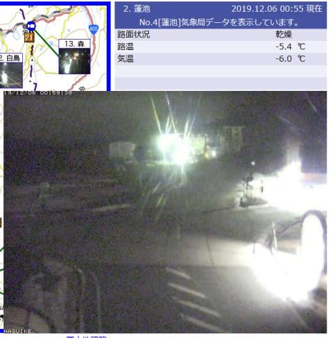
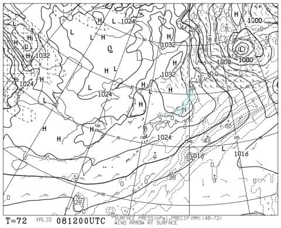
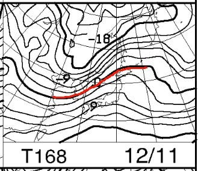
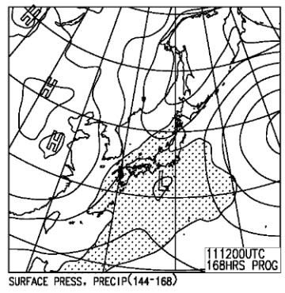
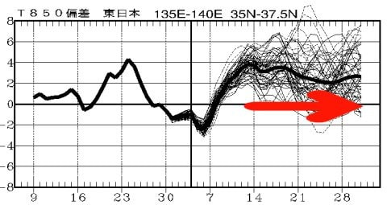

# 志賀高原，まだ積雪ほとんど無し(涙)．6日午前中の雪が勝負なんだけど…

📅 投稿日時: 2019-12-06 01:44:27

ということで．

もう，今週末のスキー場の積雪が

気になって，毎日天気予想記事に

なってしまっているこのBlogですが．

…そうです．

本日も天気ネタです！！←今週スキーに行かない人は，

「もういいよ」と思っているに違いない…

えー．

[一昨日の記事](e582b34b8472718e1fcfeb4388cfe5512.md)に，

5日（木）　（略）

　この日も志賀は昼間は曇り～小雪程度で，

　天然雪はそれほど期待できなさそう．

と書いた予想が当たり．

本日の志賀高原．

小雪がぱらついたものの，ほとんど

積もらなかったようです（涙）

こういう，当たらないでほしい予想は当たるのに．

そのあとに書いた，

　でも，夜から志賀でも積もり始めるか…

という，当たってほしいところは当たらず．

今の志賀高原，全く雪が降ってません（激泣）

([北信建設事務所道路気象状況ページ](http://hokushin-camera.org/)より）

あぁ…

5日(木)夜から6日(金)の午前中までが，

風向きがわずかに北向きになる，

短いチャンスなのに．

これから朝までの，短い時間に

雪になってくれるのか…？？

ちなみに，金曜の午後以降は，

しばらく雪が積もりそうにありません（涙）

ただ…

もしかすると．

こんな感じで，8日の天気図．

日本海側に降水域がかかっているので．

わずかな期待だけど，土曜夜から日曜朝に，

ちょっと雪が降るかも…？？

…でも．

10cmも積もらなさそうなので，

過大な期待はできないけど…

うーむ．

人工雪が打てるだけは冷えてくれているので．

全く滑れないわけではないけど…

ヤバい．

このままでは，ヤバい．

ただ，日本海側＆白馬は，

　新潟方面は10cmくらいの積雪があるかも…

と書いた以上の積雪があったようなので，

まだ良かったのですが．

志賀高原は，ちょいと残念な感じです…．

…憎い．

西風が憎い…

…果たして，何かいいニュースは無いか？？

と，いろいろ見ていたわけだけども．

…なぬ？

なぬぬぬぬ！？？？

うがーーー！！

なんだこりゃっ！！！

もう，細かいところは説明しませんが．

この2枚の天気図を見ただけで．

「あ，11日はスキー場も雨だわ…」

ということが，このBlog読者なら

分かるはず．

もう，11日(火）は，降れば絶対雨です．

液体です．

固体になる可能性は，歌っても踊っても

転がっても，1ミクロンもありません（激涙）．

…なんてこった…っ！！！

そして．

今日発表のFCVX14を見たところ．

…ダメだ．

ダメだこりゃ…

[11月末の一か月予想レポート](e1af9d14fa91e390b5bf4b446acb63dea.md)では，

12月24日までひたすら高温が続く予想でしたが．

今回もその予想はひっくり返っておらず．

それどころか，24日以降も，

年末までひたすら高温が続く

恐ろしい予想で．

クリスマス寒波も，

年末寒波もなさそう…（止まらない涙）

…ダメだ（あふれくる涙）

…なにか…

何かいいニュースは無いか…

もう，歌おうが踊ろうが，雪にならないのなら．

ここはもう，みんなでひたすら寒いギャグを言って，

地球を冷やし続けるのだっ！！

「布団がふっとんだ」

「ストーブがすっ飛ぶ」

「猫が寝こんだ」

「電話に出んわ」

……なんだか．

自分の周りが，すごく耐えられないほど

寒くなってきました…

…でも，これで志賀に雪が降る気が

しないんだけど…←当たり前だから

## 💬 コメント一覧

### 💬 コメント by (yumi)
**タイトル**: Unknown
**投稿日**: 2019-12-06 06:09:14

Ｓさぁ〜ん💦⛄😰

寒ぶぅ〜〜〜💀💀💀

久々に笑わせて頂きましたぁ〜🤣🤣🤣

### 💬 コメント by (若杉勲72)
**タイトル**: Unknown
**投稿日**: 2019-12-06 06:46:06

熊の湯のレストランも経営者が代わったかも？

ゆみりんによると、全てが大幅値上げとか。

### 💬 コメント by (FCAMEL)
**タイトル**: スキーが好きー
**投稿日**: 2019-12-06 06:46:13

焼額に叫びたい、6日は寒いか？

### 💬 コメント by (かず)
**タイトル**: Unknown
**投稿日**: 2019-12-06 11:25:39

年末  イチゴン  奥志賀大丈夫かな…

### 💬 コメント by (naoちゃんねる)
**タイトル**: Unknown
**投稿日**: 2019-12-06 13:32:42

こんにゃく、今夜食う！

お茶を飲んでるおっちゃん！

朝食食べれなくて、超ショック！

トマト食べるのちょっとまっとって！

イルカはいるか？

お金取られた、おっかねー！

帽子を忘れて、ハットした！

雷はもうたくサンダー！

バインダーが壊れてどうすれバインダー！

抹茶がたくさん、余っちゃった！

モナカを買いに行ったら、もーなかった！

日本海に飛び込んだ、ジャパーン！

男の子が海に飛び込んだ、ボッチャーン！

ステテコを捨ててこよう！

明日の天気は雪でスノー！

……これで雪が降るんですよね……😣

### 💬 コメント by (若杉勲72)
**タイトル**: Unknown
**投稿日**: 2019-12-06 18:58:47

naoさん、面白すぎます。ファンになっちゃった。

昔、ある所にカタカナ国がありました。

平和に暮らしていましたが、アイウエ王が亡くなったんです。

すると、悪い家来のカキクケ公が、天下を盗ろうと王子様を亡き者にしようとしました。

そこで、偉いお坊さんのサシスセ僧が、王子様をある島に逃しました。島の名はタチツテ島。

そこにはナニヌネ野という野原があって、僧は王子にハヒフヘ法という魔法を教えました。

その魔法は、マミムメ藻という海藻を使ったもので、この魔法を会得した王子はカタカナ国に帰って、カキクケ公を捕え、「父君を殺したのはお前だろう。やい、ゆえよ」と迫り、カキクケ公をラリルレ牢な閉じ込め、めでたくワイウエ王として即位しました。

カタカナ国には平和がもどり、国民は喜んでラッパを鳴らしました。パピプペぽー。

### 💬 コメント by (Skier_S)
**タイトル**: みなさん，地球を冷やす活動に協力ありがとうございます
**投稿日**: 2019-12-06 22:50:25

＞yumiさま

そうです．寒いです．

この寒さが，志賀に雪をもたらすのです！（そんなわけはない）

＞若杉さま

熊の湯レストラン，かなり値上がりしてましたね…

というか，今までが良心的価格過ぎたのかもしれませんが．

＞FCAMELさま

志賀高原冷え冷え活動にご協力ありがとうございます（笑）．

あまりにも普通の文章過ぎて，最初は普通に読み飛ばしてました（笑）．

＞かずさま

せめて21日くらいの週末には，1ゴン動き出してほしいのですが…

2016シーズンから，GSコースも人工降雪を復活

させたので，

天然雪が無くてもなんとかならないか…と期待してます．

＞naoちゃんねるさま

寒くなりました…

かなり寒くなりました…

これで焼額にドサドサ雪が降ってくれるといいのですが（笑）．

