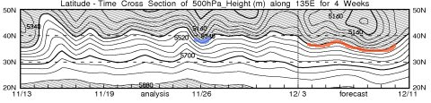

# これから一週間…スキー場には雪がいっぱい積もるよっ！

📅 投稿日時: 2012-12-05 01:26:02

🏷️ カテゴリ: [スキー天気予想](c6554f5c3c106093b511a8daae23757e8.md)

あー．

非常に良いコンディションだった先週末．

この週末も，いいコンディションだといいなぁ…

と，思うわけですが．

…この一週間．冷えるよ～っ！

いつもどおり，専門天気図，FXXN519を見てみると…

青い線で引いた850hpaの0度線．

標高1500mくらいで雪になる目安ですが．

これが日本の南側までしっかり降りてます．

…つまり，これから一週間．

山で降れば，雪です．

雪，です．

雨になることはありません！

FZCX50の850hpa気温平年比を見ると…

赤い線で示した平年気温より，2度から8度低い日々が続くじゃあーりませんか！

冷えますね～っ！

FXXN519の，500hpa高度の推移を見ると…

この，5400mの線が北緯40度を下回るとそこそこの雪になり，30度を下回ると超大雪なんですが．

これから1週間．赤線で示した部分．

ずっと40度を下回ってますね～．

青色で示した11月26～27日．ここも北緯40度を下回ってますが．

27日はかなりの大雪になったことを覚えているかと…

それ並みの積雪がこれから一週間続きますよ～っ！

で．

これからの一週間の地上天気図を，FEFE19で確認してみると…

ずーっと西高東低の冬型が続きますね．

で，網掛けの降水域が見事に日本海側だけにかかってます．

典型的な冬型．雪が降り続けるパターン．

そして．

FXXN519の500hpa高度偏差も

…日本付近がすっぽり負偏差域に入ってます．

日本付近を拡大すると…

－120ｍという，強烈な負偏差域がきれいに日本を覆ってます．

とりあえず．

これから一週間．

少なくとも来週の火曜日までは．

むちゃくちゃ冷えて，雪が降り続けますよ～っ！！！

この週末，かなりのゲレンデが一気にオープンしそうですよ～っ！！！

…でも．

土日も冷えて降り続けるので．

残念ながら，先週日曜のような晴天でスキーはできなさそうなのだ…
