# 2018年8月，モアルボアルで小5の娘をダイバー化！その7…予想外のジンベエ遭遇ダイビングのあとは，お昼休み

📅 投稿日時: 2019-07-14 03:47:06

ということで．

全く想定外に出くわした，

イワシの大群に突っ込むジンベエザメ

を見られるという，素晴らしいダイビングに

大満足の午前中が終わり．

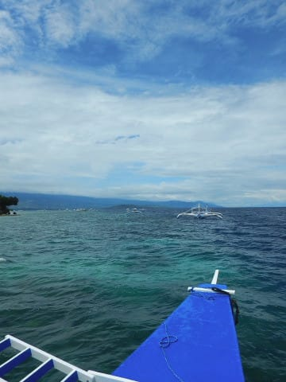

ショップへ戻ってきたわけですが…

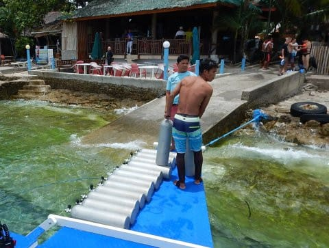

ショップ到着すると．

ちょうどプール講習を終えた

娘も戻ってきたところだったらしく．

タンク交換の練習をしているところ

でした…

はい．

残圧を確認して，バルブを閉めて…

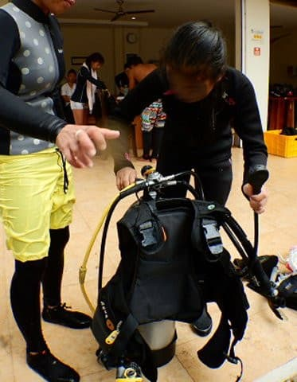

レギュのファーストステージを

タンクから外して…

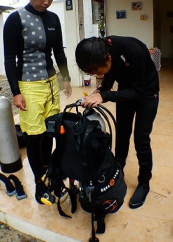

タンク固定バンドを外したら…

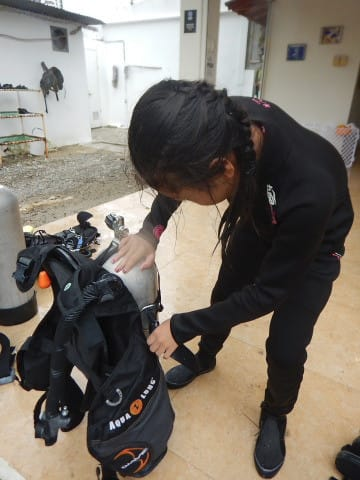

使用済みタンクからBCを外して…

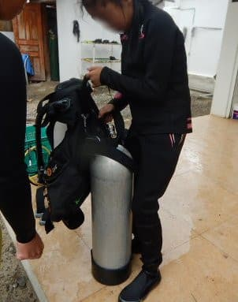

そして，新しいタンクにBCを

取り付け！

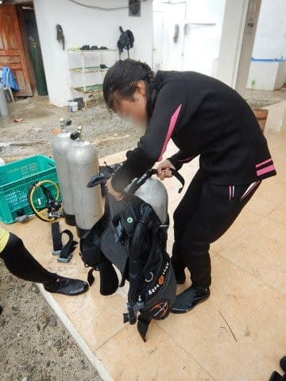

…Cカードを取った初めのころは，

この器材セッティングのやり方を

忘れるんですよね…

ってことで．

タンク交換が終わったところで，

娘の午前中の講習は終了したので．

家族そろって，お昼ご飯を食べに行きます．

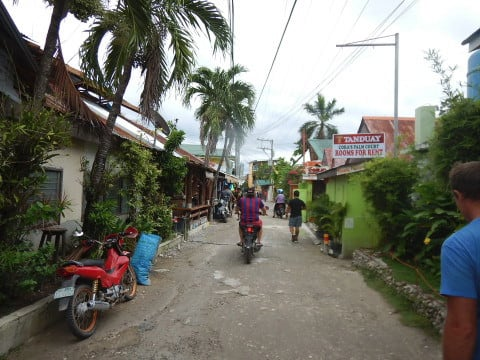

今日のお昼はこのお店．

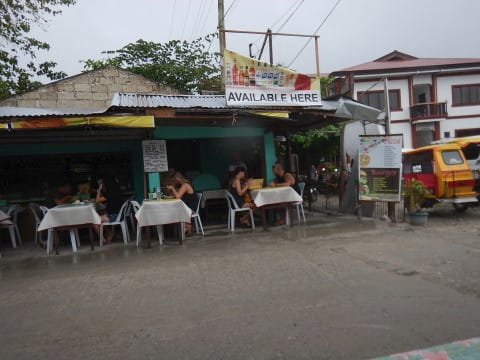

ダイビングショップから数十秒しか

離れていない，メインストリート沿いにある

Makanというお店．

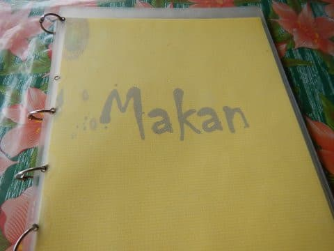

お肉やらパスタやら，フライドライスやらが

大体150～200ペソ．

1ペソ2円くらいなので，300～400円で

お腹いっぱいになれます！

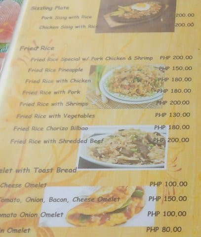

こいつが意外とおいしかった！

Bam-Iとかいうメニュー．

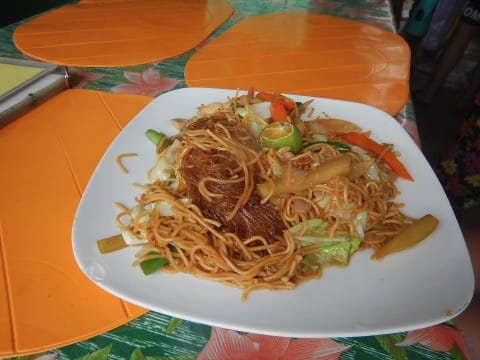

何だろう…？

ビーフンと焼きそばを足して，

タイ料理風の味付けというか…

お店はこんな感じで，かなりカジュアル．

お店を仕切っているおばさんが明るく

楽しいお店でした！

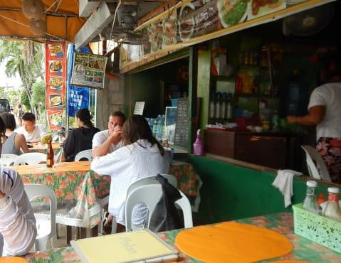

ってなことで．

食事も終わったし．

あと15分くらいで集合時間だし．

早めにダイビングショップに戻ろうか…

と，思ったところ．

娘「プール！15分あったらプールで泳ぐ！！」

え？

なに？？

これからプール！？？

…娘よ…

お前，午前中はプール実習で，ずっと

プールにいたんじゃないの？？

まだプールで泳ぎたいの？

娘「ちょっとでもいいから，プールで遊びたい～！！」

集合まであと15分なので．

プールには10分も入ってられないのに．

一旦ホテルまでもどり，

大喜びでホテルのプールに飛び込んで

いく娘…

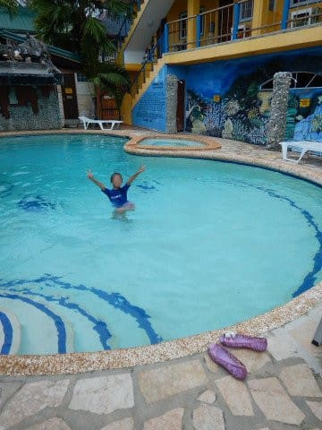

表情を見せられないけど．

みんなに見せてあげたいくらいの

最高のニコニコ笑顔で

プールで遊んでました…

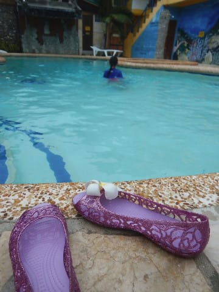

…おまえ…

ホントに泳ぐの好きなんだな…

そして．

10分だけプールで泳ぎまくったあと，

また徒歩3分ほどの道を歩き．

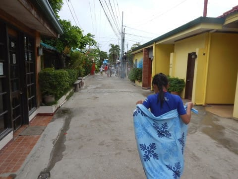

ショップに戻って，

午後のダイビング，スタートです！

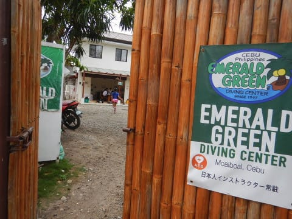
