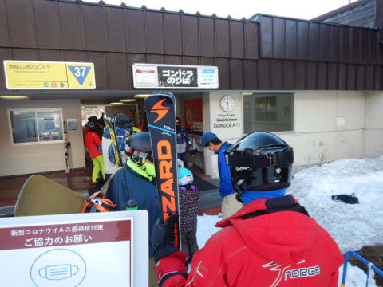
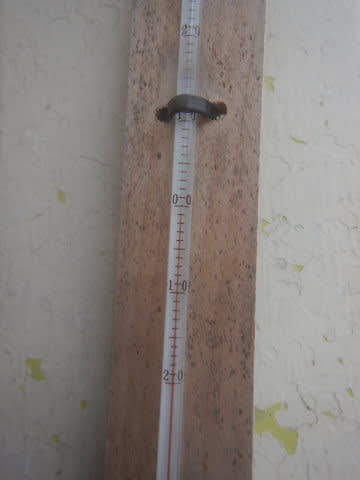

# 2021/5/2(日)の志賀高原スキー場は…午前は曇り時々晴れ，昼前からぽつぽつ雨・そして雪！

📅 投稿日時: 2021-05-02 23:21:47

えー．

本日の志賀高原は．

ガス，晴れ，雨，ミゾレ，吹雪…と，

すごいクルクル目まぐるしく天気が変わる

一日でした…

今日は，朝6:30からの焼額の早朝スキーに

参加！

…意外と人数がいて，駅舎からはみ出す

くらい人が並んでましたね．

朝6:30の山頂の気温は+1℃と，最近では

まぁ低めの気温で．

これは，冷え冷えの硬い最高バーンか？？

と期待したけど…

山頂は残念ながら，ガスが出てるんですが（涙）

でも，新雪が1-2cmほど，バーンに

乗ってます！！

あさイチは，予想外の新雪が乗ったいい感じ！！

でも，ガスの中で霧雨っぽかった後に，

いきなり日が射して…

雪が早朝から結構緩み気味（涙）

でも，焼額のスタッフは素晴らしく．

穴が開いていたバーン，大量に

雪を運び込んだらしく，バーンの

穴はすべて埋まって，コースは完全

真っ白になっています！！

朝のうちは，おおむね曇りで，時折

晴れる程度の天気．

この時期，わずかな時間でも晴れると

日差しで一気に雪が緩むので，

晴れないほうが嬉しいんだけどなぁ…

通常営業の8時半ごろには，完全に雪が緩んじゃい

ました（涙）

で．

GW5連休の今日も，ゴンドラはガラガラ…

とてもGWとは思えない！！

そして．午前10:30ごろに，なぜかいきなり

小雪が舞い始め…

雨になったり霙っぽくなったり

しながら…

降ったりやんだりを

繰り返していたけど．

雪は残念ながら，昼前にかなり重くて，

荒れ荒れになっていきました（涙）

でも．

なぜか，午後2時過ぎ．

気温がぐっと冷えて，山頂でマイナス気温に

落ちて…

なんと．

一気に吹雪になってきました！！

なぜ…

なぜ5月に吹雪？？？

一気にゲレンデに雪が積もって

来たんですが…！！

コース脇も一気に雪が積もり．

ゲレンデのコースは，新雪に覆われて

真っ白になってきましたよ…！！

まさか．

まさか5月にこんな雪になろうとは…！！

ってなことで．

吹雪で前が見にくくて．

寒くて大変だったけど．

でも，5月とは思えない雪で

滑ることができ．

早朝から15:30の営業終了まで，

ひたすら滑り続けたのでした…

で．

終了後に駐車場に行くと…

うわ．

車に雪が…！

これ，5月の積雪量じゃないよね…（驚愕）

ってなことで．

朝はガス，その後曇り時々晴れ，

昼からはミゾレー雪，

午後2時からは吹雪…

という目まぐるしい天気だったけど．

5月とは思えない新雪という

プレゼントをもらった，

今日一日だったのでした…

明日は志賀高原の登り道路は

積雪に注意してくださいね！

でも，5cmほどの新雪が楽しめるかも…！！

…ただ，朝8時過ぎには気温が上がって，

滑りにくい雪になるかもですが

## 💬 コメント一覧

### 💬 コメント by (ikkun)
**タイトル**: Unknown
**投稿日**: 2021-05-03 14:39:54

お疲れ様？です  実は……焼額山と横手山で走りながら天秤に掛けて走っていました❗風でゴンドラ？みたいな考えが過ったのは確かでした(笑)「焼額山も混んでた」と後から横手山にきた方のお仲間との話を小耳でしたm(__)m

### 💬 コメント by (Skier_S)
**タイトル**: ＞ikkunさま
**投稿日**: 2021-05-03 23:03:04

焼額の早朝は，搬器2-3台待ち程度なので，そんなに混んで

なかったのですが…

通常営業はほぼ飛び乗りでしたよ！

