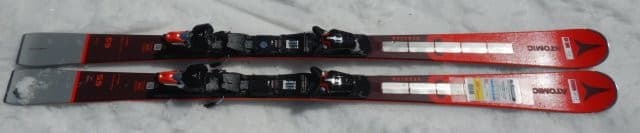
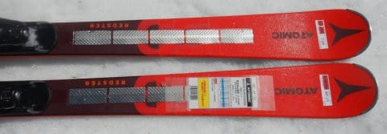
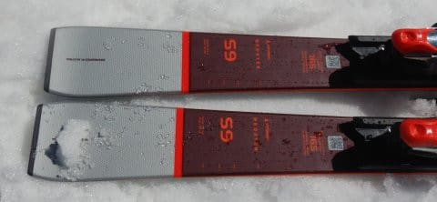
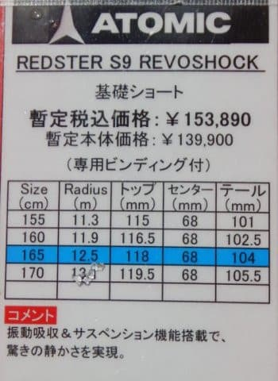
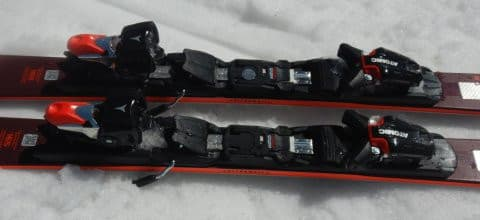

# 2023シーズンモデルのスキー板，試乗レポートその29…ATOMIC REDSTER S9 REVOSHOCK

📅 投稿日時: 2022-07-20 03:27:46

よく考えたら．

今週は3連休だったので，

平日を4日過ごせば週末じゃないですか！

…普通なら，

「4日だけ働けば週末だ～！」

と喜ぶところかもしれないけど．

私としては，

「平日4日間でこれだけの仕事がこなせるか…？」

という危機感にあおられている今日この頃．

皆様いかがお過ごしでしょうか（涙）

とりあえず，本日も2023シーズンモデルの

スキー板の試乗レポート．

今回はアトミック編です．

では，どうぞ～！

○ATOMIC REDSTER S9 REVOSHOCK 165cm

SL競技用

ATOMICのSL競技用は，

SL FISと，このS9 REVISHOCKの2種類しか

ないようで．

こいつはSL競技用のセカンドモデルに

なりますが…

写真の説明書きに，「基礎ショート」と

書いてあるように，

ビンディングもX12TLのGripWalk対応

ビンディングと優しいビンディングになり，

競技用というよりは，SLっぽい板に

乗りたい人向けの，ゲレンデ向けモデルと

言った方がいいのかも…？

その場合は，S9iとS9i Proとの位置づけが

よく分からなくなる，ちょっと中途半端な

感じの板ですが．

滑ってみると…

SL板だと思って履くと，かなり軽快ですね！

…軽快というより，グリップが

優しく，ガッツリ食いついていくと

いうより，ある程度の逃げがある板．

トップとテールのグリップがそこまで

強くなく，頑張りすぎない感じ．

狙っているスピード域もそんなに

高くないと思います．

S9iほどではないにしろ，板は結構

軽く感じるので，荒れた雪の中でも

動かしやすいですが．

逆に言うと，安定感が感じられるというより

少しキョロキョロする感じも…

低中速域では，板のサイドカーブに乗って

そこそこのカービングで小さめの半径で

回ってきます．

そこからさらに回転弧を小さくしていこうと

すると…

足場がしっかりしていない春の雪では，

板がたわんでいくというより，

板がずれて動いていき，弧が小さく

仕上がっていく感じ．

どちらかというと，スピード域が

そこまで高くなく，体力や体重が無い人が

小回りを仕上げるにはいいかな？

うーん．

でも，私にはちょっと物足りない感じの

板でした．
