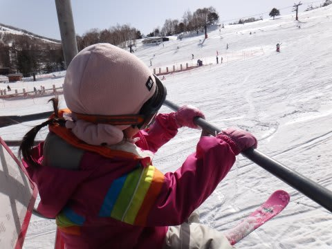

# わが娘＠5歳のスキーの腕前は…

📅 投稿日時: 2013-03-14 00:58:45

🏷️ カテゴリ: [スキー雑談](c1f9d2cb7478308da16419928ea3945e9.md)

えー．

今年もかなりの日数を雪上で過ごしているわが娘＠幼稚園年中．

[初めてスキーで滑って](d20110401.md)から，ちょうど2年が過ぎました．

…そう．

あの震災の次の日．

リフトが動かなかったので，娘に板を履かせて滑らせたのが始まりでしたね～．

…あれから2年．

すでに，娘の総滑走日数は50日くらいですか．

今ではリフトに乗るのも，手伝わなくても一人で乗れるようになってきたし．

雪上での移動速度はかなりのものになりましたね～．

平坦なところでは，もうパラレルスタンスで滑ります…．

さらに．

余裕でスウィズルやってみたり…

座って滑ったり．(下の動画の0:18ごろ)

さすが，5歳にもなるとかなり滑れるようになってきますね．

特にスキーを教えてるわけじゃないんですけどね～．

子供は勝手に滑り方を覚えてくれてますね～．

って感じで．

一の瀬ファミリースキー場に大量に存在する，スキー修学旅行生から

「すご！あんなちっちゃい子が…すげー上手い！」

と．

何度も驚きの声をかけられる娘ですが．

＃「すご！あのお父さんも…すげー上手い！」と言われたことはやはり残念ながら一度も無い

でもね．

異常にスキーになれているうちの娘．

ほんとうの実力は，こんなもんじゃないのだよ．

（続く)
