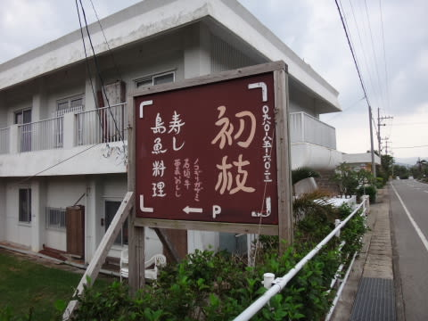
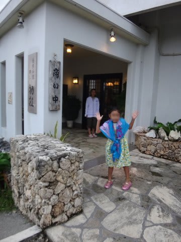
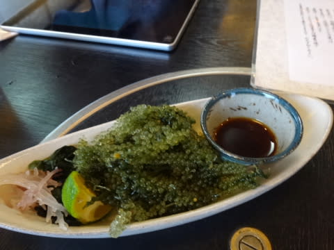
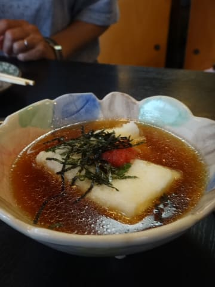
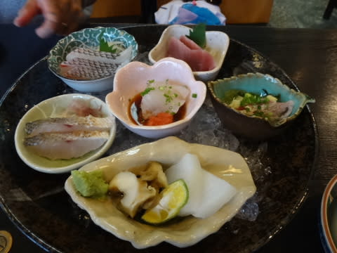
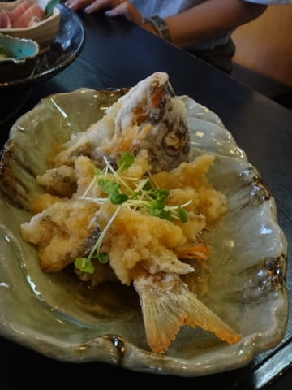
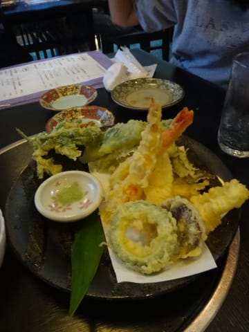
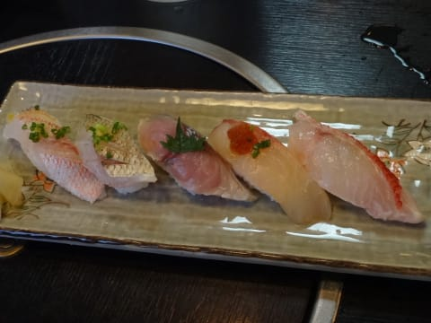

# 2015年10月　子連れで西表へダイビング旅行その8…ゼイタクな夕食タイム

📅 投稿日時: 2016-09-01 02:30:02

ということで．

ぶらぶらお散歩のあと，

夕食に立ち寄ったのは…

お魚料理がおいしいと評判らしい，

「初枝」さん．

最近できたお店なのか．

新しい，おしゃれな建物です．

ここは，まず．

沖縄っぽい，海ぶどうに…

ジーマーミ豆腐の揚げ出し．

いや，どちらも材料もいいし…

美味い！

…そういえば．

わが娘．

サンマと根曲り竹以外にも．

なんと，

海ぶどうも大好物．

＃つくづく子供らしくない味覚だ…

この海ぶどう，

ほとんど娘一人に食べられちゃいました…（涙）

で．

海鮮のお店だから，お刺身を…

うむ．いろんな種類の盛り合わせ．

どうも，南の海の魚は，北の海の引き締まった

魚と違って．

お刺身にしても，

感動するほどおいしいものは無いよな…

という偏見を持っていましたが．

その概念が崩れていきます．

いや，南の魚でも，刺身で食べておいしいものは

美味しい！

このミゾレ煮も．

かなり料理のレベルが高い…

材料もいいんだけど．

火の通し方，味付けが，

ハイレベルのプロの仕事．素晴らしい…（感動）．

どの料理もおいしかったので，ついつい

いろいろ頼んじゃいます…

そして．

最後は当然．

お寿司屋さんなので，お寿司で締めですね．

いやー．

美味しかった…

…

…

でも…

美味しかっただけではなく…

すごい高かった（涙）．

予算一人4～5000円クラスという，

普段の我が家では絶対近づけないような，

超ゼイタクな夕食を楽しんだ後．

暗い中，10分ちょっと歩いてホテルに戻って．

即座にぐっすりねむったのでした…
