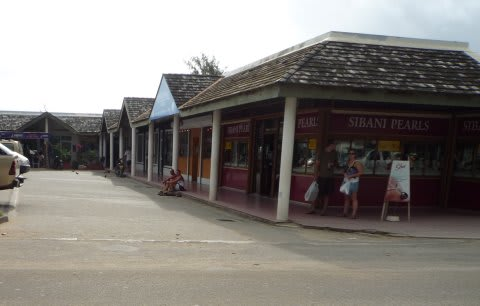
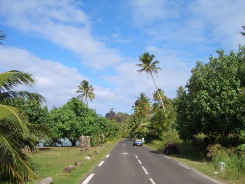
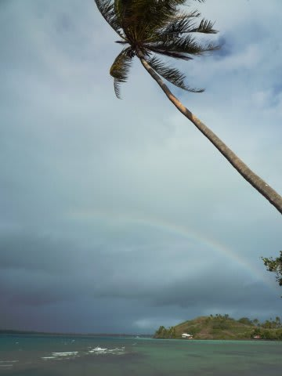
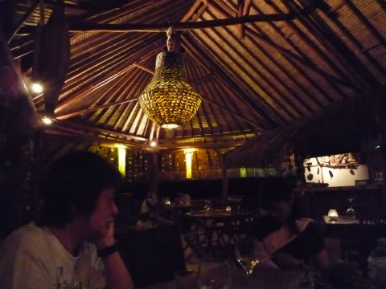
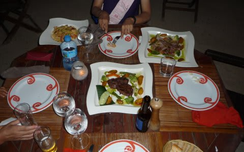
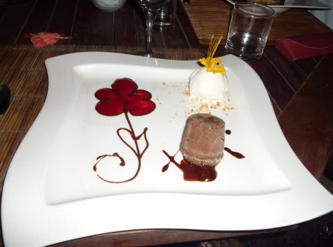

# 2009年　初の海外子連れダイビング旅行記　4　First night

📅 投稿日時: 2012-08-30 00:21:06

🏷️ カテゴリ: [ダイビング日記](ce3a7a8d424d112fce83ee85c81a0e344.md)

海に浸かってびしょぬれになったオムツを替えて，

また車で10分ほど走ると．

今度はボラボラの中心地，バイタペの町にやってきます．

中心街って言っても，港の周りにお土産屋数件と商店がある程度の，素朴な町なんですけどね～．

スーパーを覗いて，お土産屋を冷やかしたら．

まだまだドライブは続く…

だいたいこのあたりで島1/3周．

でも，残り2/3周は特に何も無い海岸線をひたすら走る感じ．

あまり面白くありません…

途中，ちょっと雨が降って，虹が出ました．

ボラボラのきれいな海にかかる虹は幻想的じゃの～

…写真で見ると，曇り空なのであまりきれいな感じに見えませんが…

で，昼ごはん時間を含めても，トータル3時間くらいで島１周

終わっちゃいました．

車に乗ってる時間は1時間くらいかな？

島一周が終わると，ちょうど夕方．

シャワーを浴びて一休みすると，夕食の時間です．

夕食は，私が個人的にボラボラで一番美味いと思っている

「カイナ・ハット」へ行くことに．

ホテルのフロントに頼めば予約してくれて，時間になったら

レストランからホテルへ迎えに来てくれます．

このカイナ・ハット．

きれいなコーラルサンドの上に立つ，サンドカーペットのレストランで，

内装の雰囲気もバッチリ．

さすがフランス領土…って思わせる本格的なフレンチが食べられます．

お値段はビール1-2本飲んで一人当たり3000円，デザート＆コーヒー

まで頼むと5000円くらいになっちゃいますが，このお値段から考えると

かなり美味い．

日本でこのレベルのフレンチを食べようと思うと，多分もっとお金がかかるんじゃないかな～．

デザートも逸品！！んまいっ！

全般的に物価が高いタヒチでも，コストパフォーマンスは高いと思います．

んで，店員さんもやさしくて子供に声かけてくれるし，

雰囲気はいいし…

グーですな．

いやいや，ボラボラ初日から，きれいな海を楽しめ，

昼も夜も食事はおいしかったし（高かったけど）

やはり良いところだのぉ～（お金さえ持ってれば）

あ，ボラボラはどこ行っても問題なくクレジットカードが使えます．

現金をほとんど持ってなくても大丈夫．

で，おいしい夕食に満足したあとはまたホテルまで送ってくれます．

自宅を発って36時間．

ようやっと布団で寝れる…

しかし，まだ出発した「土曜日」の夜なんだよなぁ，と，

日付変更線を超えたときにいつも感じる違和感を感じつつ，

あっという間に眠りに着いたのでした…
