# 2012年　子連れモルジブ　ダイビング旅行記　その１

📅 投稿日時: 2012-10-08 00:47:48

🏷️ カテゴリ: [ダイビング日記](ce3a7a8d424d112fce83ee85c81a0e344.md)

さて．

モルジブ旅行出発の日．

この日は，羽田空港深夜0:30発のシンガポール航空で出発です．

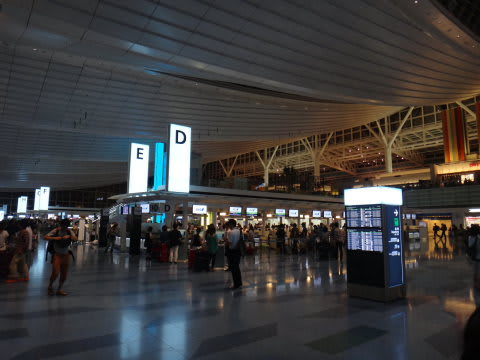

空港には夜10時ごろ入りましたが．

いやー．

羽田空港から海外へ出発ってのは．

初めてですね～．

とりあえず，初めての羽田空港国際ターミナル．

今回はスターアライアンスのシンガポール航空利用です．

スターアライアンスゴールドメンバーの我が家族は，ラウンジが使えますので．

ラウンジに入ってみましょうか…．

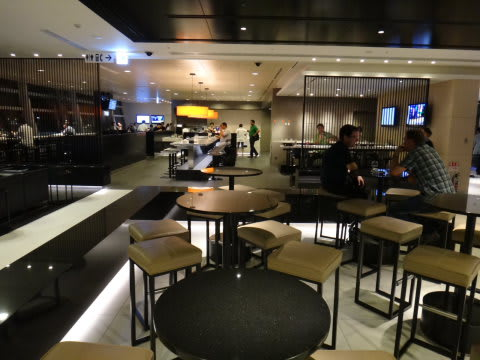

ラウンジは．

ちょいと狭い以外は，成田と同じ感じかな．

生ビール，ウイスキー，焼酎，ワインが飲み放題．

うどん，そばのコーナーや軽食の準備もあり．

夜ご飯を食べそびれていた私は，軽く腹ごしらえ．

そして，11時半過ぎに搭乗！

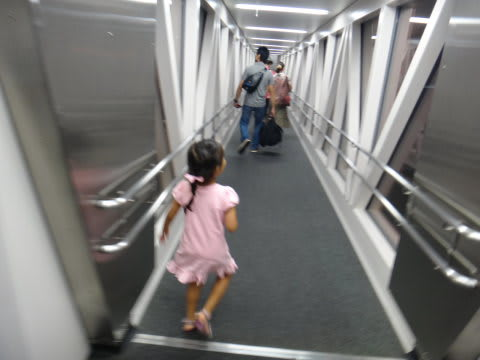

飛行機に乗る前は，

「飛行機に乗ったら，ゲームして，映画見て，お弁当(機内食のこと）食べて…」

と，かなり楽しみにしていた娘ですが．

＃どんだけ国際線の飛行機が好きなんだ

深夜便だったので，乗ったとたんに爆睡．

ゲームも映画もまったくすることなく，乗り継ぎ地のシンガポールまで

ほぼ完全に寝続けていたのでした…

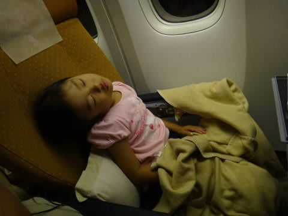

おかげで，私もぐっすり熟睡…

しかし，深夜0時半発，朝6時半着のフライトなのに，

軽食＋朝食ホットミールの2食出ます．

出されたものは食べるポリシーの私は，おかげで

ちょっと睡眠が不足気味なんですが…

さて．朝6時半にはシンガポール・チャンギ空港到着．

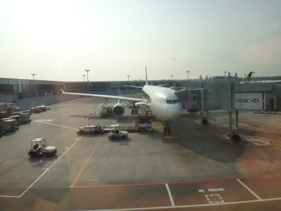

モルジブ・マーレ空港行きに乗り継ぐわけですが．

ここでもラウンジで一休み．

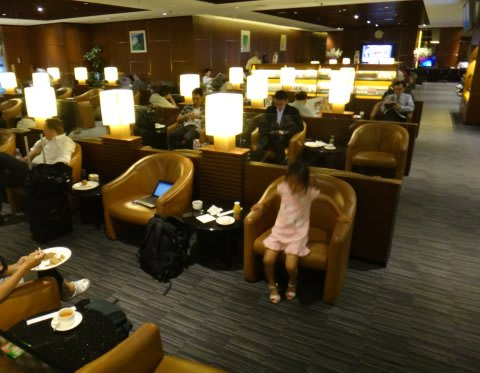

…機内食の朝食を食べたばかりというのに．

なぜかまた食事を取っている私だった…

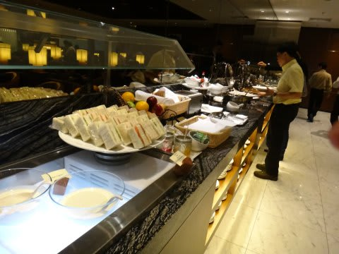

ここでも，ビールやらワインやら飲み放題でしたが．

今日の午後にはダイビングするので，ぐっと我慢．

2時間ほど一休みして，朝9時ごろに今度はマーレ行きに乗り込みます．

今度は娘，しっかり起きてゲームしてますね…

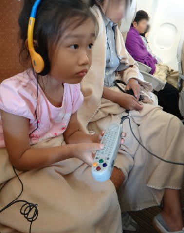

で，また食事が出るので食べる，と．

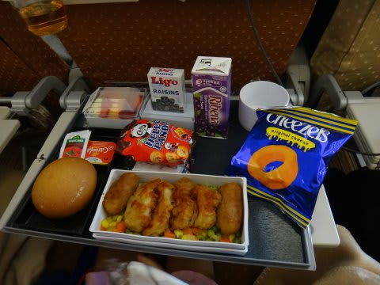

(これはチャイルドミール)

娘は大好きな飛行機に乗って，食後のアイスを食べて，

子供向け映画見て．

飛行機を超満喫しているようです．

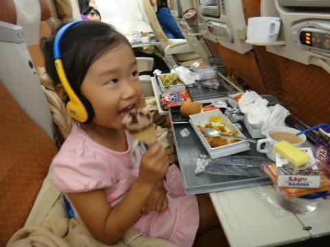

うーーーん．

飛行機好きに育ってくれて，楽なことよ…．

って感じで．

娘にとっては短すぎるらしい，約4時間のフライトで．

モルジブ・マーレ国際空港に到着です．

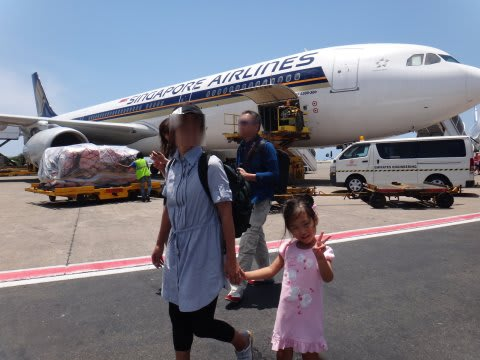
