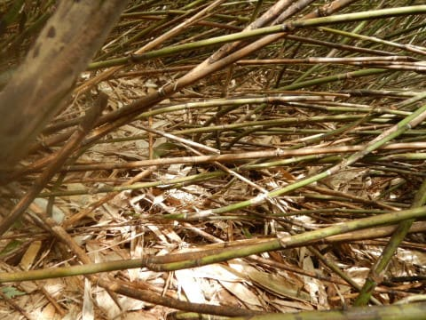

# 2023シーズンモデルのスキー板，試乗レポートその16…HEAD Supershape e-MUGNUM

📅 投稿日時: 2022-06-22 00:12:51

そういえば，土曜にネマガリダケの

竹の子狩りに志賀高原まで行ってきた

わけですが．

竹の子を採るのは，志賀高原のゲレンデ脇に

こんな感じでよくある笹薮．

笹の高さは2mくらいあるので，人の背丈より

高い笹薮をかき分けて中に踏み込み，

地面に生えてる竹の子を探すわけですが…

慣れてないと，結構見つけにくいです…

さぁ．

読者へのチャレンジ．

この写真のどこにタケノコがあるか分かるかな？

上の写真の真ん中あたりをちょっと拡大

すると…

ど真ん中に2本生えてます．

分かりますよね？？

分からない人のために．

これです！！

そして，次の問題．

この写真でも，竹の子があるようには

見えないのですが…

どこに竹の子があるか，探してみよう！

じっと見ると…

ここに生えてます．

これでもまだ分かりにくいかも…

さらに拡大すると．

こいつです．

分かりましたか？？

…って感じで．

こういうのを大量に採ってくるわけですが．

「いっぱい採れた～！」

と思っても．

皮をむくと，食べられるのは1/3くらいに

なっちゃいます…（涙）

でも，それだけの手間暇をかけるだけの

価値はある！！

ってなことで．

本題へ．

今日も2023シーズンモデルのスキー板の

試乗レポート．

今回はヘッド編です．

では，どうぞ～！

○HEAD Supershape e-MUGNUM 163cm

基礎小回りベースオールラウンド

この2023シーズンモデル．

見た目，2022シーズンモデルとあんまり変わってる

ような気がしませんね…

長さ163cm，R=11.9m と，板のスペックは完全に

小回り板です．

滑ってみると…センター72mmと広めなこともあって，

春の荒れた雪を乗り越えていく力は強い！

…でも，ちょっとグリップが強い板に慣れたからか…

ちょっと板のグリップ感が弱めに感じるかな．

スピードを出していくと，板がちょっとずれて

逃げていく感じを受けます．

雪が柔らかいってのもあったのかな？

結構ズルズルと板が落とされていく感じで，

板が頑張りすぎないのですごい楽．

すごい楽で，幅広ってのもあり荒れた斜面も

優しく乗り越えていく感じで，悪雪でも

身体に優しく滑って行けます．

切ろうと思って頑張って行けば，切って行けなくは

ないけど…

R=11.9mというサイドカーブに乗った鋭い

小回りができるという感じではなく，

雪面を柔らかく捉え，返りもゆったりと

戻ってくる感じなので，鋭いというより

緩やかに回っていく感じ．

ただ，グリップが弱めだから低速でしか

使えない板…

ってわけではないです．

振動吸収性はバッチリで，優しい板にありがちな，

スピードを出した場合に板が叩かれるとか

パタパタキョロキョロして怖い，ってのは無いです．

スピードを出しても安定感があります．

とはいえ，ハイスピードを出して強い圧をかけると，

板がじりじりと逃げていくので．

昔のMagnumより，中級・初級向けになった感じ…

すごい体に優しく，荒れた斜面でもオールラウンドに

使える板だけど．

ちょっと昔のモデルの印象と違うなぁ…

単に自分が硬くてグリップの強い板に慣れすぎた

だけなのかな？

あるいは，この板が単にエッジが丸まってただけなの

かなぁ…

## 💬 コメント一覧

### 💬 コメント by (Hide)
**タイトル**: Unknown
**投稿日**: 2022-06-23 07:38:50

おひさしぶりです。

相変わらずの志賀高原への忠誠心すごいです。

もはや引っ越しされた方が時間的余裕ができるのではないでしょうか？（笑）

さて、この板、実は私狙ってるんですよね・・・。

神保町でカレーでも食べつつ神田捜索したいところなんですけどね・・・・。

ちとお高い（泣）

### 💬 コメント by (Skier_S)
**タイトル**: ＞Hideさま
**投稿日**: 2022-06-24 02:10:09

お久しぶりです～！

もう，私の志賀高原愛はハンパないですから…

将来は湯田中に暮らしたいと本気で思ってます．

今年，スキー板は軒並みすごい値上がりしているうえ，

この板は古い型でもいい（むしろそっちの方が出来がいい？）ので，

型落ちがあればねらい目だと思うんですが…

ぜひ神田をさすらって，物欲選手権で敗れてきてください（笑）

