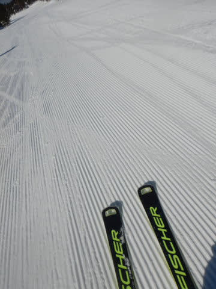
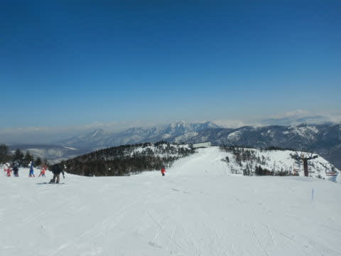
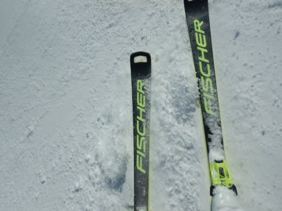

# 2022/3/12(土)の志賀高原スキー場は…終日晴天！雪は午後は緩んだけど比較的いいコンディション！

📅 投稿日時: 2022-03-13 00:18:52

🏷️ カテゴリ: [2022スキー滑走日記](cc9cb73e4320f6a97af6fccc37587a61a.md)

ってなことで．

本日も志賀高原で滑ってきました～！！

朝イチ，8:30の営業開始時，結構並んでますね…

今日は混みそうな予感…

あさイチの焼額山頂で，気温は何とかぎりぎり

マイナス…

でも，すぐにぎりぎりプラスになりそうで．

今日は予想通り，気温が上がりそう(泣)

でも．天気は朝からすっきり晴れ！

そして…

バーンはシマシマっ！！！

あさイチは，いい感じの硬めのシマシマ！

いい感じの硬めで締まった，アイスバーン

というわけでもないけど，硬めでスピードが

出る，いい感じのシマシマです！

天気はすっきり晴天で．

そして最高級のシマシマ！

これまで特派員写真でうらやましかったけど．

今日はリアルに朝イチ最高のシマシマ！！

…でも．

やっぱり朝イチからかなり混んでいたのもあり，

朝9時過ぎにはゴンドラ待ちも10分を越えて

来ちゃいました…(涙)

そして，焼額第1ゴンドラの待ちが15分を越えると．

焼額の呪いが解けるという設定の私．

焼額の呪いが解けて，奥志賀へワープ！！

奥志賀エキスパートは，朝10時前は全く緩んで

おらず．

エッジがガッツリ噛む感じの．快楽圧雪バーン！！

気温は高いけど．

北斜面で，全然雪が緩んでませんよ！

いや…3月中旬の晴天でこれなら，

かなりいいコンディションですよ！！

と，かなり気持ちよく滑ってましたが…

やはり土曜日の本日．

リフト待ちはほとんどなかったものの．

コースの人口密度は結構高くなることもあり…

いや．

ホントに奥志賀は，意外と雪も良くて．

さらに天気も良くて．

最高コンディションなんですけど．

やっぱり土日，ちょっと人が多かったのだけが

惜しかったかな…

昼頃には焼額のごドラの待ち時間が少なくなった

ようなので，焼額が生息地の私としては，

焼額に戻ってくるわけですが…

昼間の気温が+5℃を超えた本日．

やはり，昼間の雪はかなりしっとりと

重い感じになっていたものの　

ザブザブゆるゆるになることはなく．

GSコースは下地はしっかりとしていて，

表面が緩んだかな…

という程度の雪質で収まってくれました！

ただ，南向きの唐松コースや，GSコースも

下部はちょっとシットリ重い雪になり．

「あぁ…春だなぁ…」とは思ったものの．

でも，3月中旬の，かなり気温が上がった

晴天の日と考えれば．

日差しがそれほど強くないコースは，

しっかり締まったバーン状況をキープして

くれたし．

営業終了まで，大回りができるバーン状況で，

ひどい凸凹にならずに済んだし．

かなりのザブザブ雪で，ひどくなるんだろうなぁ…

という予想に比べれば．

営業終了まで，大回り板でひたすら気持ちよく

滑ってられたので．

今日も恵まれた一日だった…

と．

満足して，営業終了まで滑り続けられたの

でした…

…いや．

今日は意外とコンディションが良くて，

かなり楽しめた一日でした～！！

明日も気温が上がりそうですが，

午後は曇りそうなので，運が良ければ

日差しで雪が緩まずに済みそう…

果たして明日．

気温が上がる前に曇って，雪が日差しで

壊滅的に融けずに済むのか．

あるいは，曇るのが遅くて，日差しで雪が

壊滅的に緩むのか…

また，明日のレポートを待つのだ！！

## 💬 コメント一覧

### 💬 コメント by (大阪のK)
**タイトル**: Unknown
**投稿日**: 2022-03-13 01:27:41

今日は一の瀬がめっちゃ良かったです。

昼前後はファミリー上部とパーフェクタも空いていて、ぐるぐる回していました。

寺子屋は春を感じさせない雪質で、「さすが寺子屋は違うなー」と感じましたが、リフトが激混みで高天原に移動。

高天原も大回りの傾き放題。

結局、西向き斜面はどこも快適カミカミバーンでした🎵

明日はどうなるかな。

### 💬 コメント by (レインボー74)
**タイトル**: Unknown
**投稿日**: 2022-03-13 16:12:55

日曜日の志賀高原情報

朝の上林+5℃　蓮池+4℃。不吉な予感。

朝イチはまずまずしまっていたけれど、

次第に妖怪板つかみの魔手が！

特に寺子屋では大量増殖してました。でも考えてみれば、あいつらがいるからスキーシーズンの終わりに諦めがつくのかも。

### 💬 コメント by (ももた)
**タイトル**: Unknown
**投稿日**: 2022-03-13 18:38:52

すっかり春の雪ですね。

妖怪が大量発生していました。

せっかくの休みで明日も志賀を滑るのですが、雨の予想が心配です。S様の予想、今回ばかりはハズレないかなぁと…

極楽さん、極ツマさん

この場をお借りして。。。

今日はご挨拶できて嬉しかったです。

ステッカーもいただきありがとうございました。家族共々喜んでいます。さっそく何処に貼ろうか思案中です。

### 💬 コメント by (アツシ)
**タイトル**: Unknown
**投稿日**: 2022-03-13 21:07:44

Sさまのお車、1ゴンのポールポジションに停まってるなー、ファーストトラックやな、と思っていたら昼過ぎに見たらおりませんがな。さては呪いが解けて一ノ瀬？16:30までやってるし、早めの瞬間移動か？？と思っていたら丸池で発見！いつもと違う行動パターンですね。

私はといいますと、激寒4ロマごときではふるい落とされませんが、妖怪の出現で一気にテンションだだ下がり。12:30で上がってしまいました💧

### 💬 コメント by (Skier_S)
**タイトル**: 今日は残念な雪だったよ
**投稿日**: 2022-03-14 02:01:40

＞大阪のKさま

土曜は良かったですね…

それに比べて日曜は残念な感じ．先週と違いすぎる…

はりつき雪は勘弁です．

＞レインボー74さま

寺小屋も滑りが悪かったようですね…

まさか3月半ばにそこまで雪が悪くなるとは，先週段階では

予想できませんでしたね…

春ですねぇ…

＞ももたさま

いや…もう，妖怪大量発生でしたね（涙）

明日は，リフト営業開始までに雨は止みそうです！！

雨にぬれず滑れそうですよ～！

…雪はずっしり重い雪になりますが（泣）

＞アツシさま

あ，あれは私じゃない人に車を貸して，お昼を食べに行くのに使ってもらったんです…

私はひたすら滑り続けてました．

しかし，12:30上がりですか！

あと2時間我慢すれば，板が滑るようになってきたんですが…

### 💬 コメント by (Gokuraku  Skier)
**タイトル**: 私もここをお借りして・・・
**投稿日**: 2022-03-14 19:15:52

Sさんコメント欄お借りします。

＞ももたさま

こちらこそお声掛けいただきありがとうございました。

『極』ステ気に入っていただけた様で何よりです(^^♪

あんなステッカーならいくらでも差し上げますのでいつでもお申し付けください。

ブログはさぼっていますが、YouTubeは頑張ってアップしますので今後もご視聴のほど宜しくお願い致します。

### 💬 コメント by (アツシ)
**タイトル**: Unknown
**投稿日**: 2022-03-14 20:47:51

あ、そういったご事情でしたか。てっきり、他ゲレンデへ浮気？かと思ってました(笑) Gokuraku Skierさまご夫妻はよく見かけますし、今季も何度か1ゴンの同じ搬器に乗り合わせたこともありましたが、Sさまにはなかなか会えずに来ています。営業前や後であれば簡単に捕捉できますが、それでは簡単すぎて面白くないので、流れの中で、自然にリフトやゴンドラ乗り場で偶然を装って声をかけよう思っています。次の3連休こそは！(そういうわけで、土日の1ゴン営業開始待ちの列に居ますが知らんふりしてます😅スミマセン

それはそうと、極ステッカーまだ配ってらっしゃったんですね！来週声かけてお願いしてみよ♪

レインボー74さまのご意見に同感です。春の滑らない雪に嫌気がさし、毎年３月末でシーズン終了の決断をしちゃいます。。。

そこで毎年初夏まで滑り続けられるSさまに質問です！春雪対策にどんなワックスを使ってますか？まさか、滑らない板で滑り続けているわけではないですよね？

### 💬 コメント by (Skier_S)
**タイトル**: また雨が降ってます（涙）
**投稿日**: 2022-03-15 04:25:31

＞Gokuさま

「極」ステッカー，サイズもコンパクトだしちょうどいいんですよね．

欲しい人いっぱいいると思いますよ～！

＞アツシさま

いや…車で移動してないですが，焼額から浮気はしてました（笑）．

しかし，朝のイチゴン待ちにいらっしゃったんですね…

ちなみに私は，GWごろの春雪対策には，ワックスというより

スクレイパーをもってこまめに板の汚れを取ります．

この時期の妖怪板掴みと違って，GWごろは雪の汚れで滑らなく

なっていくので…

ペーストワックスも使いますが（ドミネーターのHyper Zoom)，

ワックスより汚れ落としの方が効く気がします．

