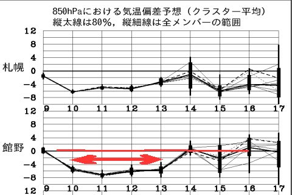
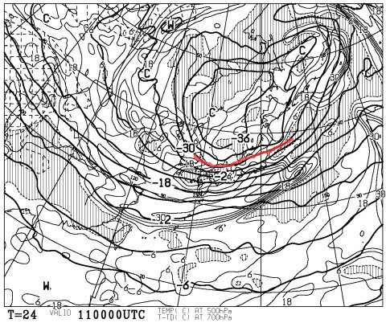
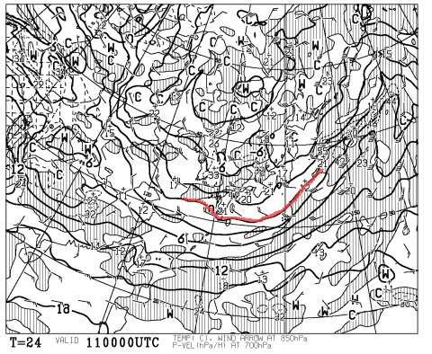
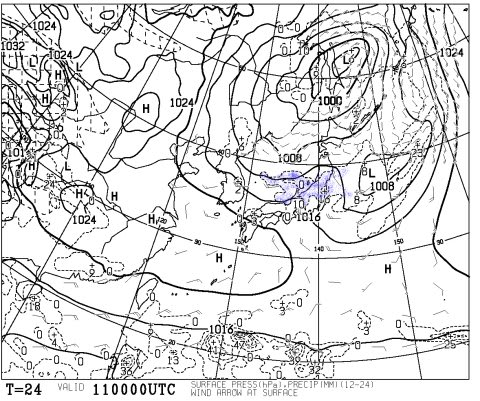
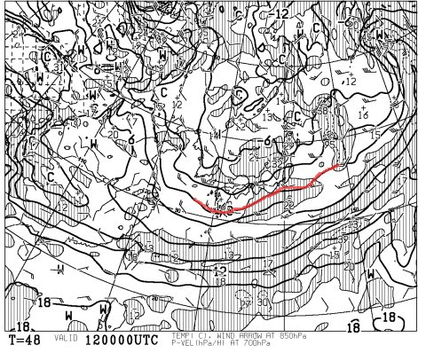
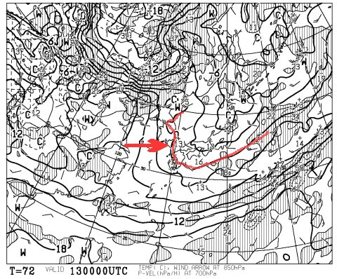
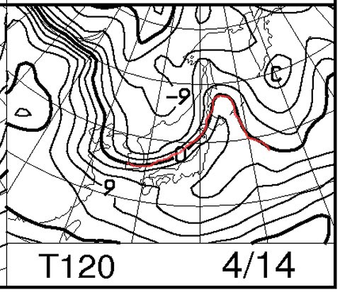

# この週末の志賀高原の天気は…土曜は好コンディションかもっ！！！

📅 投稿日時: 2013-04-11 01:39:16

あー．

なんだか．

これから冷えるみたいですね．

…あと，3日間は．

こーんな感じで…

これから13日まで，平年比6度くらい温度が低い日が続きますよ～っ！

冷えます！

んで．

11日の朝9時の高層天気図を眺めてみると…

なんと！この時期には珍しい，そこそこの積雪の目安となる，

「上空5000mで-30度の寒気」（厳密には，500hpa面-30度の寒気なんですが…）

が北陸～北信州にかけて入ります！！

さらに…

850hpa面の0度線は，日本の南までしっかり下りてますっ！

うほー！

冷えそう！

降ればぜったい雪，それもそこそこの雪質の雪になるはずっ！

…でも．

地上天気図を見ると，青くマークした降水量があるエリア．

北陸から東北までかかってますけど…

風向きなどを考えると．志賀高原は雪がそんなに積もらない感じなんですよね…(涙）．

…

…冷えるというのに．

志賀高原では，それほど積雪はなさそう．

うっすら積もる程度かな～．

かぐらとかの新潟エリアは，積もるかも．

12日も…

こんな感じで，0度線は本州より南．

志賀高原には，-3度以下の冷えた空気が入っているので．

降れば，結構いい積雪になりそうなんだけど．

なんだけど…

あんまり積もらなさそう(涙)．

13日の土曜日も…

こんな感じで，0度線は日本をすっぽり覆ってるので．

志賀高原は，朝はマイナス5度程度と，この時期にしては冷え込んだ朝になるはず！

夜のうちにうっすら雪が積もり，この日は気温は終日低いまま．

硬い下地に，うっすらとやわらかい雪が載り，それが圧雪されたコンディションで．

朝は雲が多いかもしれないけど．昼間からすっかり晴れてくれます．

この時期としては，かなり良い状況で滑れるのでは？？？

ただ．

13日の土曜日は，矢印で書いたように，暖かい空気が西から入り込み…

夜から深夜に向かって，逆に気温が上がっていきます．

14日の日曜日は…

こんな感じで，0度線は信州よりかなり北まで上がっちゃいます．

天気は終日晴れそうですね．

ってことで．この日は朝のうちはちょっとシャリシャリしたくらいの固まった雪が．

午前中早くから緩んで．

日差しも強いので，昼には典型的な4月の雪になるでしょう…．

ということで．

土曜は結構冷え込んで，4月とは思えない好コンディション（今日からの積雪が少ないとアイスバーンが出てくるかも）．

日曜は典型的な春の雪だけど，晴れてあったかい，典型的なのどかな春スキーの一日になるでしょう．

これからの積雪次第ですが，土曜に期待ですねっ！！！！

## 💬 コメント一覧

### 💬 コメント by (piyo@太田市)
**タイトル**: 最後の最後に．．
**投稿日**: 2013-04-11 08:56:00

先々週は丸沼、先週はアサマ2000と彷徨っていましたが、

最後の最後に奇跡が起きそう（＾◇＾）！

NOTWAXに期待！！

今週末は川場予定です。

### 💬 コメント by (gokuraku skier)
**タイトル**: Unknown
**投稿日**: 2013-04-11 18:44:53

土曜日は最後のご褒美にありつけそうですね！

### 💬 コメント by (Skier_S)
**タイトル**: piyoさま
**投稿日**: 2013-04-12 01:01:23

えーっと．

はじめまして，でしょうか…

この週末は，期待できますよ～

でも，まだまだ最後じゃないですよ！

去年のGWの次の週，5月に入ってから奇跡が起きたように，

今年もまだまだこれから奇跡が続く！

…と，信じましょう(笑）．

### 💬 コメント by (Skier_S)
**タイトル**: gokuraku skierさま
**投稿日**: 2013-04-12 01:03:18

この土曜日は，よさそうですよ！

日曜は晴れて気持ちいいですが，かなり気温が上がるので雪はザブザブになりそうです…

でも．

でも．

前のコメントにあるように．

まだだ，まだ終わらんよ！

…って感じで．

これからもまた冷えることを期待しましょう！

