# 2015シーズン初志賀！12月6日の志賀高原は…雪降る一日

📅 投稿日時: 2014-12-06 21:42:32

というわけで．

マイホームゲレンデ，焼額がオープンした今週．

今シーズン初めての，志賀高原にやってきたわけですが…

ふむ．

なんと．

上信越道の軽井沢を過ぎたあたりから，

積雪路面ですよ！

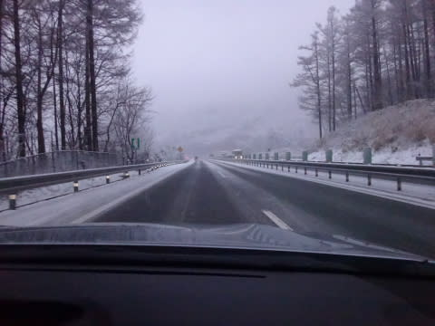

チェーン規制は長野ICからでしたが，

上信越道，夏タイヤで走るのは，

人生をかけたチャレンジになると思うので，お勧めしません（笑）

って感じで．

当然信州中野ICを降りた中野市街も，雪景色．

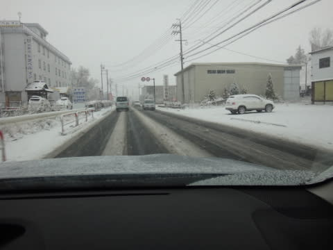

志賀高原の登り坂は，水曜に予想したとおりの，

本格雪道でしたよ～！！

で．

志賀高原に到着したわけですが．

いやー．

雪はかなり降ってますね～！！

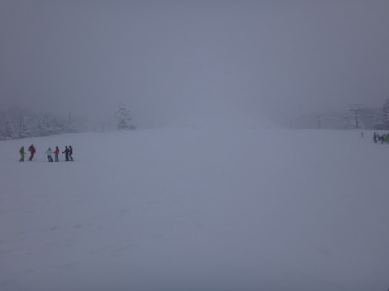

前日からの積雪は，このくらいのようですが．

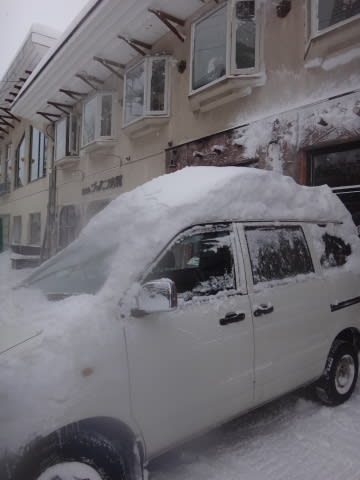

まだ一の瀬方面で滑れるのは，

ファミリー下半分，高天が原下半分，

焼額ペアの3本だけ…というのが，ちょいと残念．

まずは，一の瀬を滑ってみますか…

朝のうちは，かなり激しく雪が降ってますよ～

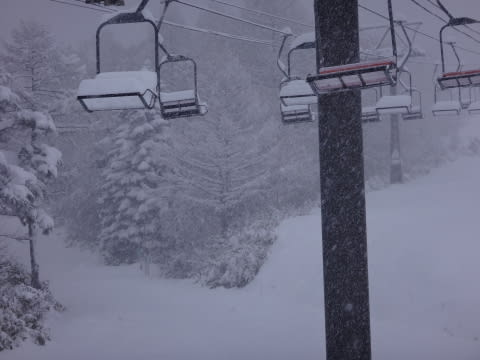

ゲレンデも，結構積もってますよ～

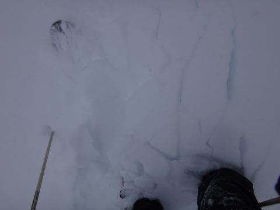

コース脇は，結構モフモフ状態！

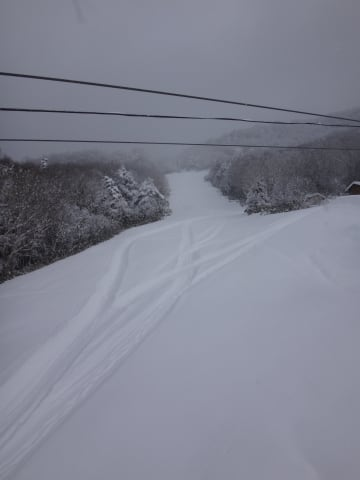

ブーツパフくらいの感じ！

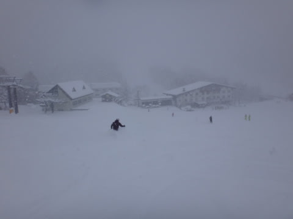

一の瀬ファミリーは，人工降雪がつけてあるのは，

コース幅の1/3くらいなんですが．

人工降雪がつけてないところは，結構な深雪で，

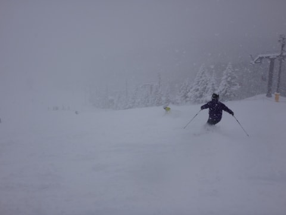

うははは！

結構いい感じ！

＃午後は，一部雪が薄くなっていたところもありましたが…．

気温も，マイナス6度と結構冷えてます．

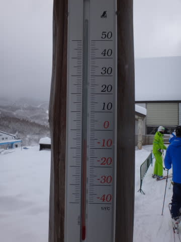

ただ．

朝のうちはペアリフトが1本しか動いておらず，

一瞬リフト待ちが伸びたタイミングもあったけど．

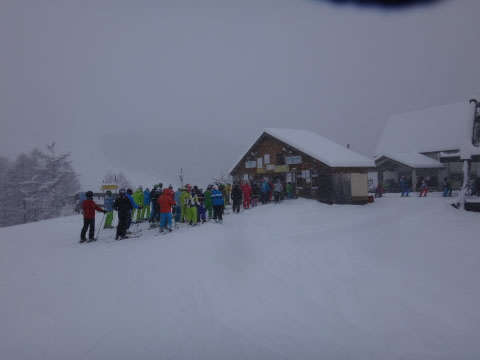

2本目のペアリフトが動き出したら，リフト待ちは

終日ほぼ0．

時折雪もやみ，いい感じに．

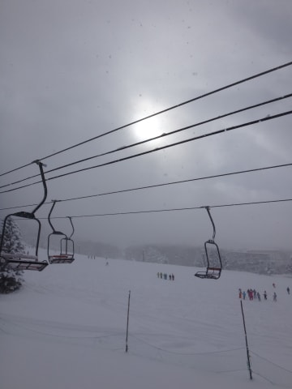

んだけど…

やっぱり基本的には終日雪が降り続けており．

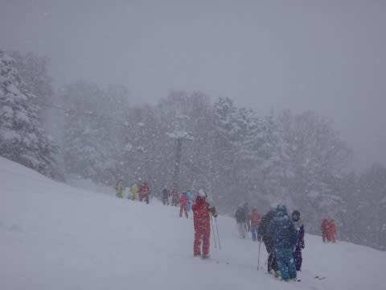

さらにいろんなキャンプが入っていて．

コースの人口密度は，ちょっと高めかな．

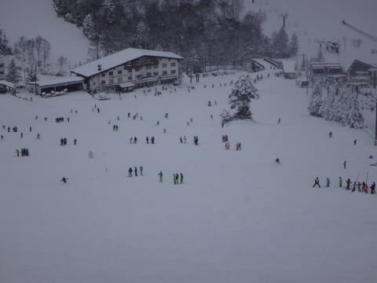

でも，コース幅は広いので，これまでの

イエティやアサマに比べると，ラインはとりたい

放題だったので，よかったかな～

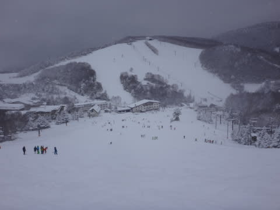

夕方になると，雪も荒れてきて．

人工降雪がない部分は，ところどころ

雪が薄くなってきたところもありましたが．

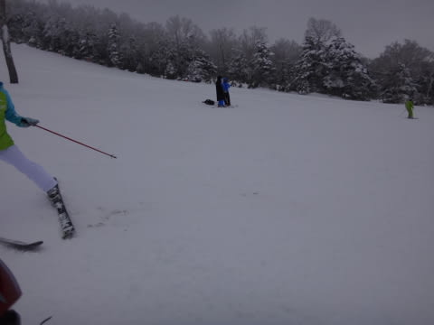

まぁ，基本的には．

私の天気予想通りの←ここ強調するところ

いい雪質のやわらかいゲレンデコンディションが

終日続いて．

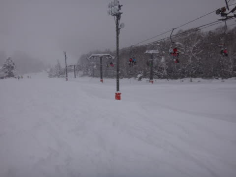

やっと，真冬の雪で滑れた，

って感じかな～！

…ってことで．

今日は一日，娘と滑っていたので．

焼額オープン日にもかかわらず．

焼額にすべりに行けなかった，Skier_Sなのでした…

PS.れおさんよりコメントもらいましたが，

明日は焼額，第2ゴンドラ動かすようです！！！

これは，明日こそ焼額に行かねばっ！！

＃ブッシュだらけだったりしないよね…
