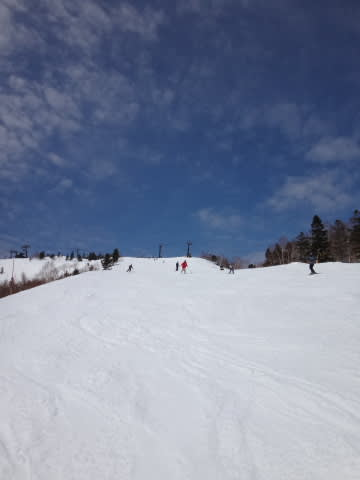
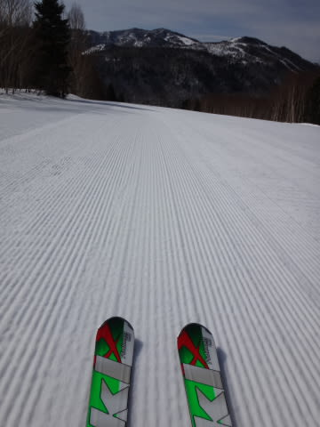
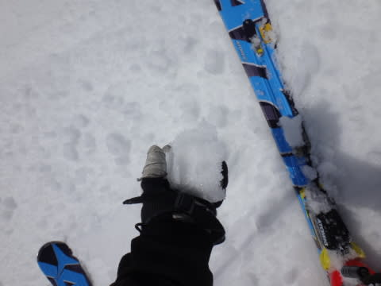
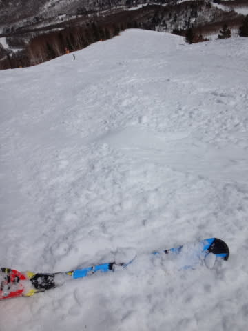
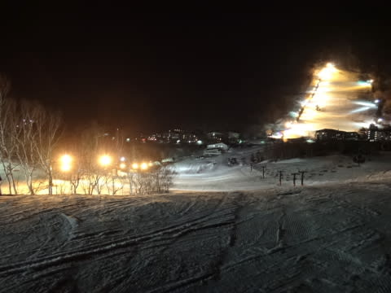

# 3月29日の志賀高原速報モード…暑いくらい．春だねぇ…

📅 投稿日時: 2014-03-30 02:48:48

🏷️ カテゴリ: [2014スキー滑走日記](c992167609b6415052179ee69ea1ea7d8.md)

えー．

当然，本日も志賀高原で滑ってきましたが．

…なぜか．

本日．

日帰りだったんです…

で．

さっき帰ってきたばかりなので．

本日は速報モードで…

あー．

今日は晴天！

朝から気温はプラスで，異常に暖かく，

朝イチはシマシマだったものの…

強烈な日差しで，暑い！ってくらいだったので．

雪はあっという間に，春のザブザブ重雪になってしまいました（涙）

ってことで．

今日は朝から重い雪で．

典型的な春スキー．

午後にはゲレンデも結構荒れちゃいました…（泣）．

…うーん．

でも，さすがにこの時期．

人も減ってきて，ゴンドラ待ちもなかったし．

一日晴れたし．

3月末と考えれば，まだましかな～．

で．

日帰りというのに．

…な，

なぜ，ナイターの画像が…っ！？？

日帰りだというのに．

…いや，日帰りで1日しか滑れないからこそ．

…夜まで思う存分滑ってきたのだ！！！←あまりのアホさ加減に，どう突っ込んでいいものやら…

ってことで．

本日の帰宅時間，深夜2時近く．

朝3:30出発だったので．活動時間23時間．

…これから寝ます．

詳細レポートは，また明日…（ばたんキュー）

追記：日曜朝に天気図見たら，低気圧さんが

　激烈に発達して，どしゃ降り＆強風になりそうな感じ…

　朝イチでヤケビは4ロマ以外全リフト・ゴンドラが

　止まっているみたいですね．

　どしゃ降りにならなさそうって予想，外したみたい（ごめんなさい）

## 💬 コメント一覧

### 💬 コメント by (aqura)
**タイトル**: Unknown
**投稿日**: 2014-03-30 16:19:31

凄い凄すぎる、さすが、Skier_Sさん。日帰りなのに、ナイターとは……♪───Ｏ（≧∇≦）Ｏ────♪

### 💬 コメント by (Skier_S)
**タイトル**: aquraさま
**投稿日**: 2014-03-30 23:17:30

日帰りだからこそ，ナイターまで滑っちゃうのです！

…っていうか，次の日の用事は昼からだったので，

帰宅が深夜2時3時までOK！って感じで．

もう，ゲレンデにいると，あとさき考えられ

なくなる人間なので…（笑）

