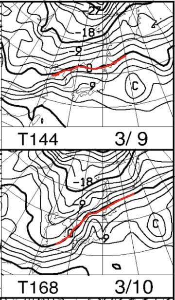

# 3月7，8日の週末の志賀高原スキー場の天気は…土曜はそこそこ冷えたいい天気だけど，日曜はヤバい．ってか，月・火は激烈高温でもっと危険（涙）

📅 投稿日時: 2020-03-05 01:14:43

ううううーん．

コロナウイルスの影響で，スキー場もすごい

お客さんが減ってきていて．

特に，志賀高原中央エリアは修学旅行生が

すべてキャンセルとなり，お客さんが激減して

大打撃のようで…（涙）．

そのせいで．

中央エリアのリフト営業が縮小されて

しまったようです…！（泣）

（[志賀高原中央エリアホームページ](http://shigakogen.co.jp/archives/5841)より）

丸池第2ペアは平日運休は，まぁそれほど影響がないとして．

一の瀬第3クワッドも，平日は動かなくなるようです…！！（涙）

うーむ．

KonSukeさんの生息地である第3クワッドが

止まってしまいますね…

まぁ，この状況を鑑みると．

土日営業してくれるだけでも，まだ

感謝しなくてはいけないのかも…

ってな悲しいニュースのあとは．

本題の天気予想へ行くわけですが．

…コロナウイルスやら雪不足やら，

よくないニュースが続く今シーズン．

せめて，週末の天気だけでもよくなって

欲しいところですが．

まず．

5日（木）の850hpa気温図ですが．

ふむ．

志賀高原には水色の-6℃線がかかる

程度なので．

そこそこ冷えて，昼間も問題なく氷点下を

キープしてくれそうですね…

そして，5日の地上天気図を見ると．

うむ．

見事に冬型の気圧配置で．

ガンガン雪が降りそうです！

この日は早朝から降り始めた雪が

終日降り続き．

昼間だけでも10～20cmは積もりそう！！！

…ただ．

風が強くて，ゴンドラはヤバそうな感じ…

つまり，この日は激冷え雪降りで強い風が

吹き付ける，吹雪ということですね…

さらに，6日（金）の850hpa気温図ですが．

この日も水色の-6℃線が志賀高原にかかってるので．

志賀高原は冷えますよ～！

朝は-10℃近くまで冷えそう．

そして，地上天気図でも，日本海側に

降水域が予想されているので．

…これは，木曜朝から金曜朝まで，ひたすら

雪が降り続きそうですね！！

まぁ，昼ごろには晴れていきそうなので．

前日まで冷え冷え雪が積もるこの日．

かなりいい一日になりそうです…

で．

肝心の週末，7日（土）の850hpa図ですが．

うむ．

5，6日より気温が高めで，水色の-3℃線が

志賀高原にかかってますが．

降水域には志賀にかかっておらず．

この日は晴れそうかな？

そして，8日（日）の850hpa図を

見てみると…

うーーん．

微妙…！

赤い0℃線がギリギリ志賀高原にかかり．

…そして，地上天気図では．

本州全面を覆っているので…

うーむ．

これは，日曜はギリギリ雨か

雪かきわどい感じです．

このままの天気図なら，何とかぎりぎり

雪のままいてくれるか…？？

ってなことで．

まとめると．

5日（木）：朝は-8℃前後の，結構冷え冷え．

　早朝から雪が降りはじめ，朝イチは

　積雪数cmだけど，昼間も雪が降り続けて

　昼間で10～20cm積もるかも？

　終日雪でかなり気温が低く，風も

　吹くため，吹雪の寒い一日．

　終日風が強いので，ゴンドラは減速，

　奥志賀ゴンドラはおそらく運休か．

6日（金）：朝は-10℃近い，冷え冷えの朝．

　前日から降り続けた雪が，朝は10cm以上

　積もり，非圧雪バーンはブーツ～脛パフか？

　朝は雪が降ってそうだけど．

　じきに止んで，昼に向かって青空が

　広がっていきそう．

　雪が柔らかいので，午後のゲレンデは

　ちょっと荒れて凸凹に．

　この日は冷え冷え，雪質も良く，

　昼からは晴れそうなので，最高の

　一日になりそう…！

7日（土）：朝は-5℃程度とそこそこ冷え込む．

　朝から天気は晴れ！

　あさイチは最高圧雪シマシマ！

　この日は終日晴れて，

　昼間は気温が0℃近くまで

　上がりそうだけど．

　昼間も日が射す南～東斜面を

　除き，いい雪をキープ！

　雪が柔らかいので，午後はちょっと

　凸凹してきそうだけど，

　基本的には晴れて雪質もよく，

　そこそこ恵まれた感じの一日になりそう．

8日（日）：朝の気温は-2～3℃くらいかな？

　朝のうちは曇り空ながら，朝イチは

　いい感じの締まり気味シマシマ圧雪が

　楽しめそう．

　でも，昼間に向かって気温が上がり…

　午後は降る．

　何かが降る．

　降り始めは雪．

　ただ，しばらくするとみぞれっぽい

　湿った雪になっていき．

　標高が低いところはかなり雨っぽい

　感じかも…

という感じでしょうか．

…まぁ，日曜午後は微妙ながら．

木曜から金曜朝にかけて，冷えた雪が

降ってくれそうなおかげで．

そこそこいい雪質で週末が迎えられそう…

…

…が．

ふぎゃーーー！

なんだ，これは？？

3月頭というのに．

9日，10日の月，火曜．

なぜ0℃線が北海道より北に行く？？（激涙）

+9℃線が志賀高原にかかってるレベルなので．

月，火曜ともに．

昼間は+10℃を超えそう！？？

…これは，降れば120％くらいの確率で

雨なんですけど…

地上天気図を見ると．

…ダメだ．

10日の火曜は来る．

液体が来る…！！（涙）

9日の月曜の方は降水域が

かかってないけど．

+10℃を超えて晴れると…

それはもう，完全に4月の雪ですね（泣）

とりあえず．

週末，日曜の昼ごろまでは良さそうだけど．

日曜の午後から月，火にかけて．

なんだかすごいことになりそうです…（涙）

あぁ…

また雪が解けていきそう…

ダメだ．

今シーズンは，ダメだ…（激涙）

## 💬 コメント一覧

### 💬 コメント by (かず)
**タイトル**: Unknown
**投稿日**: 2020-03-05 09:37:24

おかりします

ヤケビ特派員さん 本日風強いと思いますが下地の硬いの気になりますか？金土がトップシーズン最後の予感なので検討してマス！

### 💬 コメント by (レインボー)
**タイトル**: Unknown
**投稿日**: 2020-03-05 10:22:14

今のところ下地というものに出くわしていません。

これからどんどん風が強くなるので、昼からはヤバそうです。

ＧＳは新雪ふかふか

### 💬 コメント by (レインボー)
**タイトル**: Unknown
**投稿日**: 2020-03-05 16:59:12

強風吹雪で昼上がりしました。明日の新雪ふかふかに期待ですが、予報の降雪量が減ってきました。心配です。

しかし月火水にとけそうなので、可能なら金土は出動されたらと思います。

### 💬 コメント by (かず)
**タイトル**: Unknown
**投稿日**: 2020-03-05 17:41:22

ありがとうございます  金土行きます！土曜のゴンドラ待ちがどうなるのか読めないですけど  ここは行くべきデス！

### 💬 コメント by (レインボー)
**タイトル**: Unknown
**投稿日**: 2020-03-05 22:09:14

まさに現地の特派員からの最新情報です。

たった今、プリンスに着いたのですが、ホワイトアウトで死ぬ思いだった、とのことです。

なにをさしおいても、明日でしょう！

### 💬 コメント by (Northfox)
**タイトル**: Unknown
**投稿日**: 2020-03-05 22:49:14

少々無理して金曜から志賀高原入りします。

金土勝負ですね。今シーズン楽しく滑れるの最後かも．．．

しかし記録的暖冬に新型コロナで追い打ち。

購入済みのリフト券使いきれるか心配になってきました。

### 💬 コメント by (Skier_S)
**タイトル**: 明日は良さそう
**投稿日**: 2020-03-06 00:44:18

＞かずさま＆レインボーさま

明日金曜は，予想した通りいい日になりそうな予感…

朝は冷え冷え脛パフ，

一日冷え冷えで，午後は晴れていくという

超恵まれた一日になりそうですよ～！！

＞Northfoxさま

金曜から志賀ですか！！

大正解だと思いますよ…

うらやましい…

コロナウイルス対策のゴンドラ乗車制限，

休日のゴンドラ待ち時間にどれだけ影響を与えるか，

ちょっと心配です…

