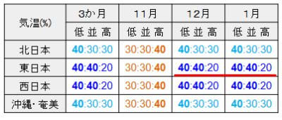

# 気象庁の3か月予報が出たよ！…11月は平年並みだけど，12，1月は冷えそう！

📅 投稿日時: 2022-10-27 02:51:12

ってなことで．

24日から冷え冷えデーが続いている

今日この頃ですが．

昨日，26日の朝まで冷え続けて…

横手山の人工降雪，降雪機の前には

盛り上がりが見えるほど積もってます！！

すごい！

（[横手山ホームページ](https://yokoteyama2307.com/news/18558/)より）

まぁ，人工降雪機の前以外はほぼ

積もってない感じですが…

今後人工降雪機が動かせそうな日は，

このあとしばらくなさそうだし…

もしかすると，29日夜～30日の朝は

ギリギリ動かせるかもしれないけど．

やっぱり11月2日の雨でやられそう…（涙）

とりあえず，この雪がゲレンデの下地に

なってくれればいいと願うばかり…

で．今週末も私はYetiに行く予定なんですが．

この週末は，天気が良さそうです！

今週末のYetiの予想：

　土日とも晴れ．

　晴れなのに，気温はそんなに上がらず．

　土曜は日が当たれば暖かさを感じる程度．

　日曜は晴れても寒さを感じるくらいに冷える

って感じでしょうか．

今週末，特に日曜に行く人は厚手の

ジャケットも持って行った方が良さそう…

ってなことで．

本題へ．

先日，10月25日に．

気象庁の11月～1月までの3か月

予報（[FCCX93](https://www.sunny-spot.net/chart/FCXX93.pdf)）が発表されました～！！

とりあえず，ラニーニャでそこそこ冷えそうな

予想のこの冬ですが．

気温傾向を見てみると…

うむ．

11月の東日本は，高温の可能性が40％と

高めだけど…

12，1月は，

低温の可能性が40％，

平年並みの可能性が40％，

高温の可能性が20％

と，そこそこ冷えそうな感じ…！！

ただ…

この気温傾向の予想．

以前書いた[北極振動](e5bde56aeb97978df16133d718c475baf.md)が考慮できておらず，

不確定性があると書かれています．

まぁ，参考程度にした方がいいってことですが，

それでも，気温が高くてどうしようもない

予想よりは嬉しいですね…

そして，

降水量を見ると…

11月は平年並みっぽいけど．

12，1月は降水量が平年より多そうなので．

雪がそこそこ降りそうですね…！！

とりあえず，下の図の左側．

11～2月の500hpa高度は日本付近で

低くなっていて．

さらに，真ん中の850hpa気温も日本付近で

低い傾向がみられるので…

基本的に日本付近は寒気が入りそうな

予想です！

特に左側の図，赤矢印で示した③のところ．

アリューシャン付近の高度が高めです．

これはすなわち，ブロッキング高気圧が

現れているということで．

このブロッキング高気圧が現れると，

日本付近に寒気が溜まり，冷え冷えに

なります…！

だもんで．

一応，12月，1月共に．

寒気が入って冬型の気圧配置が強く，

平年に比べ雪の日が多い…との予想ですね．

…ただ．

11月の850hpa気温予想を見てみると…

うーん．

日本は平年より暖かい領域と

平年より寒い領域の境目なので…

11月はそんなに冷えない予想です（ちょい涙）

とはいえ．

平年より気温がガンガン上がっちゃう

予想ではないので…

まぁ，そこそこ冷えて，11月下旬には

スキー場はオープンし始めてくれそうかな？？

ってなことで．

だいたい1か月前にあった，10月～12月の

予想からそれほど変わらず．

ラニーニャで気温が低めの冬になるという

予想ですが…

これ，だいたい昨シーズンの予想と

同じなんですよね．

…ってことは．

今シーズンも，昨シーズンと同様に，

12月のオープンの週から焼額のゴンドラが

営業できる可能性もあるってことだな．

むふふ…（期待）

とりあえず．

今シーズンも，スキー場には冷えて

いっぱい雪が積もりますように！！

## 💬 コメント一覧

### 💬 コメント by (northfox)
**タイトル**: Unknown
**投稿日**: 2022-10-27 12:07:39

11月は平年並みないし低温が60%！！ととらえて積雪が進むことを期待します。😄

12月と1月はあまり冷え過ぎず、根性の無いスキーヤー振い落とし装置が発動しないようにしてもらいたいものです。

### 💬 コメント by (スシネコ)
**タイトル**: Unknown
**投稿日**: 2022-10-27 13:21:13

ブロッキング高気圧と寒気の関係、全く知りませんでした。ちょっと調べてみたら偏西風の蛇行と関係があったのですね。お陰さまでまた一つ勉強になりました。やっぱりスキーを生活の中心にすると体も頭も健康になりますね。

### 💬 コメント by (Skier_S)
**タイトル**: 11月3日以降は冷えそう…！
**投稿日**: 2022-10-28 02:36:42

＞northfoxさま

11月も，終盤はガッツリ冷えてほしいですよね…

私も1月2月はそこまで冷えなくていいから，3，4月が冷えてほしいです…

＞スシネコさま

ブロッキング高気圧(ブロッキングHと書くことも多い)が出てるかどうかは，

天気図を読むときに結構気にしてます．

発達したブロッキングHが出てきたら，その後1週間とかしばらく冷え続けます…

### 💬 コメント by (李)
**タイトル**: Unknown
**投稿日**: 2022-10-28 13:44:56

今週末yetiでお会いできることが楽しみです！

天気及び雪の量予測もありがとうございます。例年並か例年より良いことは嬉しいですね

### 💬 コメント by (Skier_S)
**タイトル**: ＞李さま
**投稿日**: 2022-10-29 00:27:49

今週末は土曜にYeti出没予定です！

Yamaさんも一緒です．また明日お会いしましょう…！

