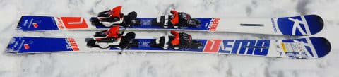
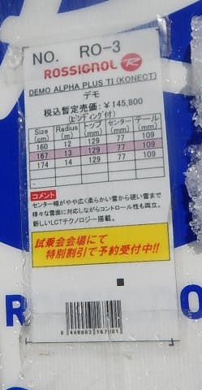
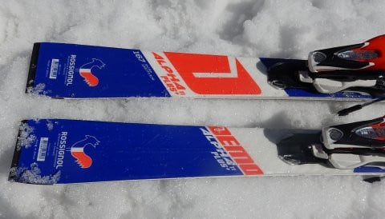
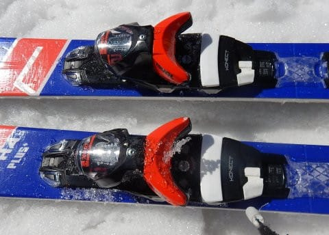
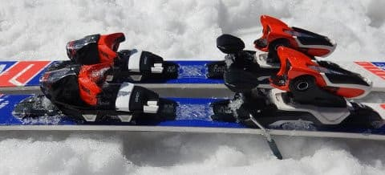
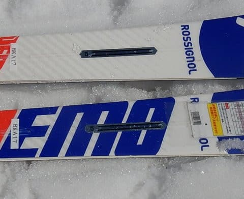

# 2019シーズンのスキー板，試乗レポート第2回…ROSSIGNOL編その1

📅 投稿日時: 2018-04-04 03:18:08

えー．

先週の志賀高原にて．

前回の試乗レポートの，レポーターの紹介部分．

間違えてるぞ

…という指摘を受けましたが．

私は何かを目指して滑っているわけでは無く，

単に自分の娯楽のために好きなように滑っている

お気楽レジャースキーヤー

だと思っているので．

全く間違えていないと自信をもって

答えられる，Skier_Sです．

ってなわけで．

2019年モデルのスキー試乗レポート第2回．

本日はロシニョール編です．

では，どうぞ～！

---

○ROSSIGNOL DEMO ALPHA PLUS TI 167cm

基礎小回り用．

昨年まではDEMO ALPHA 「SOFT」と言っていたのが．

DEMO ALPHA 「PLUS」という名前に変わったようです．

DEMO ALPHAの板はそのままに，ビンディングを

KONECTに変えたというモデル．

DEMO ALPHAのR22プレートのような頑丈な

プレートがないので，フレックスが柔らかめに

なるこの板．

DEMO ALPHAという名前は昨シーズンから引継ぎですが．

来シーズンは大きく構造を変えて．

今シーズンまで3シーズンほど続いたPropteckは無くなり，

トップからテールまでメタルのバーみたいなのが

入ったらしいのですが…

サイドカーブは13mと，小回りベースの板になります．

とりあえず，履いてみると．

かなり軽く感じる板．

結構フレックスは柔らかめで，角づけした

だけで簡単に板がたわんで，サイドカーブより

小さく感じる半径でくるくる回っていきます．

板に仕掛ける必要は全く無く．

圧を溜めにいったり，抑えに行かなくても．

レールターンのように，角づけを左右に

切り替えるだけで，結構小さめの半径で

楽にすいすい回ります．

ただ．

逆に板に圧をかけに行くと，グリップが耐えられず

板が外に逃げていく感じ．

うーん．

午後遅めで，雪が柔らかかったからかな～．

決して板がずれずれに逃げていく，ってわけでは無く，

コントロール性良く板が動いていく…

という感じだけど．

ハイスピードでガッツリグリップ，という板ではなく

ある程度の動かしやすさを狙った板のように思いました…

だもんで，荒れた春の雪をハイスピードで滑っていくと．

板が軽いのもあり，ちょっと板が叩かれて

キョロキョロ動いちゃう感じも受けます．

とりあえず，トップスピードでガッツリ

グリップを狙うとか，

体力を使って板をたわませて回っていくとか．

そういう感じではなく．

おそらく，整地でサイドカーブに乗って落ちていけば

すごいスムースに簡単に小回りができて，

それでいて軽く動かしやすい板なので．

比較的体力が無い人がカービングを決めていきたい…

ってのに向く板かな，と思いました．
