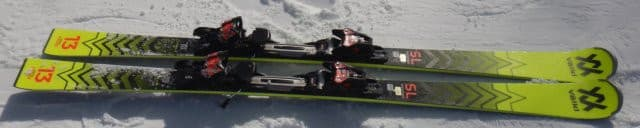
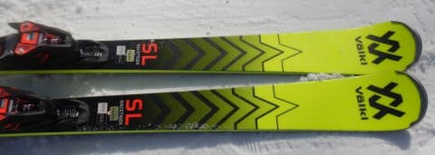
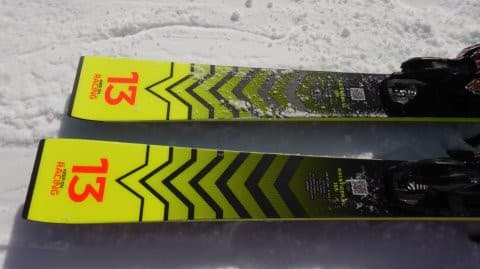
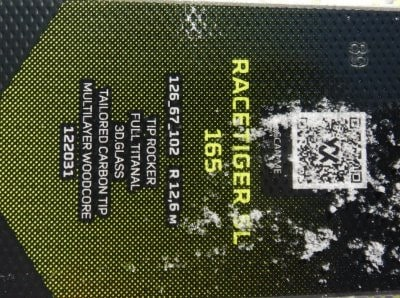
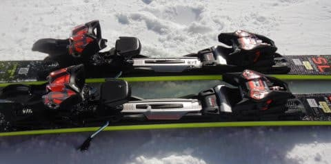

# 2023シーズンモデルのスキー板，試乗レポートその2…Volkl RACETIGER SL

📅 投稿日時: 2022-05-21 01:39:41

えー．

明日，土曜日のかぐらですが．

やはり朝から雨がぱらつき，

終日降ったり止んだりを繰り返す天気に

なりそうです…（涙）

そして，その雨は日曜朝まで残り．

朝9時から10時ごろまで雨が降る感じ

でしょうか…

その後は天気が回復していきそうですが，

曇り空が長く続く感じかな…？

で．

私の今週末ですが．

土曜にはいろいろやらねばならぬ

ことがあり（泣）．

日曜日帰りで，営業最終日のファイナルかぐらに

参戦することになりそうです…

うむ．

今シーズン，月山は大斜面が滑れないし．

沢コースだけのために往復1000km移動するのは

ちょっと考えちゃうから．

もしかしたら，今週日曜が今シーズンラストの

スキーになるのかも？？

ってなことで，本題へ．

昨日に引き続き，2023シーズンのスキー板

試乗インプレッションの第2回目．

今回はフォルクル編です．

では，どうぞ～！！

○VOLKL RACETIGER SL 165cm

基礎小回り用

VOLKLの小回り用は，

SL競技用のRACETIGER SL WC

基礎小回り用の上級モデルRACETIGER SL MASTER

基礎小回り用のセカンドモデルRACETIGER SL

と，最後にWCがつくかMasterがつくか，無印かで

3種類を見分けるという，紛らわしい

ネーミングですが…

今回試乗したのは，基礎小回り用のセカンドモデル，

無印のRACETIGER SLです．

確か，今年モデルは無印のSLは板のトップに

UVOが付いていたはずですが…

2023シーズンモデルからは無くなるみたいですね．

で．

Masterはプレート付きですが，無印は

プレート無しのrMortionビンディングが付きます．

サイドカーブはMasterと同じですが，

プレートが違って，板の内部構造（コア材）も

違うみたいです…

ってなことで．

履いてみると…

めちゃくちゃ軽い！！！

そして，板のトップがグリップして，

トップがインに入り込むような感じで

グイグイ小回りに入っていきます．

それでいてテールの張りが比較的強く，

このテールの張りでターン後半に板が

すっと抜けていく感じで，ターンの

抜けの良さを感じます．

圧がスッとテールから抜けた後，

またトップが捉えてトップがインに

回り込んでいく…という，板が勝手に

トップとテールを使い分けてくれる

ような気持ちよさがあります．

Masterに比べ，セカンドモデルだしプレート

無しだから弱いかというとそうではなく，

テールがしっかりしているからか，

ハイスピード小回りでも，ターンの

仕上げの圧がかかるところで板が逃げたり

ぶれたりすることが無く，スピードを

出しても怖くない！

意外とスピード耐性があります．

スピードを出していくと，かなり鋭い

小回りが決められます．

かなり深めの，思いっきり傾いた小回りを

堪能できます．

やはりSL系のサイドカーブなので，

大回りは得意としませんが…

弱い板ではないので，かなりのハイスピード

でも，小回りスペシャルになっちゃうこと

なく，中回りくらいまでの回転弧は作れます．

その中で，板が軽いのが効いていて，

バーンが多少荒れていても板を好きな

ところに思ったように動かせる軽快さもあるし，

キンキンに切っていくカービング小回りも

キレキレにできるし．

小回り用の板としては，結構気に入りました…

標準のストラクチャーがツリーストラクチャー

みたいで，板の滑りも良かったのも印象的．

小回りメインの板としては，かなりの

好印象な板でした．

軽い板が好きな人にはおススメ！
