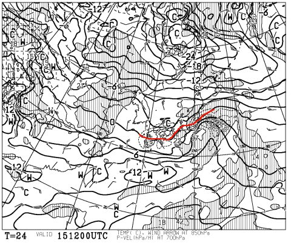

# 今週末の志賀高原の天気ですが…土曜は雪降り，日曜は晴れかな

📅 投稿日時: 2015-01-15 02:21:42

🏷️ カテゴリ: [スキー天気予想](c6554f5c3c106093b511a8daae23757e8.md)

えー．とりあえずですね．

現在の最新の天気図を見ると．

15日に雨になることはなさそうで，一安心…

15日夜9時の850hpa図ですが．

こんな感じで，0℃線は志賀高原より南まで下がり．

ぎりぎり-3℃線がかかってます．

だもんで．

雨になることは無いでしょう…（ほっと一息）．

15日の昼過ぎ，降り始めは湿った重い雪ですが．

そのあとは冷えた雪が16日朝まで降り続きそうな感じ…

で．

16日は．

こんな感じで，また私の嫌いなプチ低気圧が発生する予想で．

前回も書いたように，こーゆープチ低気圧がある天気図になると．

予想が大きく変わることが多く．

16日に雪が降るかどうか．まだわからないです…

低気圧のわずかなずれで，雪がドサドサ降るか，

すっきり晴れるか．

全く変わっちゃいます…

運が良ければ．

16日もドサドサ降って，17日朝はパウダー．

運が悪ければ，

16日は全く積雪なしです．

うーむ．

パウダーになるよう，祈りたいところ．

んで．

17日，土曜日ですが．

これは，降りますっ！！

んで．冷えます．

17日夜9時の地上天気図はこんな感じで，見事な縦縞だし．

850hpa図を見ると，赤く印した0℃線ははるか南で，

志賀高原には，水色で記した-12度線がかかってます…！

これは，昼間でもマイナス10℃クラスの冷えかな…

冷えて一日雪が降りつづけ，チョー寒い1日になりそう．

そして，18日の日曜は，地上天気図はこんな感じで．

高気圧が張り出してくるので…

日曜は，晴れそう！

朝までチラチラ雪が残る可能性もあるけど．

少なくとも午前中には雪が上がり，日差しのもと

シマシマ圧雪バーンを滑れるかな！

昼間の気温は，土曜日に比べて結構上がりますが．

でも，雪が悪くなるほどではないな～．

ってことで．

まとめると．

土曜日：朝はパウダーが積もっているかどうか，まだ未定．

　朝から雪が降り続け，終日雪降り．太陽は拝めない．

　かなり寒い！朝はマイナス15度以下かな．

　昼間もマイナス10℃くらいでしょう．

　昼間も時折雪は強く降り，ゲレンデに積もるくらい．

　午後はもさもさバーンかな…

日曜：朝までチラチラ雪が残るかもしれないけど，

　午前中から日が射す．朝イチは最高の冷え冷えシマシマ

　圧雪バーンが楽しめるはず！

　午後はすっきり晴れて，土曜より気温は上がり

　快適な一日．雪質は午後も全く問題なく，

　トップシーズンの恵まれた一日となるかな～．

現時点では，こんな感じです．

ただ，前日金曜の積雪量と，日曜の晴れるタイミングは

まだ予想が難しく，変化する可能性もありますので，

直前にまた予想します…

## 💬 コメント一覧

### 💬 コメント by (びわ湖)
**タイトル**: Unknown
**投稿日**: 2015-01-15 13:01:25

S様 楽しくチェックさせて頂いています。教えて頂きたいことがあります。

昨年 夏にSさんと同じSX サイズ160を値段に負けてしまい購入しました。今年、乗ったのですが後半、後ろのエッジが抜けにくいです。乗り方のコツが有れば御教授お願いします。トップも安定感がない気がして、少し怖いです。

### 💬 コメント by (Goku)
**タイトル**: Unknown
**投稿日**: 2015-01-15 21:45:24

先週は行きそびれたので今週は快晴の焼額山シマシマバーンを滑りに行きます♪

### 💬 コメント by (Skier_S)
**タイトル**: びわ湖さま
**投稿日**: 2015-01-16 03:25:02

えー．

びわ湖さんがこれまで履かれていたのは，

おそらくロッカースキーが出る前の板かと推測します…

SXはトップロッカーですので，ロッカー板なりの

乗り方を求められます．

トップを押さえに行ってはいけません．

母指球荷重はNGです．

ひたすらくるぶし～かかとのあたりに

乗り続けてやってください．

谷回りでも，センターを押し続けていれば良くて，

トップを押さえに行く動きは全く要りません．

むしろ，山回りでは外足を前に持っていき，

切り替え時にはその前に出した谷側の板の

テール部分の上を重心が通っていくよう，

谷側に体を運んでいって切り替えることで，

板のテールの硬さによる板の走りを引き出せます．

とりあえず，これまでの板より10cm後ろに

荷重ポイントがあると思ってもらえれば，

ロッカー板の性能が引き出せるかもです．

…慣れてない最初は，かかとより後ろに乗るくらいの

勢いで後ろに乗ってもいいかもしれません．

…私はSXに慣れすぎて，谷回りでトップを

押さえないといけない板に乗れない体に

なってきました（笑）．

この板に慣れると，もう病みつきになりますよ．

### 💬 コメント by (Skier_S)
**タイトル**: Gokuさま
**投稿日**: 2015-01-16 03:25:45

ってことは，日曜参戦ですか？

私はいつも通り，土日とも朝からかっ飛ばしていると

思います～！

