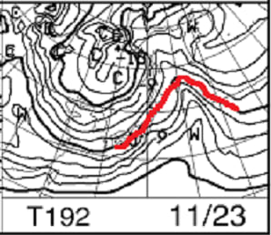
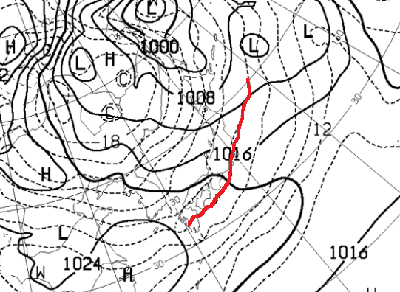

# 11月23日からかなりの冷え込みが27日までは続きそう…今の天気図のままなら26日前後にそこそこ積雪も！

📅 投稿日時: 2021-11-17 01:46:52

えー．

金曜日の記事で，

「14日から19日まで冷えなさそう」

と書いたのですが．

熊の湯は15日以降，本日16日まで，

気温が高く人工降雪機が全く動かせなかった

ようです…(涙)

横手山は，16日に人工降雪機動かせたの

かな…

アサマ2000は早々に20日オープンを

あきらめ，27日オープンに切り替えた

ようですね．

（[アサマ2000ホームページ](https://asama2000.com/2021/11/15/%e3%82%aa%e3%83%bc%e3%83%97%e3%83%b3%e5%bb%b6%e6%9c%9f%e3%81%ae%e3%81%8a%e7%9f%a5%e3%82%89%e3%81%9b-2/)より）

この後は，17日朝は人工降雪機が動かせる

かな…

でも．

18日はヤバそうで．

19日は絶対動かせない気温に上がりますね(涙)

20日も人工降雪は厳しいかな…

当然のごとく．

20日オープン予定のかぐら，湯ノ丸，

鹿沢が予定通りオープンするという

甘い期待は捨てましょう(泣）>

熊の湯もダメだと思います…

で．

19日にオープンする横手山．

オープン後の20，21日の週末には

人工雪の積み増しができなさそうで．

ちょっと厳しい気配…

そして…その後の21，22，23日の

850hpa気温を見ると．

うむ．

あまりよくなさそうな予感…(ちょい涙)

天気図を見てみると．

…21日の日曜は赤い0度線がかなり北に行き．

志賀高原は+6度線がかかるくらいなので…

ダメですね．

むちゃくちゃ気温が上がって，

さらに雪が厳しい状態になりそう…

21日の地上天気図は，網掛けの降水域に入って

ないので，雨は降らなさそうなのが救いかな…

でも．日が差すと雪が一気に解けそうな

やばい気温なので，曇りの方がいいけど…

晴れたらやばいです．

そして，22日の月曜は．

なんか0度線が志賀に近づいているように

見えますが…

残念ながら，昼間は南風で気温が上がります．

そして，0度線付近の気温線が詰まっている，

「温度傾斜がきつい」状態になってます．

これは，典型的な荒れる天気のパターン．

で．22日の地上天気図を見ると．

…ダメだ(死)

この日は，日本全国が網掛けの降水域に

覆われているので．

強烈な南風の雨になりそうです．

おそらく，横手も営業できないほどに

雪がやられてしまいそうな雨… （激泣）

だもんで．

22日の雨で雪が解けてしまい，

23日の祭日も，オープンできる

スキー場はないどころか．

横手も一時営業休止になるかも…？？(止まらない涙)

でも．

でも，23日になると…，

ちょっと冷えてきてるかも？

赤い0度線がやっと志賀より南に

下がってきましたよ！！！

そして，23日の地上天気図は…

一応，志賀にも降水域の網掛けが

かかっているけど．

…せっかく冷えたのに，今度は西風で，

おそらく志賀は降らないパターン(泣)

降っても積もるほどじゃないです…

残念…

でも，人工降雪機はフル稼働できそう！！

さらに．

この水色矢印で記したように．

なんだか24日以降は，28日くらいまでは

結構冷えてくれそうなのだ！！！

ってなことで．

あまり精度が高くないので，これまでそれほど

使わなかった，FEASシリーズの天気図．

これは，最大11日間の天気図が出ているので，

これを見てみると…

をを！

24日の天気図では，赤い0度線が

太平洋側まで下がってます！！

激冷えです！！

ちょっと志賀では西風っぽいけど…

うまくいけば雪がわずかに積もるかも？？

日本海側はそこそこ雪が降ってくれそう！

そして，25日も…

赤い0度線は，志賀高原より南側！！

大丈夫！

人工降雪機は終日フル稼働できます！！

で，26日の土曜は…

この日も，0度線は志賀より南側です！！

そして，地上天気図の等圧線も縦じま！！

縦じまの冬型の気圧配置なので北風が

入ってくれて，志賀も積雪があるかも…

この天気図が正しければ，日本海側は

結構な雪になりそうな感じ…！！

ってなことなので．

おそらく．

24日以降，27日の週末に向けて

冷えてくれて．

26日はそこそこの天然雪も期待できるので…

27日はかなりのスキー場がオープン

できそうな予感…！！！

…でも．

ちょっと心配なのは．

FEASの天気図．

これまでの経験則上．

1週間より先の予想は，あまり正確じゃ

ないんですよね…

果たして，この予想通りになってくれる

のか？？？

とりあえず，ほかの天気図と突き合わせて

みても．

24日以降は冷え込むことは間違いなさ

そうなので．

20，21日の週末と23日は残念な感じに

なりそうだけど．

27日の週末に期待っ！！

## 💬 コメント一覧

### 💬 コメント by (真美子)
**タイトル**: Unknown
**投稿日**: 2021-11-17 13:33:48

12月なのですか? 11月の間違いではなく、

### 💬 コメント by (Skier_S)
**タイトル**: ＞真美子さま
**投稿日**: 2021-11-18 05:38:03

すみません！11月でした…

ご指摘ありがとうございます～！！！

