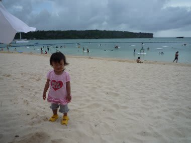
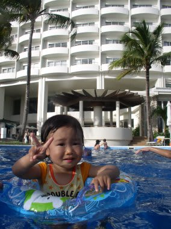
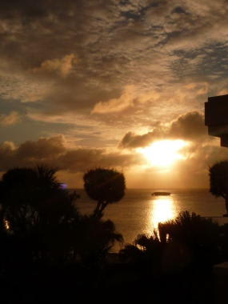

# 初の子連れダイビング旅行記＠2009年　その12　娘，初海水浴に行くも…

📅 投稿日時: 2012-07-23 01:28:54

🏷️ カテゴリ: [ダイビング日記](ce3a7a8d424d112fce83ee85c81a0e344.md)

あー．

3年前のこの旅行記も．

今回と次回のあと2回で終了です…

で．

実は先週の3連休でまた潜りに行っていたので．

この旅行記が終わっても．

今度は新しい旅行記が続いたりします…

では，本編行ってみよう！

----

で．

2本目は私が潜ったので．

3本目は妻が潜りに行って私が娘の子守役．

…プールばっかりで，娘も飽きただろうなぁ…

今度はプールじゃなくて海に泳ぎに行こう！

と，娘を連れてビーチへ出てみました．

しかし．

なぜか．

砂浜に出て，泳がせようと服と靴を脱がせた瞬間．

なんだか，娘の動きが固まりました．

すごくいやそうな顔をしているんですが…

一体どうした？？

なんか，片足を上げて「あんよ，あんよ～！」と，訴えかけます．

え？足がどうしたの？

と，見ていると…

今度は反対の足を上げて「いや～！」

…なんと．

砂が足につくのが気持ち悪いみたいで．

「砂だから気にしなくていいよ～」

と言ってみても，両足を交互に上げて，足を手でぬぐって

「いや～！！！」

って泣き出しました．

うーーーーーーーーーーーーむ．

予想外．よそうがいっ！

砂が足につくのがいやとはっ！

とりあえず，抱きかかえて海に連れて行き，

海の中につけて足の砂を落としましたが…

そのあと，海底に着地させると，砂に足が潜って

動きが固まりました．

ものすごいいやそうな顔をして，目で必死に

「ここは嫌」と訴えかけるので，仕方なくプールへ．

半泣きの娘をプールに連れて行くと，生き返ったように

「ばしゃばしゃーっ！」

と言って元気に遊びまくります．

お前，プールだとゴキゲンなのね．

うーん．海が駄目とは，ちと想定外だった…

プールで遊んでると，ダイビングが終了したみんなが

戻ってきました．

これで全員ダイビング終了．

器材を洗って片付けなくてはならないので，いつもの

「娘をプールから引き離す」儀式を執り行い，

他の物で気を引きながら注意をプールからそらして行きます．

ダイビングショップで器材を洗って，

ショップでログ付け．

で，これまで3日間撮りためた写真を，ノートPCで持って行き

確認しながらログ付け．

娘も一緒に魚の写真を見て喜んでます．

すると，私のワイド写真を見かけたガイドの皆さんから．

「え？これ，うちのダイビングで撮った写真？こんなにきれいに写るんだ…」

という，予想外の反応が．

えーっと．

間違いなくおたくのショップで撮った写真です．

皆さんが毎日潜っている海です．

…初級者ゲストが多いショップでは，あまりカメラ派の人が

潜りに来ないから，こういうワイドの写真をあんまり見ないんでしょうかね～．

って感じで．

すべてのダイビング日程を無事終了．

とりあえず，両親の誰かが残って「プールで」

面倒を見ててあげれば，ダイビングはまったく問題なく

乗り過ごせたので一安心．

この日の夜は，ビーチにある沖縄居酒屋でゆっくり夕日を眺めつつ，

沖縄料理で過ごします．

 

娘は大好きな海ぶどうをいっぱい食べて大満足．

こうして．

沖縄最後の夜も，無事更けていったのでした…

## 💬 コメント一覧

### 💬 コメント by (マルハバ)
**タイトル**: Unknown
**投稿日**: 2012-07-23 08:30:33

ウチの娘も海嫌いです。

プールで潜るのは大好きでしたが

本人に言わせると「しょっぱいのがイヤだ」

とのことです。

生まれて初めての海水浴が

パラオの無人島（ウーロン島）

という贅沢さだったのに…

その後モルディブへ行っても

海へは行かずプールに入り浸りでした。

名前に「海」の字をつけてやった

親の面目？まるつぶれです(笑）

### 💬 コメント by (Skier_S)
**タイトル**: うちの娘は…
**投稿日**: 2012-07-23 23:46:46

いやー．

やっぱり，子供は最初は海が嫌いなんですね～．

しかし，初めての海水浴がウーロン島ですかっ！

まさか，ダイビングに連れて行って昼休憩のとき，

ってわけじゃないですよね…

うちの娘は，砂浜が嫌いだったようですが，いまでは

砂浜も海も好きになってくれました．

…ただ，珊瑚がとがっていて刺さりそうなので，

珊瑚がいっぱいある海が嫌いという，わけの

分からない子供に育ちました(涙）．

### 💬 コメント by (マルハバ)
**タイトル**: そのまさかでした
**投稿日**: 2012-07-24 23:28:21

女房子供を島に下ろし

シアス方面へボートダイブ2本の約3時間あまり

誰一人いないウーロンで

無人島体験をさせてしまいました（汗）

更にお迎え時は潮が引いてボートが接岸できず、

ビーチで不安げにうろたえる母子を

泳いで助け？に行ったくらいなので

まさかどころではなかったのかも（爆）

### 💬 コメント by (Skier_S)
**タイトル**: その「まさか」でしたか…
**投稿日**: 2012-07-25 01:28:43

いやー．

まさか，ホントにダイビングで行っていたとは…

あのコロールからのウーロンまでのボートって，結構時間がかかるじゃないですか．

初めての海で，いきなりそれですかっ！

船酔いとかしなかったですか？？

うちもいつかは子連れでパラオに行きたい！

と思っていますが，あの長時間のボート移動と，

慶良間とは違ってダイビング中にボートの回りを泳いで遊ぶとかできないので

ダイビング中に子供が何で暇つぶしをするのか…

という問題で，いまだに実現していません．

ああ．ホントは子連れパラオと子連れモルジブダイブクルーズ行きたいんだけど…

