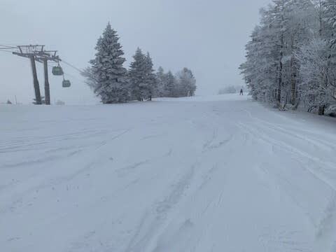

# 志賀高原に行ってない週末だけど…3月2日(土)の志賀高原スキー場は，特派員によれば積雪10cm，朝は小雪で午後は晴れ

📅 投稿日時: 2024-03-03 03:05:40

🏷️ カテゴリ: [日記](cc4b5682fb7b8b144980957a978653fb0.md)

ってなことで．

志賀高原へ行けない本日．

志賀へ行ってないので時間があるだろう…

と思われるかもしれませんが．

[家の引っ越しや転勤](eea295bc788d44e3b95fbd0da86a37884.md)があろうが，

海外出張から帰国した日とか，

海外出張に行く日だろうが，

骨折して退院した翌週からでも

スキーに行っていたという，

よっぽどなことがない限り，志賀高原へ

向かう私のことですから．

週末に志賀高原に行けないということは，

それだけクリティカルということで…

せっかくの土曜なのに睡眠時間も

それほど取れず．

また深夜まで必死に仕事しているという

悲しい状況なわけだけど．

それでも，今日もちゃんとBlog更新！！

えらい！！えらすぎる！！

まず．

本日も特派員の方が志賀高原の写真を

送ってくださいましたが．

3月2日の土曜の朝は，雪降りで迎えた

ようで…

-15℃近い冷えという予想ほどには

冷えなかったけど，

あさイチの気温は，冷え冷えの-12℃！

で，

朝までの積雪は予想の10cmをわずかに

上回る15cm程度．

あさイチのバーンは，圧雪の上に

10cmほどの軽い雪が乗った，

トップシーズンのコンディション！

そして，朝のうちは小雪が舞い，

視界もそれほど良くなかったみたいですが．

昼頃には日も差すようになり…

午後は予想通り，いい感じに晴れた

ようです…！！

…そして，クローズのはずのオリンピック

コースにも，シュプールがいっぱい…

日が差したけど，最高気温は

これもほぼ予想通りの-5℃程度．

晴天だけど冷え冷えで雪質もよく．

バーンも夕方には多少荒れたものの，

冷え冷え最高雪質で終日滑れたようで…

うーーーーーん

うらやましい…！！！！

さらにはナイターにまで繰り出した

特派員もいたようで．

ペアリフトの一ノ瀬ファミリーナイター

だけど，楽しめたようです…

いやーーー．

久しぶりにトップシーズンのゲレンデが

戻ってきたみたいですね～…！！

あぁ…

久しぶりのトップシーズンのコンディションの

一日．

なぜ私は家にいるのか…

明日の志賀高原は，槍とミサイルが

降るように呪いの念を送らないと

いけないかな？？←心の狭いヤツ

でも．

このあとは，3月5日から6日にかけて

液体が空から降る危険性があるものの．

今後1か月間，3月の間はだいたい平年並みで

推移してくれそうだし…

おそらく来週も，そこまでコンディションは

悪くならないはず…！！！

と必死に念じながら，来週はスキーに

行けることを願っている，Skier_Sなのでした…

## 💬 コメント一覧

### 💬 コメント by (4年前から読ませてもらってます)
**タイトル**: Unknown
**投稿日**: 2024-03-03 12:43:54

昨日はコンディション良かったのに何故か人が少なく、レストランもゴンドラもガラガラでしたよ。来週行けるといいですね

### 💬 コメント by (副院長)
**タイトル**: Unknown
**投稿日**: 2024-03-04 00:42:05

大阪から、8週連続の方もおられるのですね。勇気もらえます。他にもすごい人いる、僕も9週目にはいりました。今日で、第3高速おわりましたね。最後の客として上がりました。なんか寂しいです。

### 💬 コメント by (Skier_S)
**タイトル**: 最高の週末だったようで…
**投稿日**: 2024-03-04 02:22:45

＞4年前から読ませてもらってますさま

コメントありがとうございます～！

この週末は最高だったようですね…

来週も最高であり続けるように願うばかりです．

来週こそ滑りに行きます！！

＞副院長さま

おっと．9週連続ですか…

関西から9週連続はすごいですね．

今日で第3高速終わりは寂しすぎますが，ちゃんと雪だしして

シーズンを長くしてくれるなら耐えましょう…

