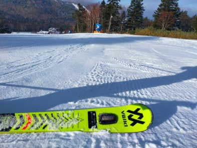

# 2022/11/19(土)の横手山スキー場，特派員レポート！！

📅 投稿日時: 2022-11-20 01:20:19

えー．

厚生労働省基準では，私はどうやら濃厚

接触者には当たらないみたいなんですが．

（1m以内でしばらく対話した場合でも，

　お互いにマスクをしていれば濃厚接触と

　ならないらしい…)

でも念のため，大勢が出向くスキー場へ

行くことは自粛したSkier_Sです…（涙）

今のところ幸い発熱などの症状はないですが．

とりあえず，接触後5日間の火曜までは

在宅でじっとしている予定です…

どれだけ仕事が忙しかろうが，徹夜だろうが

スキーに行く自分にとって，こんなことで

スキーに行けなくなったのは残念だけど，

まだトップシーズンじゃなくて良かったと

自分で慰めています…

ってなことで．

私はスキーに行けませんでしたが．

またいつもの特派員が横手山に

行ったようなので．

今回は，特派員の横手山レポート！

えー．

まず．

朝イチは，海和さん，渡部三郎さん，

モーグルの堀島選手のデモ滑走でスタート

したようで…

バーンコンディションも良さそうです！

あさイチから天気がよく，山頂から

遠くまで見晴らしせるほどの晴天で…

今朝まで人工降雪機がしっかり動かせた

ようで，土も出てないいいバーン！

特派員は捨て板じゃなく，シーズン本番用の

板で滑って問題なかったみたいで．

かなり硬めに仕上がってるのにエッジが

ガッツリ効く，快感バーンだったみたいです…！！

予想以上にバーンコンディションが良さそうに

見えますね…

リフト降り場付近も，雪がたっぷり！

ただ，天気がよい土曜の週末．

さらにバーンコンディションがよいと

来れば…

当然，リフト待ちがすごいことになった

みたいで．

3本目を滑ったあたりからリフトが混み始め…

10時半ごろには最大15分待ち！！

午後になったらすくかな，と思ったけど．

午後になっても6~8分待ちくらいに短くなった

程度で，リフト待ちは続いたらしく．

ペア1本だけだったので，リフトはかなり

待ったみたいです．

でも，クワッド+ペアの2本で廊下ゲレンデに

人を送り込むイエティと違って，

ペア1本だけの輸送力しかないため．

リフト待ちは長くても，コース上の

混雑はそれほどひどくなかったみたいですね…

午後になって気温は多少上がったものの，

下地が十分硬かったので，表面がしっとり

した程度にしか緩まず…

ゲレンデは午後になっても，いい感じの

バーンコンディションをキープしたようです！

うーん．

イエティに比べると，コース上の人口密度が

常識的な範囲に収まってるように見えますね…

ってなことで．

一日券が4800円もする

という高額投資の元を取るべく．

この特派員はラストまで滑ったようですが…

ラストまでしっかりカービングできる

いい雪だったようで．

ラストの頃にわずか2カ所ほど，雪が

薄くなってきたところもあった程度で．

あさイチから15時のリフトストップまで，

昼休みもとらず，たっぷり滑ってきた

ようです…！

うーん．

志賀高原の特派員．

休みを取らずひたすら滑る，

終わってる人が多いなぁ…
