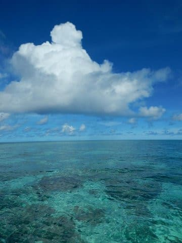
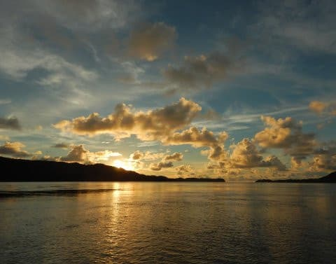
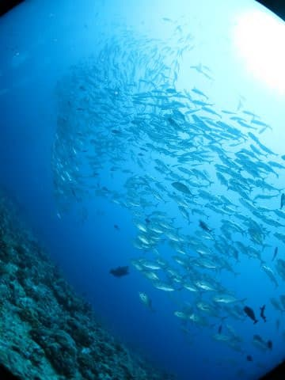
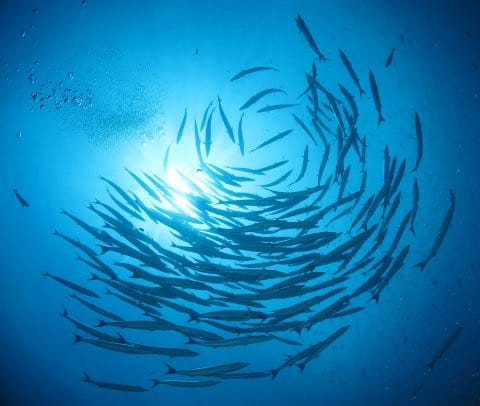
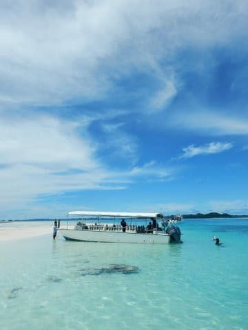
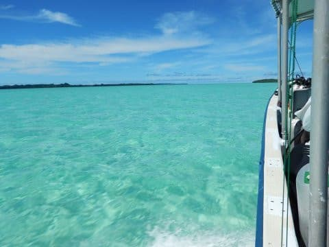

# 2017年8月，小学生の子連れでパラオ再訪！…プロローグ

📅 投稿日時: 2018-08-20 01:38:11

🏷️ カテゴリ: [ダイビング日記](ce3a7a8d424d112fce83ee85c81a0e344.md)

えー．

昨日は，ナビ取り付けレポートで．

リアカメラ配線に続く，2度目の衝撃の事実を

報告しましたが．

本日は，徒然スキーヤー日記の本来のネタ，

ダイビング日記を挟みます…←いつもながら，矛盾に満ちた表現だ…

いや，来週にはもう夏休みPart2の座間味旅行に行くというのに．

まだ去年のパラオの旅行記を全く書いていない

ということに危機感を感じ．

そろそろ，昨年のパラオ旅行記を

書き始めないと…

と思った次第で．

ってな感じなので．

本日は，昨年8月(もう1年前ですね（涙）)に行ったパラオ旅行記．

ようやっと開始です！←旅行記はいいから，ナビ取り付けレポートを早く…という声が聞こえる気がする…っ！

では，どうぞ～！

---

2017年，娘が9歳の夏．

来年になれば，10歳から取得可能な，

ジュニアオープンウォーターダイバーの

Cカードが取得できる，わが娘．

娘に体験ダイビングをさせてみて．

ダイビング適性も問題ないことが分かったので．

間違いなく．

来年は，娘をダイバーに仕立て上げることになる．

となると…

ジュニアオープンウォーターは，11歳までは

最大深度12mまで…という制限があるし．

また，12歳になっても，潜れるのは18mまで．

12歳から取れるジュニアアドバンスを取っても，

15歳になるまでは最大21mまでという制限があり．

あまりディープなポイントに連れて行けません．

さらに，我が家ではせいぜい年間15～20本程度しか

潜らないので．

そこそこの流れのある難しめのコンディションでも，

なんとか潜れるかな…っていう目安．

50本を潜るには，3-4年はかかるだろうし．

とりあえず．

娘がダイバーになる来年以降．

5年間ほどは，難しい海に行くことはできないわけだな．

…となると．

ディープでタフな海は今年のうちに行っておかないと

次いつ行けるか分からない

ということなわけで．

…だとすると．

カレントはストロングだけど，大物ガンガンの

パラオのブルーコーナー．

そして，ブルーホールやマクロ穴など，30m近い

ディープな海．

そーゆーところには，あと5年ほど行けないと

いうことだよね…

今年行っておかないと．

次に行けるのは5年後…

…

…これは．もう．

今年行くしかないじゃないか！！

ということで．

娘がダイバーになる前のラストチャンスとして．

3年前に行ったパラオに再訪することに決めたのでした…

これでしばらく，大物ガンガンの上級者ポイントには

行けなくなるので．

ブルーコーナーを潜り倒すぞ～っ！！

　

　

　

　

