# 1月11日の志賀高原は…時々晴れ間もさし、予想よりよかったよ！

📅 投稿日時: 2015-01-11 21:28:21

ってことで。

無事、今週も志賀高原にやってこれましたが。

…なんだか。

今日は（も？）。

…予想と違う天気で始まっているのですが。

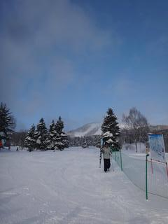

え？

なんで、晴れてるの？？

山頂へ出ると…

やっぱりすっきり晴れ！

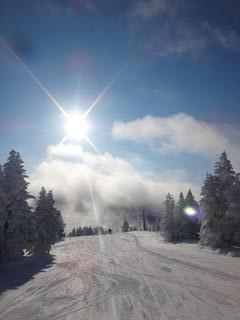

まぁ。

予想が外れたとはいえ。

こんなうれしい外れ方なら大歓迎！

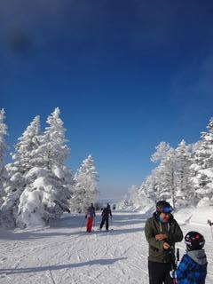

…私の天気予想の信頼性は落ちていくけど(涙)

そして。

山頂の気温はマイナス9度と。

まーまー冷えてます！

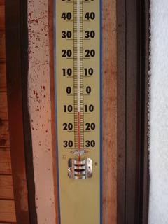

んだもんで…

雪質は最高っ！！！！

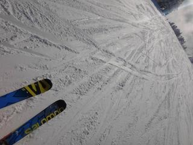

ぐはははは！

朝イチは、最高晴天の縞々バーンだっ！

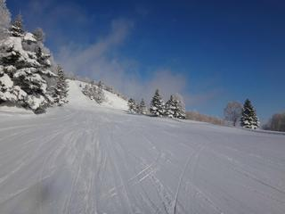

新雪バーンはそれほどでもなく、10ｃｍほどの積雪かな。

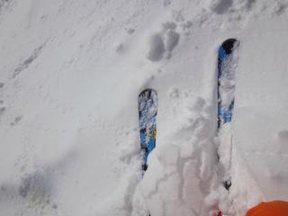

でも、晴れてて気持ちいい～！

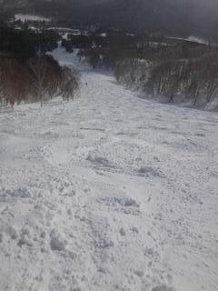

これは。

時々雲がかかるときはあるものの。

終日雪の予想だったのに、こんなに晴れてくれるなんて。

これはきっと、私の日ごろの行いの…(以下略）

いやー！

きもちいいよ！

と、滑っていたら。

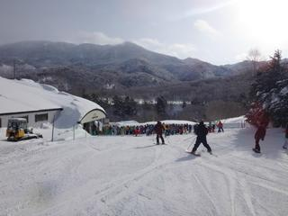

あららら。

やっぱり、午前10時には…

ゴンドラ10分以上待ち（涙)

そして。

ゲレンデの人口密度も…

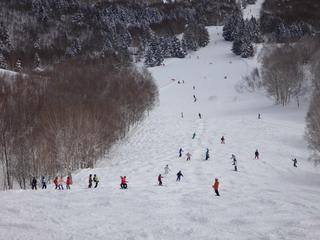

うむ。

あがっていきますな。

ゴンドラは、いつもどおり11時半には待ち時間がなくなったけど。

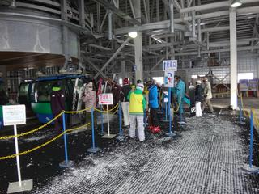

ゲレンデの人口密度は、2時ごろまでちと高め。

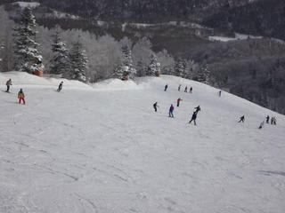

そして、雪が結構降ってきました…

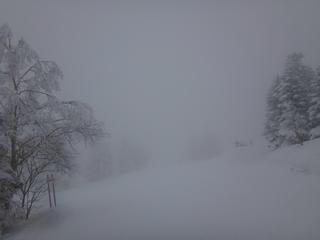

でも。

4時ごろには、結構本格的な降りになってきたけど。

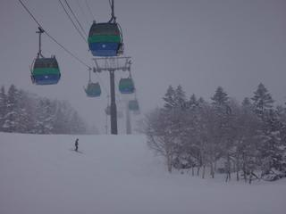

幸いゲレンデは夕方までそんなに荒れずに。

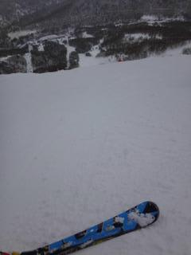

夕方まで、滑りやすかったな～。

そして、ナイターに行ったわけですが。

なんだか、すごい雪で…

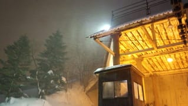

なぜか、圧雪のかかるサンバレーナイターが、新雪なんですが…

ってことで。

ブーツパフのナイター、楽しみました～！！！

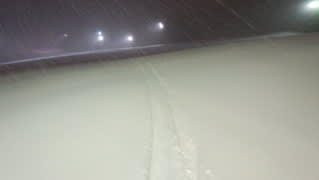

ってことで。

本来なら、終日雪のはずの本日。

午前中、すっきり晴れてくれたのは。

きっと、私の日ごろの行いが…（パーン)←読者に狙撃される音

## 💬 コメント一覧

### 💬 コメント by (すぎぃ)
**タイトル**: Unknown
**投稿日**: 2015-01-12 10:36:43

>（パーン)←読者に狙撃される音

原田知世に撃たれたりして(私スキ)

### 💬 コメント by (Skier_S)
**タイトル**: すぎぃさま
**投稿日**: 2015-01-12 22:33:53

…若いころの原田知世に撃たれたら，

私もスキーで転んじゃうかもしれません（笑）．

