# 12月13日の志賀高原詳細モード…曇～雨，ゲレンデ状態も残念な感じ（涙）

📅 投稿日時: 2015-12-15 00:58:58

🏷️ カテゴリ: [2016スキー滑走日記](c70c67ed5248e9432b899dcd5747048bb.md)

えー．

いろんなニュースで言われてますが．

16日の水曜日から冷えそうな今日この頃，

皆様いかがお過ごしでしょうか．

いや．17日の木曜日は，今のままの天気図なら．

…かなり冷えて，結構降りそうですね…

…今週末は期待できるのかな？？

ってことで．

昨日速報した，日曜の志賀高原，焼額山の状況．

本日は詳細モードです！

まず．

朝，起きた時に．

…なんだか，すんごい気温が高い気が…

そして，リフト営業開始に合わせて外に出ると…

え？

なに？これ？

ポツポツと雨が降り出してるんですがっ！？？

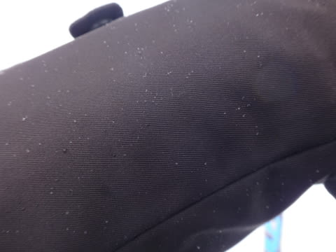

こんな感じで，ほとんど気にならないレベルの

降りだったのが救いですが…

午前中は，この程度の

「あれ？雨かな？」

って，気づくかどうか，といった程度の

ポツポツした雨がたまーに降る，と言った

感じの天気．

で，

昨晩から気温も下がらず，人工雪も打てなかったので…

雪は全く増えてません（涙）．

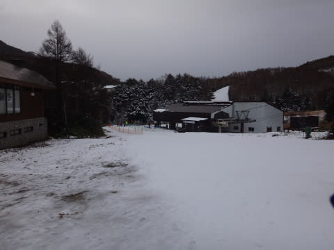

っつーか．

減ってます，雪．

コース脇は，かなり土が…（泣）．

そして．

リフトで山頂に出ると…

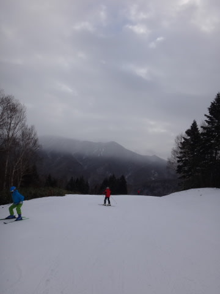

うむ．

雪質は水を吸った重めの，春の雪ですな…（涙）

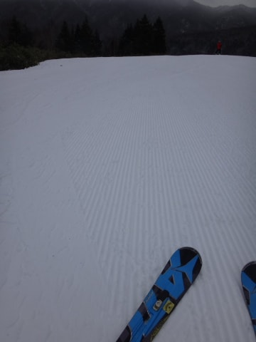

でもまぁ，朝イチはシマシマバーンで，

数本は楽しめたのですが…

朝9時には．

ふむ．研修会の皆さんが出てきましたね…

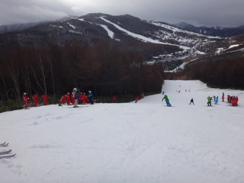

そして．

ゲレンデが人でいっぱいになってしまいましたね…（悲）

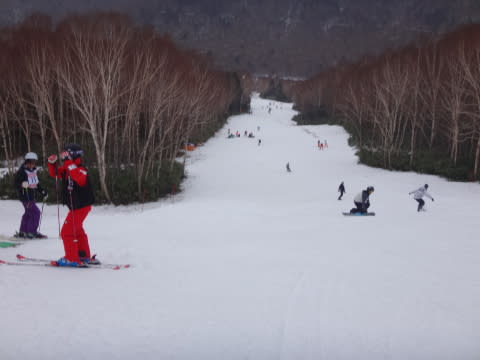

当然，リフトもちょっと混み気味．

午前中，第4ロマンスは平均2-3分待ち．

タイミングによっては，もっと待つことも…（泣）．

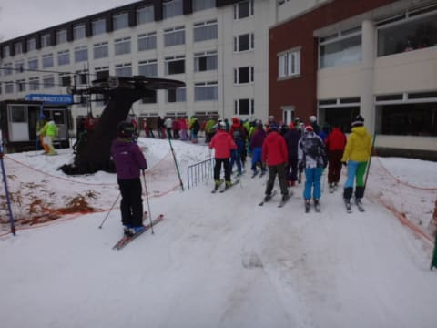

第2高速は基本的に待ちは無かったけど．

研修会のグループがリフトに到着すると，

1-2分待ちが出ることもあったかな～．

そして．

終日，気温は高いままで．

雪も，「4月か？？」って感じの

ザブザブした雪になってきました…（涙）

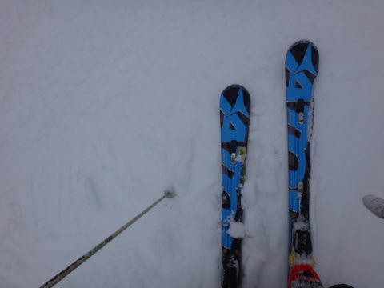

なぜ？？

なぜ，12月というのに．

こんなに雪の状態が悪いの？？（あふれる涙）

さらに．

午前中は，こんな感じで天気は何とか持ってくれて…

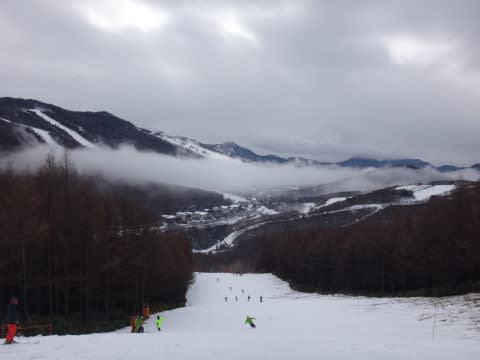

雪もまだ，それほどひどくは荒れてませんでしたが．

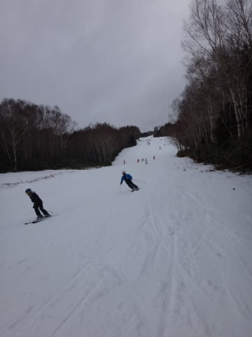

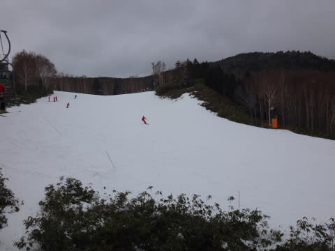

午後になると…

うん？

雨？？

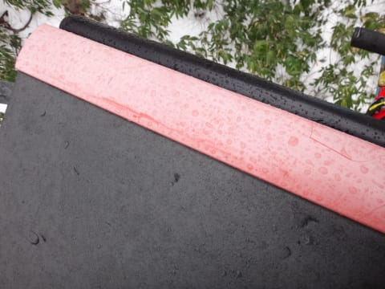

それも，ウェアがしっとりするくらいの

降りになってきちゃったんですが…（涙）．

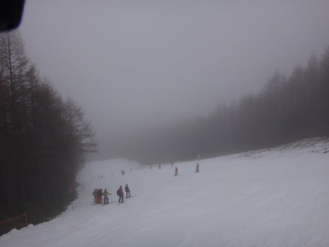

雨が降ってきたおかげで，ゲレンデの雪が溶けはじめ…

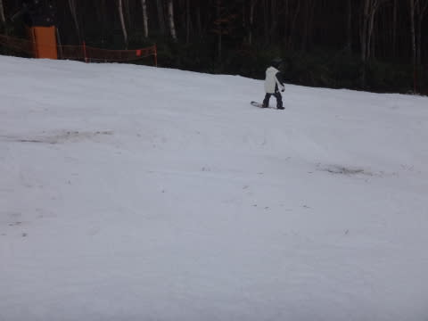

あらら？

なんだか，コースのそこかしこに土が…（悲）．

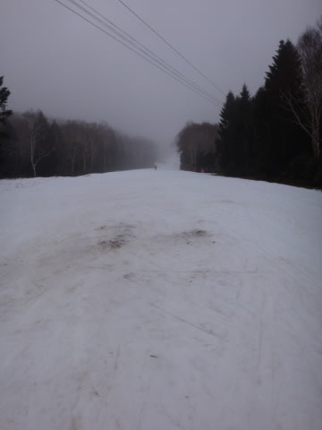

コース脇の人工降雪が無いところは…

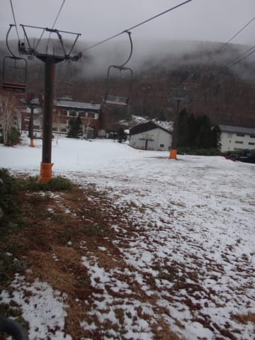

うーん．

かなり雪が消えてしまったのですが…っ！（泣）

そして．

雨で雪が柔らかくなったので．

加速度的にゲレンデは荒れていき…

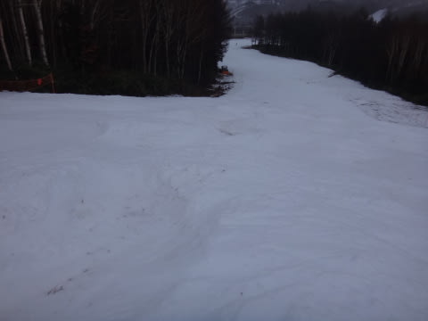

ダメだ…

ダメだよ…

午後は，かなり荒れ荒れのゲレンデでした…（かなり残念）

ってことで．

とりあえず，この日も16時のリフトストップまでは滑ったけど．

ウェアもびしょ濡れになるような雨降りの中．

土が出てきた荒れたザブザブゲレンデを滑るって…

これは，GW後半か？？

これはいったい，何の仕打ちだ？？

一体，私が何をしたというのだっ！？？←いや，いっぱい悪いことしてるでしょ

って感じの一日で．

かなーり残念な感じでした…

うーん．

今週末こそ．

冷え冷えのパフパフの雪がいっぱい積もって．

思いっきりゴンドラをグルグルしたいものだなっ！！！

## 💬 コメント一覧

### 💬 コメント by (Goku)
**タイトル**: グルグル～
**投稿日**: 2015-12-15 20:49:54

したい！したい！グルグルしたい！

できれば１ゴン、グルグルしたい！

### 💬 コメント by (KENKEN)
**タイトル**: お疲れさまでした。
**投稿日**: 2015-12-15 22:20:48

コンディションはちょっと(かなり)残念でしたが、

沢山のご指導ありがとうございました。

知らない世界をのぞき込んでしまい、もう戻れそうにありません。

また次回宜しくお願いします。

PS 会社帰りに神田に寄ってしまい、物欲選手権に惨敗してしまいました。

次回はnewブーツで参戦予定です。

### 💬 コメント by (Skier_S)
**タイトル**: 早くゴンドラぐるぐるしたい…
**投稿日**: 2015-12-15 23:20:04

＞Gokuさま

ああ…

1ゴングルグルしたいですねぇ…

一体いつになることやら…（涙）．

今週末に期待！

＞KENKENさま

この週末はお世話になりました～！

「あなたの知らない世界」へお連れしてしまいましたが，

もう抜けられないかも…（笑）．

…で，物欲選手権に完敗したわけですね．

もしかすると，ATOMICブーツですか？？

…だんだんとアブナイ世界に近づいている気が…

また23日，よろしくお願いします！

