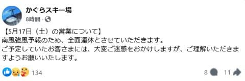
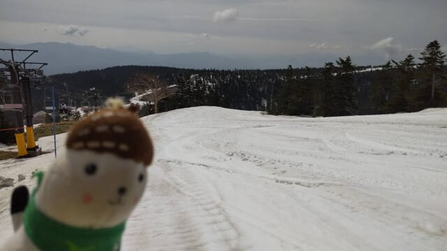
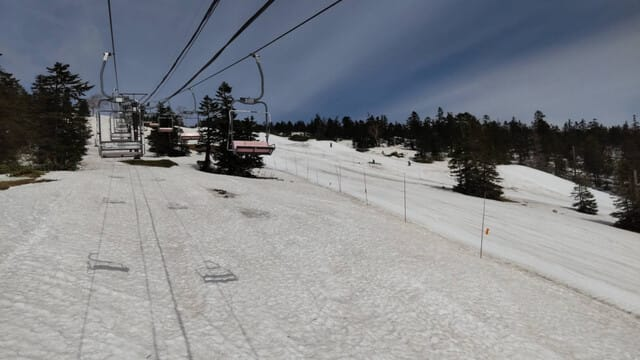
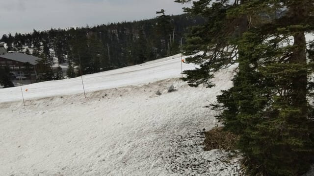
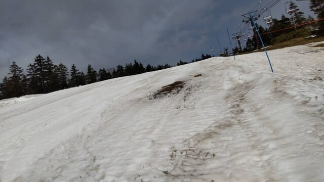
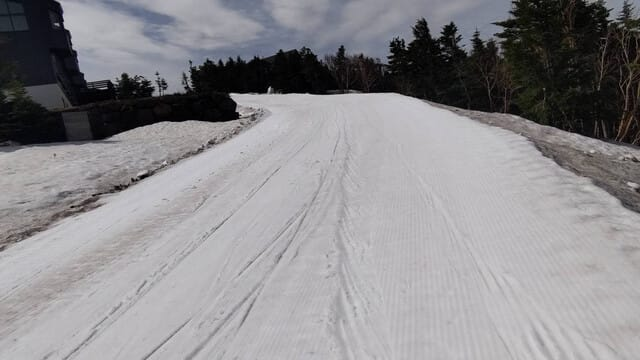
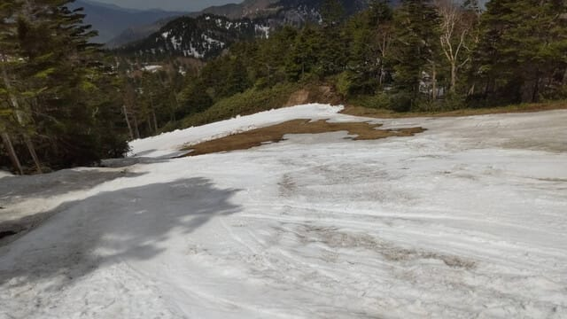
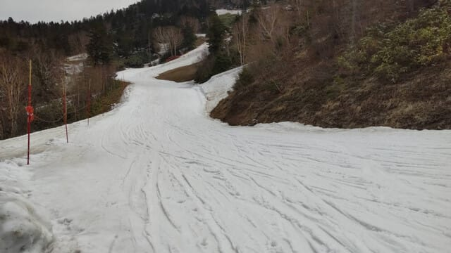
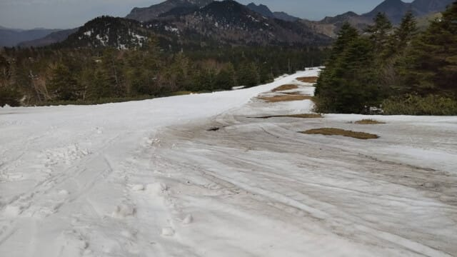
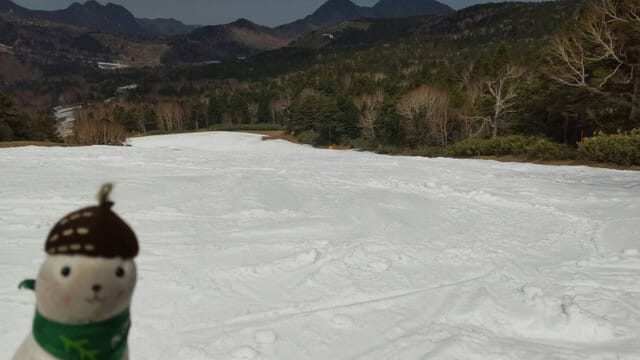

# えええ！？明日5/17(土)はかぐらスキー場終日運休？今週末はスキーはあきらめた(泣)

📅 投稿日時: 2025-05-17 00:14:41

🏷️ カテゴリ: [日記](cc4b5682fb7b8b144980957a978653fb0.md)

ということで．

なんと．

今日の夕方の段階で．

明日の土曜の5/17はかぐらスキー場が

強風のため終日運休

することがアナウンスされました…(泣)

（[かぐらスキー場Facebook](https://www.facebook.com/snowkagura/posts/pfbid037UomQgrYaaRky5KyFVR3cCEmU1wWetQX9ouiVKo6RhwvxL2R1rkFRoKdBv2CdzAWl)より）

うげげげげげ～っ！！！

日曜は娘に勉強を見てと言われているので，

今週も滑りに行けるのは土曜だけだったのに…

また先週と同じく，土曜を狙って悪天候

とは…！！！（激泣）

一瞬，また先週と同じように志賀高原へ

行こうかな…

とも思ったけど．

まだ風に強い熊の湯ならともかく．

横手・渋だと，かぐらと同じく強風で

運休になる可能性は高いし．

志賀草津道路は雪崩の影響でまだオープン

してないし…

そしてそもそも昨日も4時間しか寝てなくて，

今日も仕事を終えて帰宅したのが0時近い

というのもあり．

またこれでリフトが動くか動かないか

分からない横手・渋に行くのに，3時間睡眠で

出発する根性がなく…

明日のスキーはあきらめました

ええ．

諦めました．

諦めましたとも～！！！

うーーーん．

変則で週末を休んで平日に滑りに行ったGWを

除けば，

実に11週間以上ぶりのスキーに行かない週末

になりますね…

せっかくかぐら，まだまだたっぷり雪が残って

いるというのに．

今シーズンはかぐらを一度も滑ることなく

シーズンを終えてしまいそう…

なぜ，週末を狙って天気が悪くなるかな（泣）

ということで．

残念ながら今週末は滑りに行けませんが…

今日，５/16の渋峠・横手山スキー場．

おこみん特派員情報によると…

本日の天気は曇り時々晴れですかね．

うーん．

なぜ平日はこんな穏やかな天気なのに…

渋峠，まだ雪は結構残っているように

見えますが．

さすがにそろそろブッシュが出てくるように

なってきたのかな…

そして，まだ渋峠から横手山は滑って

下りることができるものの．

でももうこのあたりは，もうそろそろ

ヤバそうな感じ…

土日2日間，もつのかな？？

第2リフトを降りてからの

連絡路はまだ大丈夫ですが．

第2ゲレンデのメインバーンはやっぱり

この土日で終わり，って感じですね…

そして．

渋峠が終わる来週末以降も，雪が残れば

営業を続けると言っている第4ゲレンデは

こんな感じ．

うーん…

渋峠より長持ちするのかな～，これ…

ってな感じで，雪はまだ残ってますが．

なんにしろ，今日も朝から雪の滑りは

あんまり良くなかったみたいで．

渋も第2も第4も，勢いをつけて滑っても

リフト手前で止まってしまい，漕ぐのが

大変だった…との報告でした．

むしろ明日，雨が降ったほうが板が

滑っていいのかも…？？？

でも．明日，かぐらは営業中止だけど．

横手山，動くのかなぁ…

とりあえず．

私は意地悪な天気に泣きながら，

久氏振りにスキーに行かない週末を

過ごしてます…（泣）
