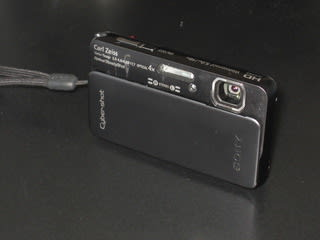
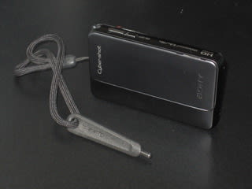
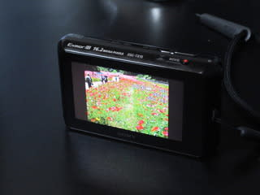
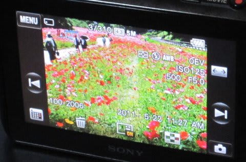
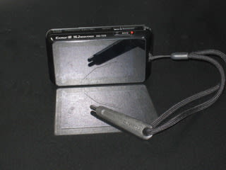

# スキーヤー用デジカメ　SONY TX10　インプレッション　その3

📅 投稿日時: 2011-06-16 01:43:49

さてさて．

しばらく間が開きましたが．

このシーズン購入した，Sony サイバーショットTX10.

[購入まで](edc461a9f1ae90e7a790c71fb3597b618.md)

[その1](e031365507b66f6126431a5fb1065d1cf.md)

[その2](e6165f9b8a49463a457f0bd67988f6dae.md)

と，これまで紹介してきましたけど．

今回．

操作性について語ってみましょうか．

操作性はといえば．

タッチパネルの使い勝手は，結構いいですな～

マルチタッチには対応してませんが，

再生時に写真を次々送るときとか，撮影メニューの

スクロールのときとかは，iPhoneライクに指で送っていけば

画面がスクロールさせられて便利．

結構さくさく動きます．

小さなボタンを何回も押してメニューを呼び出す必要も無く，

画面のボタンを押せば設定できるので，各種操作は

わりとわかりやすいです．

で．このタッチパネル．

TX5は感圧式でしたが．TX10から静電容量式タッチパネルに

なったんですね～．

「静電容量式って…グローブしてたら操作できないじゃん…」

と心配してましたが．

カメラに付属のスタイラスペン．

これがストラップにつけられるようになってます，

んで，グローブをしたときはこいつを使えば…

操作性に問題なし．

っつーか，指で操作するより，このペンで操作する

方が操作しやすいかも．

グローブしてなくても，このペンを使っていることが多いです…

というわけで．

心配した操作性は気にならず．

まぁ，以前のカメラだと，

露出補正やらモード選択やら，結構いろいろいじってましたが．

このカメラの場合，プレミアムお任せモードにしちゃうと，

静止画を撮るときはほとんど何も操作しなくなりますけどね～．

…いや．

タッチすればピントが合う，ってのは活用するなぁ．

これまで，被写体を画面中心に持ってきてシャッター半押し，

その後撮影したいフレーミングに戻して撮影，という

技を活用してたけど．

この技が不要になります．

画面内を動き回る子供にタッチすれば，子供を追いかけて

フォーカスし続けてくれるし．

動画でもタッチフォーカスが使えるので，カメラがピント

に悩むことはなくなりました．

再生時の操作性も，サムネイル画面やカレンダー画面を

指で送っていけばすぐ目的の写真が見つかるし，

拡大写真を，指で写真をズラすように動かしてスクロール

できるのがすごく便利かも．

動画再生時の操作性ですが．

スキーの滑りを撮影した時．

その場で滑りを確認するときに重宝する，スロー再生やコマ送りは

ちゃんと備えています．

Canonのカメラみたいな可変速スローが無いのと，

スローやコマ送り再生時に操作ボタンが動画の上にオーバーレイ

されてしまうのが，ちょっと欠点か…

まぁ，ボタンは半透明なので，滑りの解析上問題になるほどでは

ないですが，ちょいと気になりますかね～．

あと，液晶の明るさが5段階に設定できて，「明るい」に設定すれば

スキー場の屋外でも見れる明るさ．

液晶はすごい感動もののきれいさです．

従来の23万ドット液晶から比べると．

92万ドット液晶は驚きの高精細さ．

（この写真じゃよくわからんか…）

液晶は，ハイビジョン動画のビューワーとして十分．

昔のビデオカメラだと，液晶画面では細かな動きが

わからないので，宿に戻って本格解析…

って感じでしたが．

これは，液晶だけで十分ハイビジョン画質の動画が

確認できます．

あー．液晶画面の表面強度は．

かなり強いですね．

ウェアのポケットに無造作に突っ込んでますが．

全く傷つきません．

（…この写真，机の傷が写りこんで，液晶に傷があるみたいに見えるなぁ…）

タッチパネル以外の操作性も．

撮影時はシャッターを開ければよく，小さな電源ボタンを

押さなくても良いとか，

（昔のモデルはシャッターに引っ掛かりがなくあけにくかったけど，

TX10はグローブしててもサクサクシャッター開け閉めできます）

ズームレバーもグローブしたまま操作OKとか，

結構良くできてる感じです．

…と，

いいことばっかり書いてきましたが．

次回は．

不満点を述べるのだ．
