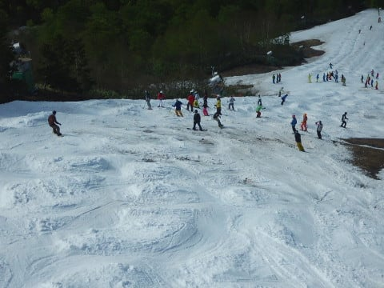

# 5月20日のかぐらスキー場，速報モード…朝はなんとうっすら積雪！でも，午後は気温も上がりバーンも悲惨に（涙）

📅 投稿日時: 2018-05-21 01:36:56

ということで．

今日は予告通り，かぐらへ行ってきました～！

…で．

いつも通り，スキー板の手入れだなんだを

していたら，夜遅くになっちゃってるので．

そうです．日曜深夜定番の，速報モード！

えー．

まず．

朝7時近くまで雨が降り続いていたらしい，

かぐらスキー場．

営業開始前には雨も止んでましたが…

この時期としては寒めの気温でスタート！

でも．

先週は雪があったみつまたからゴンドラへ

降りるコース，完全に雪が消えてますね…（涙）

ゴンドラコースも雪が無くなり，

とても先週まで滑れたとは思えない感じに

なってます…（泣）

ゴンドラの窓には，朝までの雨の

名残の水滴が残ってますが，

営業開始時には，私の予想通り←非常に大切なので，今回も強調しておく

もう雨は止んでましたよ～！

で．

かぐらゲレンデまでやってくると…

ここも先週に比べると，かなり

雪が減ってますね…（涙）

でも．

リフトに乗ると…

え？？

うっすらと，雪？？

どうやら，今朝にかけての雨．

山頂付近では，雪だったようです…！！！

朝イチの山頂は，1cmに満たないほどですが，

かすかに新雪が乗ってますよ！

うおおおー！！

この時期に新雪がゲレンデに乗っているとは！！

…でも．

この時期の新雪．

板が滑らなくなるだけで．

実はあんまり有り難くなかったりして…（涙）

朝イチのメインバーンは，うっすらと

ガスが残ってましたが…

…うーむ．

それよりも．

コース幅が狭まりましたね（泣）．

でも．

すぐにガスは晴れてきて．

朝イチで人が少ない，気持ちよさそうな

バーンが見えてきましたよ！

…でも．

実際に滑ってみると．

硫安が効いている固い部分と，

効いてない柔らかい部分が

まだらに入り混じって，さらに時々

重い新雪につんのめるような，

ちょっと気持ちよさに欠けるバーン

でした…（残念）

そして．

朝10時を過ぎると．

うげげげげ．

なんだ，これは！！

…そうです．

この時期のかぐらのお約束．

激込みバーンの登場です！（泣きながら）

リフト自体はそれほど混んでなくて，

午前中も搬器数台待ち，午後はほぼ飛び乗り

だったんですが…

でも．

コース幅が狭くなっているので．

コース上の人口密度が増えて．

そのせいで，ゲレンデはあっという間に

ボコボコになっていきます…

昼過ぎには，コブ溝に土が出始めて．

午後2時ごろには，かなりコブが

深くなってきたので．

あぁぁぁぁ…

そして，3時ごろになると．

雪の薄いエリアがコース幅ほぼいっぱいに

広がる部分も…（激涙）

うーむ．

残念．

なんだか，残念な感じです…

リフト営業終了の午後4時ごろは．

結構雪があるように見えるこの写真の

あたりでも．

かなりそこかしこで，コブの底が抜けて

ました（涙）

おそらく．

次の週末．

クワッドリフトの営業，厳しいんじゃ

ないかな～………

うーむ．

かぐらファイナルのこの週末までもって

ほしいんだけど，無理っぽい…（涙）

とりあえず，また明日，詳細レポート

やります～！←普通はこのレベルのレポートで十分詳細だと思う

## 💬 コメント一覧

### 💬 コメント by (naoちゃんねる)
**タイトル**: アライリゾート行ってきました
**投稿日**: 2018-05-21 14:28:50

ご無沙汰してます。かぐらは激込みなんですね。

4月下旬以降全く土日休みが無く、ようやくの日曜休みで娘とアライリゾートに行ってきました。

https://youtu.be/Pllg4RCySi4

上部は問題なしでしたが、一部これは完全に途切れてるだろ…という箇所があり、かなり空いていました。今日で営業終了というのも納得です。

かぐらも厳しいんですね…

こんなんでしたので、娘はようやくスキーシーズンは終了だという事を理解してくれました。

お先にシーズン終了します。S様のまだまだ続くスキーレポート楽しみにしていますね！

### 💬 コメント by (Skier_S)
**タイトル**: naoちゃんねるさま
**投稿日**: 2018-05-22 06:20:28

動画見ましたが…

いや，ARAIもすごかったんですね（笑）

しかし，この時期になってもスキーに行きたがるとは！

うちの娘はGW以降，

「ゲレンデが楽しくないから，もういい」

と言ってますから…

ちょっと根性が足りないみたいです（笑）

シーズンお疲れ様でした．

また来シーズン，志賀高原でお会いしましょう！

### 💬 コメント by (yama)
**タイトル**: アライの１週間
**投稿日**: 2018-05-22 17:26:06

１週間で雪が減りましたね。動画のリフト乗り場手前のコースはほぼコースいっぱい滑れたのが嘘のようです。１週間早くシーズンラストにした理由がわかります。先週行けて良かったと思えます。スキーはイエティまでお休みです。月までは行けませんから。

### 💬 コメント by (Skier_S)
**タイトル**: yamaさま
**投稿日**: 2018-05-23 00:41:22

これで次はYetiまで，スキーはおあずけですか…

一緒に月まで行ってみませんか？（笑）

