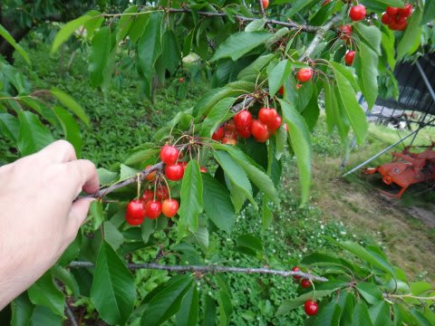
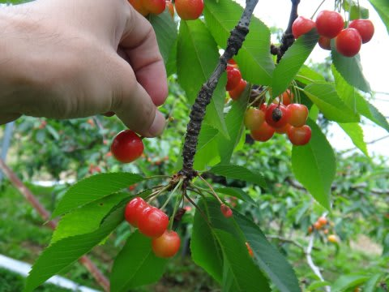
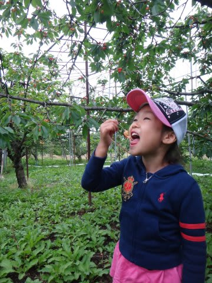
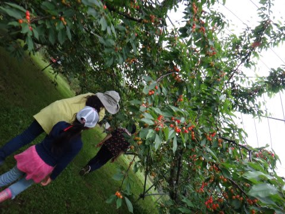

# この時期の山形といえば，さくらんぼ狩りでしょ

📅 投稿日時: 2013-06-29 03:30:17

🏷️ カテゴリ: [日記](cc4b5682fb7b8b144980957a978653fb0.md)

えー．

日曜の東北道上り渋滞がいやだったので．

土曜に日帰りで月山へ行きたかったのですが．

…本日，帰宅が遅かったので，土曜に行くのはあきらめました(涙)．

日曜月山日帰りソロツアー＠一人で運転に備え．

土曜は一日ゆっくりする予定…

＃娘にたたき起こされるでしょうけど

しかし．

この時期は，ちょうどさくらんぼがピーク．

月山に行く方，帰りにさくらんぼ狩りに行くのも

いいかもです～．

時期的には，6月中旬～6月末くらいまでですが，

今年は例年より10日程度遅いらしく，ちょうど今が

ピークのようです．

あー．

道の駅とかにある，さくらんぼ狩りの案内所みたいなところで

頼んだり，Webから申し込んだりすると，一人1500円とか

取られて，かなりお値段が高かったりします．

一番安いのは，細い道端にあるマイナーな農園．

私が例年お世話になるのは，

「佐竹農園」

さん．

Webとかで調べても出てこないと思います…

＃違う佐竹農園が出てきます

場所は，[この辺り](https://maps.google.co.jp/maps?q=38.393057,140.263073&hl=ja&ll=38.393221,140.263149&spn=0.007139,0.00868&sll=38.392994,140.263245&sspn=0.00357,0.00434&brcurrent=3,0x5f8bc15ed648b1a1:0x5ca66158ec133e15,0&t=m&z=17)です…

寒河江スマートICを降りて10分弱ですかね～．

大人一人1100円で，今回リピーター特典だったのか，

幼稚園児の娘はただにしてくれました．

3人で2200円で，好きなだけ佐藤錦が食べ放題！

ちょっとお高く感じるかもしれないけど．

超贅沢な，「さくらんぼだけでおなかいっぱい」

という夢が叶います…

自分も行くまでは「ちょっと高いなぁ…」

と思ってたけど．

実際に行ってみると，結構面白いです．

もともと結構お高い高級さくらんぼの佐藤錦．

一個でおなかいっぱいになるりんごとかと違って，

「これ大きい！」

「これ，真っ赤できれい！」

とか選びつつ，つぎつぎとちぎって食べ，ちぎって食べ…と1時間くらい

平気で食べ続けられちゃいます．

＃50個以上食べてる気がする…

「これって，500円とか600円とかするさくらんぼパックの

2-3パック分以上食べたのでは？」

って感じで．

果物狩りの中で，終わった後の満足感がもっとも高いです…

で．

さくらんぼがぬれてだめにならないよう，農園は屋根がかけてあるので

雨の日でもOKですよ～

月山が天気が悪かったとき．

早めにスキーを切り上げて，さくらんぼ狩りってのも

いいかもです…

## 💬 コメント一覧

### 💬 コメント by (komu)
**タイトル**: Unknown
**投稿日**: 2013-06-29 10:00:41

数ある果実園の食べ放題で唯一お得感のあるのがさくらんぼですよね。

それにしても…どうしても…

月山日帰りヒトリストするのですね…

レポート楽しみにしてます。

### 💬 コメント by (Skier_S)
**タイトル**: 行ってきます…
**投稿日**: 2013-06-29 21:28:43

どうしても，ヒトリストです…

生きて帰ってきたら，レポートします…(汗）

