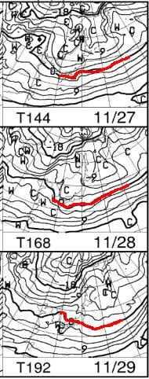

# スキー場は23日から冷え冷え！…そして志賀高原中央エリアの2022シーズンのリフト営業予定が出たよ！

📅 投稿日時: 2021-11-23 00:35:07

🏷️ カテゴリ: [スキー雑談](c1f9d2cb7478308da16419928ea3945e9.md)

えー．

本日の志賀高原は，昼前から液体が

ぱらぱらと降り始め．

午後は一時強く降ったようですが…

今，硯川のライブカメラを見てみると，

カメラのレンズに水滴がついているので，

先ほどまでは雨っぽかったようですが…

気温は氷点下になっているので，

雪に変わってるのでは…？

（[北信建設事務所道路状況カメラ](http://hokushin.pref-nagano-roadcamera.jp/)より）

とりあえず．

横手山も，明日の営業中止はアナウンス

されていないので…

どうやら，この高温の雨を無事乗り切った

みたいですね…！（一安心）

そして．

このあとは予告したように…

23日からは冷えるのだ！

23日の850hpa図．赤い0℃線は太平洋

まで下がり，志賀高原には-3℃線が

かかるくらいなので…

人工降雪機はフル稼働できるのだ！！

（西風なので志賀には雪は積もらないけど）

さらに，24日以降も．

850hpaの赤い0℃線は志賀より南に

いつづけてくれて，志賀高原は人工降雪機が

昼間もフル稼働できそうだし…

27日以降は，また太平洋側まで0℃線は

下がってくれて．

白馬や日本海側の標高がそんなに高くない

スキー場でも人工降雪機がフル稼働

できます！！

特に28日は激冷えですね…

27，28日は天然雪も期待！！

…でも．

土日に降るんじゃなく，

土日の前に降ってほしかった…

とはいえ．

この様子なら，スキー場は27日，28日と

続々オープンしそうですっ！！

…ってなことで．

ようやっと志賀高原も本格オープン

できそうな予想になってきましたが．

先日，志賀高原中央エリアのリフト

営業予定が出ました～！！

([志賀高原中央エリアホームページ](http://shigakogen.co.jp/archives/13008)より，以下同じ）

最近，志賀高原はあまりいいニュースが

無いので．

またなにか，とんでもない改悪(？)

がされてるんじゃないかと，こいつを

じっくり眺めてみたわけですが…

一の瀬エリアは，赤丸で示したように，

一の瀬ペアと高天ヶ原トリプルが

11月27日オープンと，

いつもより早い11月オープンを

目指しているみたいですが…

それ以外は水色で括った高天ヶ原

クワッドが12月11日で，

それ以外は大体12月18日オープンですね…

ってことは．

一の瀬上部，12月3週までオープン

しないのか…(涙)

ここ数シーズン，雪が少なくて，

一の瀬正面バーンは12月3週以降の

オープンが続いていたものの．

それでも，天狗コースなどはそれ以前に

オープンしてたりしましたけど．

今シーズンは，早くに雪が積もっても，

3週目まで一の瀬上部はオープンさせないと

宣言されちゃってますね…(泣）

コロナ騒ぎで修学旅行生が来なく

なったので，無理やり早くに

天狗コースを開ける必要がなくなったと

いうことでしょうね…（涙）

で．

シーズン終了の方を確認してみると．

一の瀬クワッド，高天ヶ原クワッド，

ダイヤクワッドは例年通り，GWの

5月5日まで．

焼額みたいに5月8日までやらないようです

で．

山の神第2は…

終了時期未定．

うーん．

焼額が動いている限り，GWまで

やってほしいんですが…

また4月になったら止めて，

一の瀬と焼額・奥志賀エリアを

行き来できなくするんだろうなぁ…

そして，

西舘・ブナ・ジャイアント・丸池・

蓮池・寺子屋エリアですが．

全て12月18日オープン．

営業終了は，寺小屋が5月5日の

GWまでなのを除くと，

3月末か4月第1週の週末で終了ですね…

まぁ，ここは大体ここ数年のパターン通り．

…かつて昔は，ジャイアントや

サンバレーなんかは，雪がある限り

GWまでやってくれたもんだけどなぁ…

と，おぢさんは昔を懐かしんでしまう

ところですね…

という感じで．

まぁ，昼間のリフト営業予定は，

大体例年通りだったのですが．

実質一の瀬ファミリー以外は正月のみと，

昨シーズン一気に営業日数が減った

ナイター営業．

今シーズンはダイヤナイターの週末

営業が復活したりしてないかな…？？

と，すごく期待してみてみましたが…

([志賀高原中央エリアホームページ](http://shigakogen.co.jp/wp-content/uploads/2021/11/2021-22%E3%83%8A%E3%82%A4%E3%82%BF%E3%83%BC.pdf)より，以下同じ)

…大変残念なことに．

これも昨シーズンとほぼ同じでした(激涙)

一の瀬ファミリーは，12月25日から

1月3連休の1月9日までは毎日，

それ以降は水曜～土曜の営業が

3月20日まで．

3月最終週は営業せずです…

で．

2シーズン前までは3月いっぱい毎週

営業していたダイヤナイター．

今シーズンも残念ながら，

12月29日から1月2日までの正月のみの

営業で，3連休も動いてくれません…(泣)

高天ヶ原も全く同じ日程です．

そして，丸池に至っては．

12月31，1月1日，2日の3日間だけ営業．

サンバレーは，なぜかそれに加えて

1月3連休の1月8，9日も営業して

くれますね…

なんでサンバレーだけ3連休動かすのかな？

ダイヤも3連休動かしてほしい…(泣）

ちなみに，営業時間も昨シーズンと変わらず，

ファミリー，ダイヤ，高天ヶ原は

18:30～21:00の2時間半．

丸池，サンバレーは

19:00～20:30のわずか1時間半の営業(涙)

ナイター料金も変わらず，

ファミリー，ダイヤは2300円，

高天ヶ原，丸池，サンバレーは1800円．

…丸池，サンバレーがわずか1時間半で

1800円って…ちょっと高い(涙)

ってな感じで．

全くいいニュースが無くて，

かなり残念な感じの，中央エリアの

営業予定だったのですが．

…昨年よりさらに営業日数が

減ることが無かっただけマシ

と，自分を慰めるしかないのだろうか…

あぁ…

なにかいいニュース，ないかな…(涙）

とりあえず．

他のスキー場がオープンしないので．

明日もYetiに行ってきます…

そしてこんな時間まで記事を書いていて，

　また睡眠時間が4時間を切ってしまいそう（涙）

## 💬 コメント一覧

### 💬 コメント by (ikkun)
**タイトル**: Unknown
**投稿日**: 2021-11-23 03:46:39

仕方ないですね？スキー人口だだへりですからね(泣)

ナイターも行かなくなりました❗近いんだけど(笑)  スキー二本チューンナップ出しっぱだから片方だけども引き取りしないとヤバいなあ(泣)

### 💬 コメント by (レインボー74)
**タイトル**: Unknown
**投稿日**: 2021-11-23 16:41:53

先ほど湯田中に入城しました。今シーズンもよろしくお願いいたします。

7カ月ぶりの温泉は、もう最高っす。懐かしいっす。

火曜日の海和ゲレンデ情報です。

40過ぎのクラウンさんと、60前の国体選手によると、朝の一般解放前に地元の高校生に開けたためか、最初からガタガタつるつるで、腰によろしくないとのことで、4500円３時間で終了だとか。下の方は一部よろしくなかったそうな。

私のようながたのきてる老人には、絶対にやめた方かよさそうなコンディション。しばらくは地元の関栄ドライブインのモツ定食や仲よし食堂のラーメンで、時を待つことにします。

でも、志賀高原シーズン券に加えて横手ロングシーズン券も保持されている、かの有名な○○りん様は、なんと賢いことか。午前中の削りかすを助けにするために、午後からのご出勤で、今日も楽しくお過ごしなされたとか。あの人にかなう人がこの世に存在する、なんてことは、私には到底想像できません。かのエス様でさえ、、、

### 💬 コメント by (Skier_S)
**タイトル**: まだ雪が積もらない…
**投稿日**: 2021-11-24 01:15:53

＞ikkunさま

やっぱり仕方ないんですかね…(涙)

ナイター大好きなので，ナイターが無くなっていくのは寂しい限り…

＞レインボー74さま

無事の入城，おめでとうございます．

お待ちしておりました！

今の横手山のコンディションは良くないようなので，

コンディションが良くなるまではごゆるりと湯田中でくつろいでください…．

あるいは，○○りん様と同じく，午後出動でしょうか(笑)．

