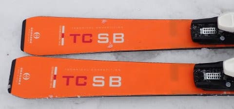
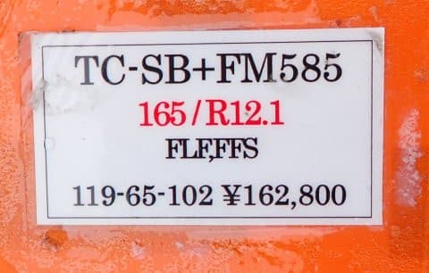

# 2024シーズンモデルのスキー板，試乗レポートその16…OGASAKA TC-SB＋FM585

📅 投稿日時: 2023-06-20 04:12:28

🏷️ カテゴリ: [スキー板試乗](c0bd8048615710cee890e403a36cc9a2b.md)

えー．

今日ももう外が明るくなったころに

更新していますが．(涙)

…昨日はうっかり記事を下書きにした

まま投稿し忘れて放置してて，

朝にそれに気づいて投稿したので，

更新時間が朝9時過ぎでした…

だもんで．

昨日朝にこのBlogを見て，

「なんだよ～，記事更新されてないじゃないか～」

と思った方は，[昨日の記事](e1e518dab6e345e4766baeb9f88a7878e.md)も読んでください…

ってなことで，本題へ．

2024シーズンモデルのスキー板の

試乗レポート．

本日は小賀坂編です．

今回も一ノ瀬ファミリーの，雪がちょっと

悪かった時の試乗レポートになります．

では，どうぞ～！！

〇OGASAKA TC-SB＋FM585 165cm

基礎小回り

技術選向け小回りスペシャル板のシリーズ，

TC-S〇ですが．

今年はSBという名前になりましたね…

アルファベット全部使い切ったあと，

名前どうするんだろう？

ちなみにこの板は，プレートなし，

優しめのFMプレート，強めのGRプレートの

3種類が選べますが，今回試乗したのは

FMプレート付きになります．

滑ってみると…

うん？？

今シーズンのSUよりも，グリップが優しくなった

感じ…

谷回りの早い段階からガッツリ捉えるというより，

谷回りでは板の動かす自由度を持たせ，

弧を作りやすくしている感じ．

山回りでも，板が動かせないほどしっかり

グリップしてググっとたわんでいくというよりも，

グリップした中で板を動かせる自由度があり，

キレキレの中たわみ量で弧をコントロールする

というより，ズレ・キレを調整しつつ，板を

動かしていく量で弧を作っていくタイプ．

今シーズンモデルは，板が早い段階から

カツンとグリップして，そこからたわみに沿って

きれいに切れていく感じが強かった気が…

フレックスも昨シーズンに比べて柔らかく，

それでいてしっかりグリップ系なので，

キレキレカービング小回り系でしたが．

来シーズンモデルは，もう少し玄人好みの，

谷回りで板を動かしてターン弧を魅せる

板になったのかな～．

ただ，当然のごとくズレズレの板ではなく，

グリップとズレの出し入れが楽にできて，

ずらしていくとトップがインに入っていく

ような旋回力の高いズレになる，

攻めたズラしができる板．

とはいえ…

FMプレートだと，スイートスポットの

スピード域はちょっと低めになるかな．

去年のがっつりカービング系のSUと比べると，

動かしやすいぶん，わりと優しめの板に

感じます．

低速から使いやすいので，指導者とかには

いいんじゃないかな？

トップスピードになると，しっかり押さえ

ないと板のトップがちょっとだけ逃げる感じが

あります．

でも，板の動かしやすさと，そこからくる

ズレでの旋回力の出方がいい感じなので，

春のザク雪やコブ斜面では滑りやすく感じます．

ただ…硬めのバーンを攻めるとか，高めの

スピード域でガッツリ使おうとか，

あるいはミドルターンくらいまで引っ張る

オールラウンド板として使おうとしたら…

私ならFMプレートより強めのSRプレートの

ほうを選ぶかな…．

この板は，おそらく．

ある程度の急斜面でずらしを使いながら，

板を動かす小回りを見せるための板として

作られたんじゃないかな～．

カービングのキレキレ小回りが好きなら

今シーズンのSUを，

鋭いズレを使って板を動かす小回りを

見せたければ来シーズンのSBが合いそう．

うーん．

しかし．

TC-S〇シリーズ，毎年方向性が変わるなぁ…
