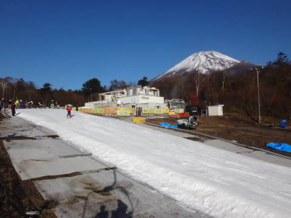
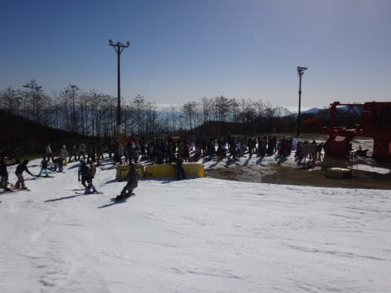

# 11月12日，日曜日のイエティのコース状況詳細…例年より空いてるかな？

📅 投稿日時: 2016-11-15 03:35:55

えー．

今週の冷え込みが弱そうで．

19日のスキー場オープン，どうかな～…

…と，思ってましたが．

本日天気図を見てみると…

うむ！？？

数日前は，平年より高い気温予想だった，

16，17日…

平年より冷える予想に変わってきましたよ！？？

…この気温だと．

16，17日は夜中は人工雪が打てそうなので…

上手くいけば今週オープンに間に合うかも！！

うむ．

私の祈りが通じたようだな．

…19日以降，また気温が上がってしまいそうなところが

気になりますが…

ってことで．

昨日速報した，この日曜のYetiのレポートです…

---

えー．

まず，日曜の朝は．

昨日速報したように，

朝から晴天っ！！

朝イチは，先週よりちょいとだけ

コースが広がったかな…？

ってゲレンデを．

人が少ないのもあって，朝イチは結構気持ちよく

飛ばせたかな？

空は雲一つない天気で．

そして，9時くらいまでは，リフト待ちも

少なく．

朝のうちは，まぁ楽しめたかな…

しかし．

気持ちよかったのも，朝9時までなのだ．

朝9時を過ぎると．

ゲレンデの人も増え始め…

そして，リフト待ちも5分近い待ちに…（泣）．

ありゃー…

と，思ってたら．

並行したペアリフトが，10時から運転開始となり．

それ以降は，クワッドリフト待ちは少ないときは

この程度．

ペアリフト側の待ちは0という感じで．

リフト待ち自体は減りましたね～．

ただし．

リフトが2本動き出すと．

リフト待ちは減るけど…

コース上は…

うむ？？

ありゃりゃりゃ…（涙）

という感じで．

昼近くには，とても気持ちよく飛ばせる感じではない

人口密度に…（涙）．

そして…

日差しのおかげで，コース上の雪も表面が融けて．

板に張り付くスピードが出ない雪に…

でも．

オープン以降，それほどひどい雨が降っていない

今シーズン．

例年よりコース幅も広い気がするし．

雪の厚みも，この時期としては結構マシで．

コース上に土が出てくるような心配は

無かったですね～．

さらに，ペアリフトの待ち時間は終日0だったし．

午後になっても，クワッドの待ち時間も，

平均2-3分程度と．例年のこの時期よりは短めの気がして．

リフト待ちが少ないのは良かったかな？？

うーむ．

去年までより，人が減ったのかな～？？

午後3時頃に，ちょっと雲が増えて…

富士山が隠れてしまうような感じになるときもあったけど．

…むしろ，こういうタイミングの方が雪が張り付かず．

板が滑っていいんだけど…

でも，やっぱり人が多い（涙）．

板は滑るけど，今日はとてもじゃないけど

飛ばせるコース状況じゃないなぁ…

うーむ．

やはり．

このままではフラストレーションがたまってしまう！

今日もナイター開始時の気持ちいいバーンを

楽しまねば…

ということで．

午後4時のコース閉鎖＆1時間の整備タイムのあと…

午後5時のナイタースタートと同時に，ゲレンデへ！

シマシマっ！

今日もシマシマっ！

いやー．

至福の時間！

これだけのために，今日来た価値があった…

というほどの，最高の2本を堪能っ！

…でも．

開始後30分も経つと．

ナイターの方がなぜかリフト待ちが長く（涙）

コース上の人も増えて，昼間と変わらない

混雑状況になってきたので…

この日も午後6時過ぎには切り上げました…

という感じで．

例年より人が少ない感じを受けた，今シーズンの

イエティでしたが．

…でも．

順調に行けば．

これで，イエティは今シーズンラスト．

ふははははは．

今週末からは，アサマ2000がオープンするのだ！！！

…もう，イエティは今シーズン滑ることが無いはずなのだ！！

…もう，滑らなくていいはずなのだ…

…滑らなくていいはずだよね…

…もし，今週末．

雪不足でアサマがオープンせず．

「またイエティにやってきました～！」

というレポートになったら…暴れる．

昨シーズンの悪夢が繰り返されるようだったら，

暴れる．

そうならないよう，天気の神様に必死に祈り続ける，

Skier_Sなのだった…
