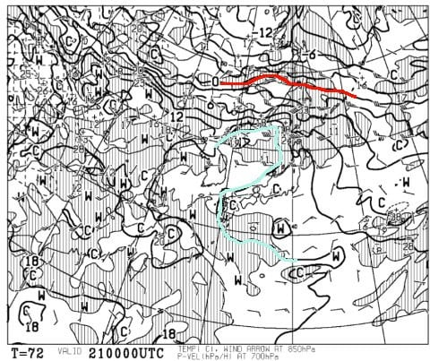
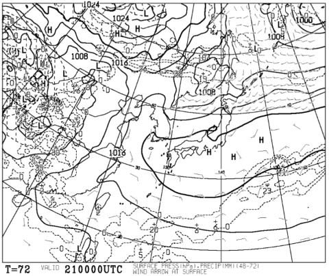
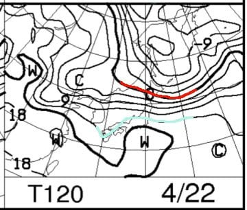
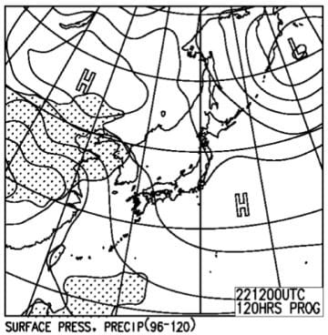
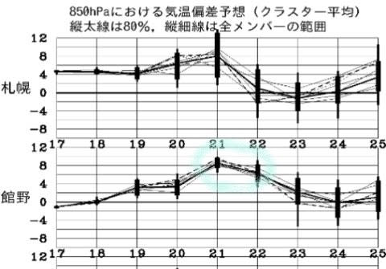

# 4月21，22日の週末の志賀高原の天気は？…2日とも晴れそうだけど，ありえないほどの超高温（激涙）

📅 投稿日時: 2018-04-19 00:47:42

えー．

全国130億4000万人のSkier_Sファンのみなさま←それ，地球の全人口超えてるから

お待たせしました．

2日ぶりの更新です…

いや，昨日，記事の更新がなく．

「Skier_Sは死んだか？？」

…と，多くの方が思ったのではないかと．←いや，誰も心配なんかしてないから…

スキーシーズンは意地でも毎日更新！！

と，何があろうとも記事を更新していました私も，

…ついに，昨日は力尽きました（屍）

ってか．

寝てる間がない感じのご無体状況でした（涙）←明け方に机の前で数時間気を失ってたけど…

うむ．まぁ，

長いシーズン中．

こんな日もあるよね…（自分を慰める）

とりあえず，今日はちゃんと夜は寝るぞ…

ってなわけで．

寝る前に，水曜恒例．

週末の志賀高原の天気予想！！

…って．

もう，この時期のスキー場の天気を気にするのは

かなりマニア度が高い人たちだけだと思いますが．

…このBlog読者はマニア度が高い人が多いようなので．

マニア度の高い人向け天気予想です！（開き直り）

…で．

まずは，土曜の850hpa気温図ですが．

な，なんだ，こりゃーーーっ！！！

赤い0℃線が樺太まで北上しているのは

いいとして←良くないけど

水色の+15℃線が志賀高原に近づいてるんですが！？？？

…これって．

+15℃線って．

ほとんど「夏か？？」ってレベルですけど！？？？

志賀高原でも，昼間に15℃を超えてきそう…

これは，猛暑の一日です（涙）．

で，土曜の地上天気図を見ると．

高気圧に覆われるので，終日晴れますね…

いや，喜べない．

この高温の晴天は喜べない．

曇ってくれればいいけど，

すっきり晴れると…

強烈な日差し＆高温で，雪は壊滅的状態になりそう（激涙）．

そして，日曜の850hpa気温図は…

あううーーん．

土曜よりマシですが．水色の+12℃線が

志賀高原にかかってます…

この日も，暑いレベルの高温になりそう（涙）

さらに，日曜の地上天気図は…

この日も高気圧の勢力下で晴れますね．

ええ．晴れます．

晴れなくてもいいのに，晴れます…

とりあえず，この土日．

21，22日は．

水色で囲ったように．

平年より6℃から8℃高い気温

になりそうです（涙）

ダメだ…

なんだか，ダメだ（泣）．

ってな感じで．

まとめると．

21日土曜：朝から晴れ．終日晴れ．もう日が射さなくていいくらい晴れ．

　朝から気温は+10℃程度と，4月としては未体験ゾーンの

　超高温で始まる．

　早朝は初めの一瞬だけ，放射冷却の冷え込みで

　表面がちょっと締まった雪になってる可能性も

　あるけど…すぐに雪は緩みだし．

　朝早いうちから，板が沈んでいくような，

　ずぶずぶの緩い雪になり．

　強い日差しで，滑りの悪いネットリした感じに

　なっていきます（涙）．

　昼間は+17℃くらいまで上がるか？

　夕方はドボドボザブザブの荒れ荒れ雪に．

　ウェアのジャケットを着てられないくらい

　暑くなりそうな一日．

22日日曜：この日も終日晴れ．

　朝の気温は+10℃近く，大体土曜と同じ感じ．

　早朝は放射冷却で一瞬だけ固いかもしれないけど．

　すぐに雪は緩み…強い日差しで，ガンガン

　雪が解けだす（涙）．

　午前中から，板が雪に潜って張り付くような

　滑りの悪い雪になり．

　午後のゲレンデコンディションは，滑走意欲を

　なくすレベルになりそう．

ってな感じで．

この3月，4月．

ダメだ．

気温が高すぎる…（泣）．

今日も雨が降ってたようだし．

GWまで，どのくらい雪が残ってくれるのか…

とりあえず．

GW滑りに行こうと思っている方は．

一心不乱に全身全霊ハイパワー冷え冷え踊りを

休むことなく止まることなく

ひたすら踊り続け．

これから1mほどの積雪があることを

願いましょう…←ありえないから．無理だから

## 💬 コメント一覧

### 💬 コメント by (横須賀のウルトラセブン)
**タイトル**: 二日ぶりの更新！
**投稿日**: 2018-04-19 12:37:57

密かに北極に行ってマイナス50度の寒気団を志賀高原

上空にせっせと運んでいるのかと・・セブンは既に今シーズン終了です。後はSさんのブログ、真夏のような志賀高原～それでも楽しい（悲惨な）スキーレポを見てシーズン終了の余韻に浸りたいと思います！👏

### 💬 コメント by (yumi)
**タイトル**: やはり、気を失っていたのですね。
**投稿日**: 2018-04-19 15:44:24

Ｓさぁ～ん🌸🌸🌸

お久しぶりでぇ～す🎉

昨日の編め❓飴❓雨☔️は、とっても微妙な感じ💧でしたよ。

朝から湯田中はざぁざぁ降りで、８時頃に上がりましたが第１トンネル出たらミゾレになって、第２トンネル出たらミゾレ混じりの雪💧第３出たら、湿雪💧、焼額山は☔️、奥志賀山麓☔️山頂は一応、雪❄️でした。

今日は、朝から強烈な☀️お日さまで、唐松辺りはオナクナリになったかと。

明日も暑い☀️😵💦ので、GSも心配です。

奥志賀は、まだまだキレイですよ。✨

一の瀬もキレイでしたよ✨

ちなみに、くま🐻も何とか滑れます✨

### 💬 コメント by (Skier_S)
**タイトル**: 冷え冷え踊りを踊り続けないと…
**投稿日**: 2018-04-20 01:41:31

＞横須賀のウルトラセブンさま

あら…

もう今シーズン終わりですか．

まだまだ雪はありますよ！（もうそろそろやばいですが）

とりあえず，滑れる限りスキーレポート続けますので，

月山が終わるまで，余韻に浸り続けてください…（笑）

＞yumiさま

お久しぶりです～！

やっぱりかなりの雨だったんですね…

今週末の焼額，大丈夫か心配です…

唐松が終わったらかなり致命的ですね．

GWはアウトっぽい感じになりますね…

残るは奥志賀と一の瀬，高天のNHKバーンですか．

今週末も気温が高そうなので，かなり雪が

減りそうです．

GWまでもつことを祈りましょう…

