# 2月8日の志賀高原詳細…朝イチ最高なれど，昼頃からは曇り～ガス（がっくり）

📅 投稿日時: 2015-02-10 02:23:49

🏷️ カテゴリ: [2015スキー滑走日記](c09ea645cfc085f86dfcd80f49599dd89.md)

ということで．

昨日速報した，日曜の志賀高原の詳細レポートをば…

…日曜の朝．

目覚めると，それはそれは見事なすっきり晴れっ！！！

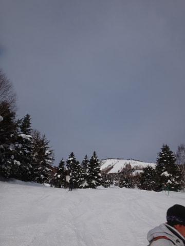

いやー！

土日とも朝イチに晴れるなんて，たぶん…

いや，きっと．

間違いなく．私の日ごろの…（以下聞き飽きたセリフが続くので省略）

ってことで，ゴンドラで山頂へ登ると．

山頂の気温は…

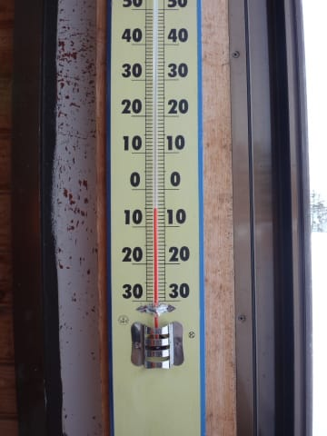

ふむ．

マイナス6℃ですか．

この時期の志賀高原としては，ちょいと高めの気温ですな…

で，ゲレンデは…

日も射して，最高の雪質っ！

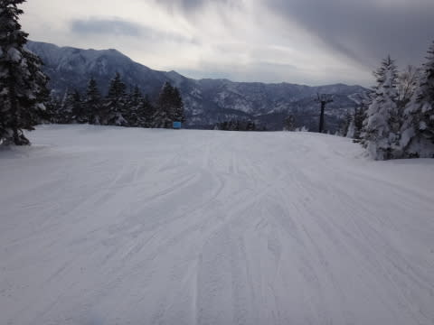

バーンはシマシマ，ピカピカっ！

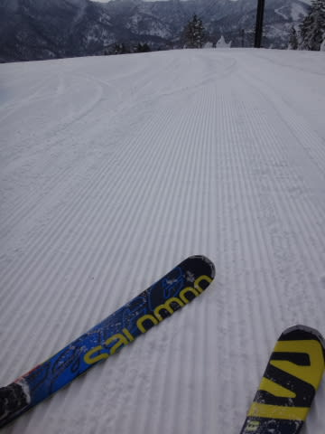

土曜は柔らかい雪だったけど，

今日はしっかり締まった雪で．

これはいいよっ！

スピード出せるよっ！

まさに，

…朝は晴れ～曇り，最高の締まったハイスピードバーン！

って予想が当たってるじゃないか！←ちょっと自慢

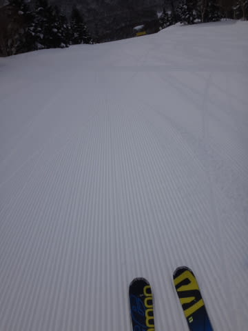

すげーーーっ！

最高っ！

2日連続最高っ！

ビバ！焼額！！！

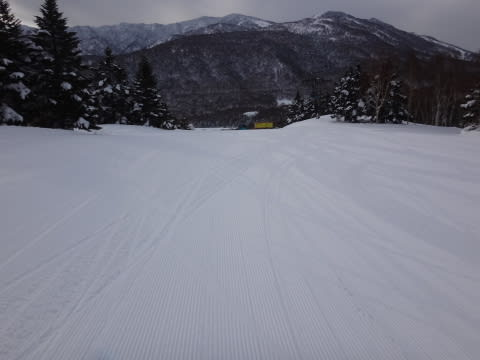

…と，超快感麻薬系シマシマバーンを[Gokuさん](http://red.ap.teacup.com/gokurakuskier/350.html)とKENKENさんの3人で，

異常なサルスキーヤーモードで自由落下してましたが…

営業開始から1時間後，午前9時半には，

太陽が雲に隠れはじめ…

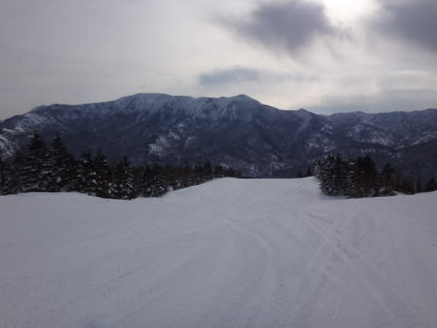

あらら？？

なんだか，10時には人も増えだし…

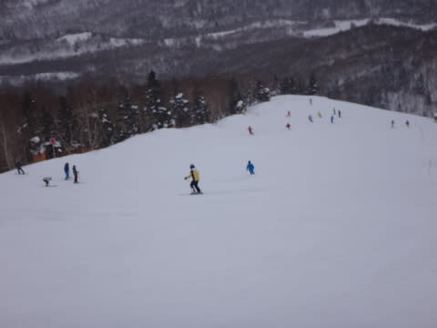

そして，10時半には第1ゴンドラが10分近い待ちに…（涙）．

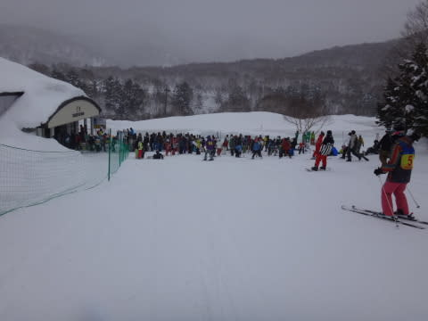

朝イチは最高だったというのに，その2時間後には，

曇って人も多くなり，かなーり快適度がダウンしちゃったなぁ…（悲）．

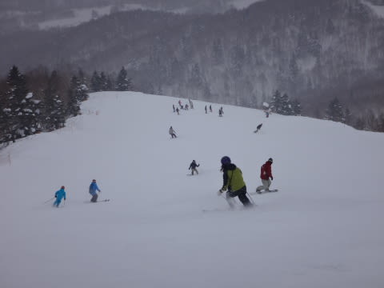

と，悲しんでいたら．

そのくらいは甘かった．

午前中から雲が増えていき，午後には雪が降り始める．

という予想が．

悪い方向に当たっちゃったのか．

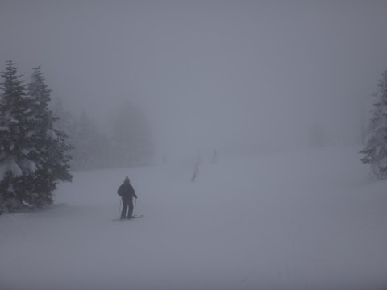

あうーん．

11時半には，山頂付近に雪が降り出し，さらにガスが…

うーむ．

天気が悪化するのは昼過ぎと思っていたけど．

午前中からこんなになっちゃうとは…

そして．

たいへん残念なことに．

午後の間ずっと，山頂付近は視界が悪い状態がつづき…

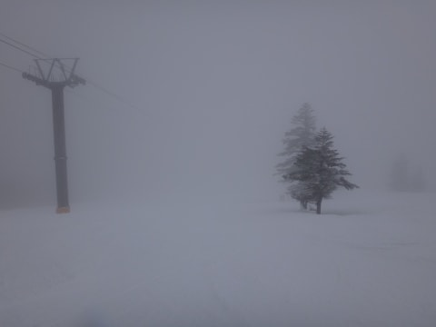

そして，天気が悪くなったからか．

午後のコースは人がいなくなり，またまたゴーストタウン状態に…

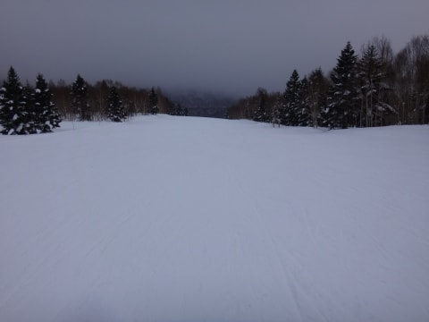

でも，山頂以外はガスもなく，視界も効き．

人がいなくなったゲレンデを飛ばしたい放題になったので．

…これもまたいいかな！

…と，ポジティブに捉えてみる．

いやー．

でも．

ホントに日曜で，こんなガラガラでいいのかな？？？

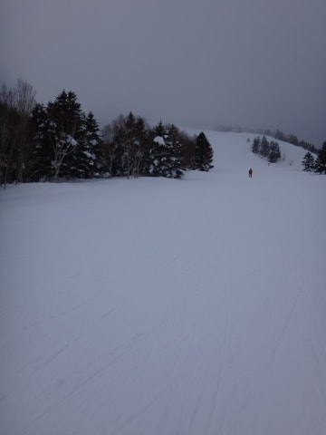

雪質も，営業終了まで，こんな感じで最高のままで．

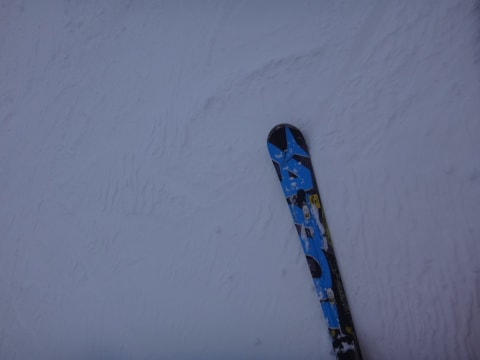

午後遅くには，ところどころに凸凹はでてきたものの，

視界の悪い山頂以外，比較的気持ちよく飛ばせる

コンディションがリフトストップまで続き．

まぁ，朝イチの状態が続かなかったのはちょっと残念ではあったものの．

全体的に楽しめる日曜日ではあったかな～．

と，ゴンドラ終了までひたすら滑り続けたSkier_Sなのだった…

## 💬 コメント一覧

### 💬 コメント by (KENKEN)
**タイトル**: 志賀高原最高
**投稿日**: 2015-02-10 21:31:26

Skier_S様

今回は丸２日もお世話になり、"これでもか"っていう位に志賀高原を堪能しました。8

また技術指導もありがとうございました。

忘れないうちに復習に励みたいと思います。

しかし、今回さんとGoku様と一緒に滑らして頂いて、サルスキーヤーにはほど遠い自分を痛感しました。

もうしばらく人間として修行を積んでまいります。

次回は間が空きますが、春スキーをご一緒できればと思います。

明日は今回快く？スキーに行かしてくれた家族と人生初のネズミーランドで家族サービスに励んできます。

Hご夫妻もお世話になりました。

またSさんの裏話聞かせて下さいね。

### 💬 コメント by (Skier_S)
**タイトル**: KENKENさま
**投稿日**: 2015-02-10 22:02:13

2日間，こちらもお世話になりました～！

いろいろありがとうございました．

>しかし、今回さんとGoku様と一緒に滑らして頂いて、サルスキーヤーにはほど遠い自分を痛感しました。

…いやいや，

しっかりついてきた方は，もう十分サルスキーヤーの

仲間入りですよ（笑）．

もう，普通の人間の世界には戻れな～い…

また，家族サービスでポイントをためて，

志賀高原スキーに行けることを期待してます…

また，よろしくお願いします！

### 💬 コメント by (Goku)
**タイトル**: サル1号2号3号
**投稿日**: 2015-02-10 23:09:20

サル2号のGokuです。

いや～楽しいスキーでしたね。

やっぱり志賀はサイコーです。

KENKENさんも充分立派なサルですよ～

また一緒に滑りましょう。

### 💬 コメント by (Skier_S)
**タイトル**: Gokuさま
**投稿日**: 2015-02-12 01:21:32

今日もサル化しましたね～．

ってより，今日のサル化がすごかったですね（笑）．

…でも．

確かに．

間違いなく，KENKENさんもサル仲間ですよね！

