# なぜか本日は志賀高原にいたりする

📅 投稿日時: 2016-10-10 00:14:54

えー．

いろいろあって．

＃ホント，いろいろあった…

この3連休は，会社を休めることになり．

＃週末に一日も会社に行かなくていいなんて…

＃どれだけぶりだろう…

これは．

リフレッシュしなくては！！！

…と．

いろいろお出かけ予定を立てていたものの．

…よりによって．

この3連休．

雨だよ…（涙）

かといって．

家や近所でうだうだしていてもリフレッシュにならん！！！！！

…そう．

晴れなくても．

雨が降らなきゃ何とかなるだろう…

という楽観的な見込みのもと．

やってきたのは…志賀高原！←どんだけ志賀高原が好きなんだ

いや．だって．

この3連休，志賀高原が紅葉ピークだっていうから…

まぁ，車で走るだけでも

きれいな紅葉が見れるかな，と思ったんですけど．

…

…

…

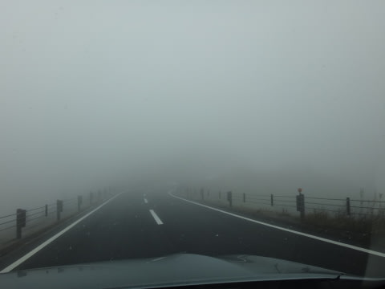

やっぱりダメか…

すごいガス＆強風…（涙）

そして，気温は6度．

さーーーーーむいよ！！！

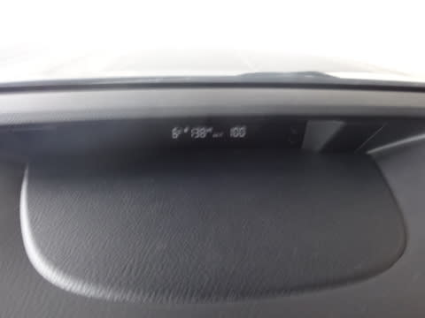

そして…

きれいな一面の紅葉というより．

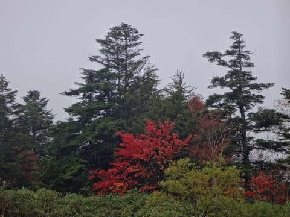

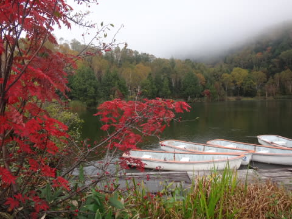

…ところどころ，まだらに色づいている

木がある感じ．

うーむ．

一面の紅葉を期待したんだけどな～．

そして．

こんな天気にもかかわらず．

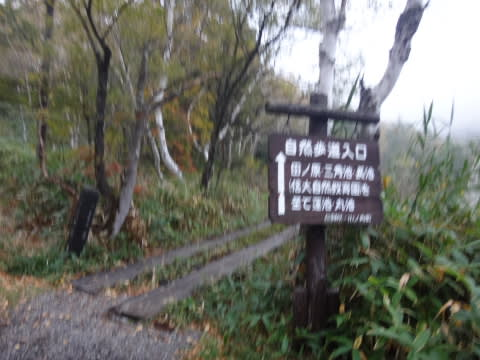

トレッキングルートを歩く私．

いや．

でも．

ガスのトレッキングルートも，なかなか

幻想的でいいんでないかい？←決して負け惜しみではない

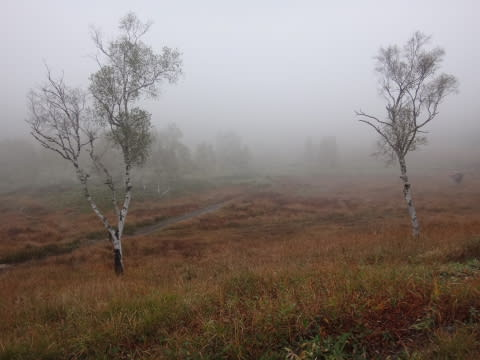

木戸池から信大自然教育園前という，

黄金ルートをたどりつつ…

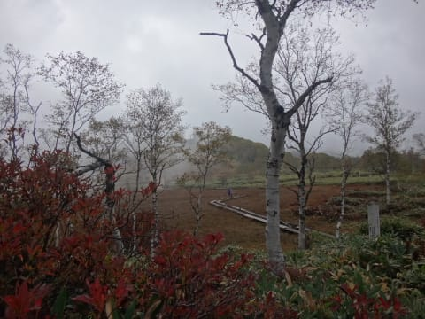

秋の気配を楽しみます．

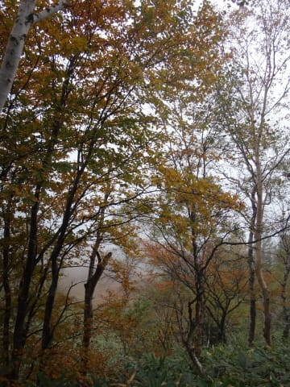

…つーか．

もう，秋も終わりの気配…

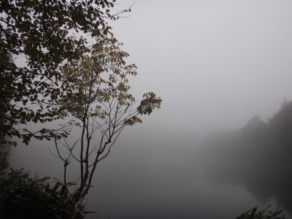

そんな中．

時折降る雨にも負けず．

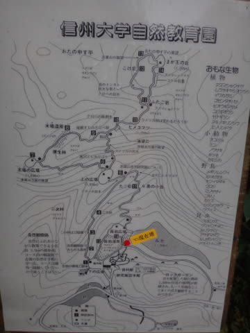

こんなルートをフルで歩いてみましたが…

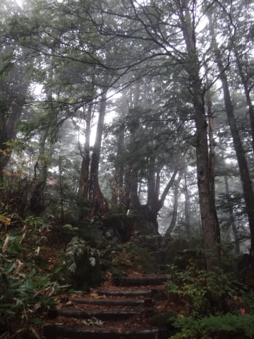

いや．

これ．

雨が降ったら歩くべきじゃないですね←当たり前だ

途中，二組にしか会わなかったよ…←自分以外の人がいたのにちょっと驚き

というわけで．

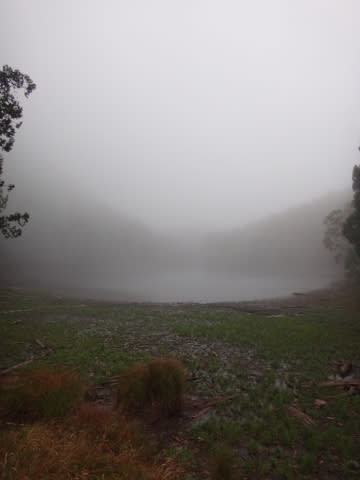

今日は霧，時々小雨の志賀高原をゆっくりと歩いてみました…

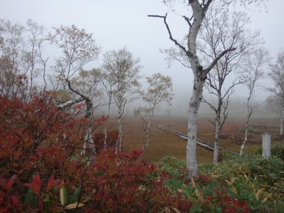

明日も志賀高原を歩く予定！

…天気が良ければ，岩菅山山頂を狙おうと

思っていたんだけど…

それは無理かな～．

曇りなら池めぐりコースかな．

では，これから車中泊＠道の駅です～．

おやすみなさい～

## 💬 コメント一覧

### 💬 コメント by (yama)
**タイトル**: 志賀高原
**投稿日**: 2016-10-10 08:05:39

10日11日と志賀高原に来ています。今、すき家で朝食中です。K様と合えればいいなと思います｡もちろんSさまにも。

### 💬 コメント by (Goku)
**タイトル**: Unknown
**投稿日**: 2016-10-10 13:12:25

只今、グランフェニックスでランチ中。

生憎の天気ですね。

色づきも今年はイマイチかな

### 💬 コメント by (Skier_S)
**タイトル**: 疲れた…
**投稿日**: 2016-10-11 00:41:38

＞yamaさま

本日はありがとうございました！

りんご，帰宅してから1個おいしくいただきました！！

また，柚子の時期によろしくお願いします～

＞Gokuさま

あれ？

午後1時ごろに，奥志賀に紅葉フェスティバル

に顔を出していたので…

しまった．

ニアミスでしたね～！！！！

コメントを確認していれば…

しかし．

この3連休，20000mクラブな方が数名

志賀に来ていて，さらにGokuさんまで…

なんだか集まってましたね（笑）

### 💬 コメント by (Goku)
**タイトル**: Unknown
**投稿日**: 2016-10-11 20:03:08

ニアミスというより、同じ場所にいましたね(笑)

それにしても皆さん『志賀高原愛』に溢れていますね。

### 💬 コメント by (Skier_S)
**タイトル**: Gokuさま
**投稿日**: 2016-10-12 00:04:15

ニアミスというか，

もう数10mってところまで接近してましたね（笑）．

しかし．

この3連休…

みんな何かに惹かれたかのように

志賀高原に集まってました（笑）

