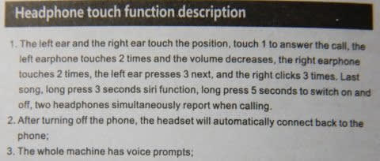

# AirPodsコピーの800円の激安Bluetooth TWSイヤホンを買ってみた その2…外観チェック＆充電，そしてBluetooth登録まで

📅 投稿日時: 2020-06-13 01:52:12

何度も言いますが．

このBlog，スキーBlogなんです．

スキーBlogなのに．

なぜ自動車ネタやガジェットネタの方が，

スキーの話題よりアクセス数が圧倒的に多い，

この不条理感…

とりあえず，

読者の皆様におかれましては．

このBlogはスキーBlogだということを

心に刻み込んでおいてくれると嬉しいです…

ってなことで．

今日は[前回](ee86b38be5f7cad4218e94f41a250cc53.md)の続き，

AirPodsコピーのTWSイヤホンの話題

です！←スキーBlogだと言ってるそばから，何か矛盾を感じる

えー．

[前回は](ee86b38be5f7cad4218e94f41a250cc53.md)．

記事を書いたのが深夜だったので，

記事を開梱の儀まで書き上げたところで

打ち切ってしまい，性能や音質について

全く書かなかったので

「記事タイトルと中身が違う！！」

とツッコミを受けそうな感じだったのですが…

さらに昨日は，

記事を書く時間すら取れなかった

という悲惨な状況で．

ようやっと今日は，使ってみた感じのレポート．

充電＆Bluetooth接続編です！

…ってなことで．

到着したi11 TWS．

ケースは思ったより小さいですね…

見た目，腕時計を一回り大きくしたくらい．

車のリモコンキーをちょっと分厚く

したくらい，って表現がいいかな？

中のイヤホン本体を見てみると…

プラスチック部品に安っぽい

バリも出てないし．

軸の部分も妙に太かったり

しないし…

これでホントに2時間も持つ電池が

内蔵されてるの？？

これで送料込み800円とは思えない…

見た目は十分な品質ですね…

で．

さっそく使ってみようと，マニュアルを

読んでみるわけですが…

中国語は読めないので，

裏面の英語表記を読んでみましょうかね…

…って．

何じゃこりゃ！？？

英文が…英文が，意味をなしていないん

ですが！？？

果たして，この謎の英単語の羅列を読み解いて，

使い方が分かる人がいるのか…？？

中国語は読めないけど．

表面の中国語の漢字の羅列と突き合わせながら，

なんとか意味が分かる感じでした…（涙）

うーむ．

マニュアルはお値段なりの品質ですね（笑）．

ってなことで．

まずは充電ケーブルをケースにつないで，

充電するところから始まるわけですが．

ちょっと付属の充電ケーブル，短いなぁ…

充電器はついてきてないので．

手持ちの適当なUSBアダプターに

差し込んで，充電を開始すると…

なんだ！？？

なんだか光りやがりましたよ！

ケース内のイヤホンが光っているのが

ケースを通して見えていて，

ケース底も赤く光ってます…！

このイヤホン，ケースとイヤホンと

両方に電池があるわけですが．

ケースの電池の充電中は，ケースが赤く点滅し，

イヤホン充電中には，イヤホンが赤く点灯

するようです…

しばらく経つと，

イヤホンの光が青色に変わり，

イヤホンの充電が終わったようです…

ちなみに，

ケース底面の赤点滅が連続点灯に変わったら，

ケースの充電が終わった合図です．

なので．

さっそくケースから取り出して，使って

みようとするわけですが…

をを！！

ふたを開けてイヤホン本体を取り出した瞬間に，

イヤホンのライトが点滅を始めやがりましたよ！？

なんと，イヤホンをケースから取り出すと

自動的に電源が入るのか…っ！！

そして，一度このi11を認識させたスマホ等の

デバイスがあれば，このまま自動で

接続まで完了するので．

ケースから取り出し，耳に入れるころには

もうイヤホンはスマホにつながってます．

電源ボタンを押したり，Bluetooth接続のために

何かすることもなく．

ケースから取り出すだけで電源が入り，

スマホとの接続が完了するとは…！！

ちなみに，使い終わったイヤホンをケースに

戻すと…

今度はイヤホンの電源が自動的に

切れて．

さらに，自動的にイヤホンの充電が

始まります！！

ケースが電源につながって無いときは，

ケースの電池からイヤホンに充電される

わけですが．

この時はケースが青色，イヤホンが赤色に

光ります…

ケースからイヤホンへの充電を止めたければ，

ケースのこのボタンを押せば充電の中止/再開が

切り替えられます．

ちなみに，ケースの電池はイヤホンを4回フル充電

できる容量があるようです．

とりあえず．

スマホにこのi11を認識させると．

スマホからイヤホンの充電残量が

確認できますし…

通知欄のBluetooth接続マークの横に

電池マークが出て，ここでイヤホンの

電池残量が確認できます…！！

一応，マイクもしっかり認識してるので．

こいつで電話の通話ができます…

…なんだ．

800円のくせに，思った以上に便利じゃ

ないか…っ！

（すみません…長くなったので，また[続きます](ee3e9bc695a15a2da9b39ad0532fd1990.md)）
