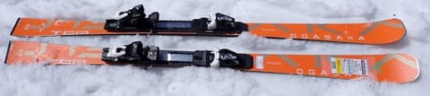
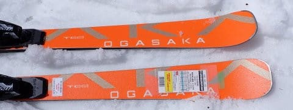
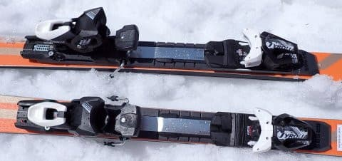
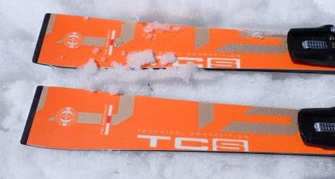
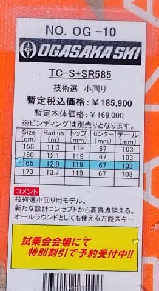
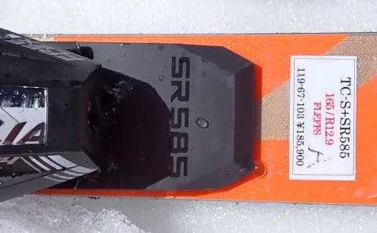

# 2025シーズンモデルのスキー板，試乗レポートその18…OGASAKA TC-S+SR585

📅 投稿日時: 2024-06-25 01:55:15

えー．

スキーシーズンが終わったこの週末．

今年初めて，山を歩いて（走って？）来ましたが…

[去年は4回ほどチャレンジ](eaea2ea7b7f88328e0bfed3ca8b55f36e.md)した，

小仏駐車場から景信山→陣馬山往復ルート．

行き1時間45分

帰り1時間28分

という結構情けないタイムでした（涙）

昨年ラストは

行き1時間33分

帰り1時間12分

だったので…

行きが12分，帰りは16分も遅くなってる（泣）

スキーと山歩きで使う筋肉がやっぱり

全然違うみたいで，8か月近くスキーで

鍛えたはずの身体なのに．

山を走ると身体も重く感じ，すぐに心拍数が

上がってしまい．

かなり自信をもって行ったのに，ボロボロに

やられた感じ（泣）

これまでは，スキーシーズンに運動するので

体力は春～夏前がピークだったのに．

山を走るようになってから，

スキーシーズンで体力落ちたね

と思うようになった，このヤバさ．

…いや．

衰えじゃないはず．

年齢による衰えじゃないはず…っ！！

でも．今，記録を見返すと．

昨年の初めて山行は同じルートをたどっていて．

行き1時間53分

帰り1時間29分

だったので．

それより行きで8分，帰りで1分タイムが

上がっていたから．

まぁ，基礎体力は昨年より確実に上がって

いるのだと信じたい…

ってなことで，本題へ．

今日も2025シーズンモデルのスキー板の

試乗レポート．

今回はオガサカ編です！

〇OGASAKA TC-S+SR585 165cm

基礎小回り．

技術選向けのTCシリーズの小回り板．

これまで，TC-S〇という名前で毎年〇の

アルファベットが違う名前でしたが…

そろそろオガサカの人も，どのアルファベットが

何年モデルかわからなくなってきたので，

単純なTC-Sという名前にしたという，

2025シーズンモデル．

今回試乗したのは，一番強いSRプレートが

入ったやつです．

で．滑ってみると．

今シーズンモデルのTC-SBに比べると，

フレックスがかなり強くなった感じ…

メタルのバネが強くなったというより，

コア材の硬さを感じます．

…コアというより，プレートの強さかな？

プレートが硬いからか，谷回りから

ウニョーンとたわんで回って行く感じでは

なく，ちょっと突っ張る感じがあります．

そのため，今回の試乗コンディションの

緩めの春の雪ではちょいとたわみにくく，

かなり気合を入れて圧をかけていかないと

小回り板のわりにまっすぐ目に走ります．

サイドカーブは小さめだけど，板自体の

旋回力もそこまで強くなく，

おそらく普通の人が履いたら，165㎝でも

ミドル，ヘタすればロングっぽいターンに

なるんじゃないかな～…

かなりスピードを出して，高速で落差を

取らないと鋭い小回りができない感じ．

ただ，フレックスが強いながらも，たわませ

られればたわみの出方は良いので，

締まり気味の斜面でしっかりスピードが

乗った時は，ちょうどいい中回りマシン

くらいの回転弧で鋭いハイスピード

カービングができます．

中回りマシンだととらえれば，強いフレックス

がもたらす高速安定性により，ものすごい

ハイスピードで気持ちいい中回りができます！

どこまでスピードを出しても板に余裕がある

ような，ショート板としては桁違いの高速

安定性がある感じ…

普通のゲレンデで滑るスピードを大きく超える

ハイスピードで，安心してガンガン中回りが

できます．

小回り板というより，中回り寄りのSL競技板

みたいな感じかな？

カービング小回りをするには，硬めの斜面で

かなりスピードを出してガッツリしっかり

踏んでいかないといけない感じ…

でも，カービング小回りができない領域で，

板を動かす小回りで滑るときに，板の

しっかり感とグリップが結構あるので，

板を動かしていった小回りでも

安定感やスピード耐性はかなり高め．

あと，ポジションの許容度もそこまで

高くなくて，正しいポジションに乗って

いかないと板のたわみは出せません．

とりあえず，このSRプレート付きは，

かなり玄人好みの板ですね．

正しいポジションに乗れて，

かなりのスピードを出して，

結構な筋力がある人が選ぶ板かな～．

私に対してはちょっと板のレベルが高すぎる

感じでした…

硬い斜面だともう少し何とかなったかな？

## 💬 コメント一覧

### 💬 コメント by (副院長)
**タイトル**: Unknown
**投稿日**: 2024-06-25 08:43:39

S様、山は熊に遭遇しないようにお気をつけください。小賀坂よさげです。高齢者には弱いプレート付きか、ジュニア版でいいのかなと思うこの頃。でも先に靴がへたってますのでそちらが先かと。

鹿にもご注意くださいませ。自転車乗りは何人か鹿にサイドから突撃されています。

### 💬 コメント by (Skier_S)
**タイトル**: >副院長さま
**投稿日**: 2024-06-26 02:08:49

いやー．

以前一度，目の前で熊に遭遇してびっくりした経験があるのですが…

まぁ，裏高尾山系ならそこまで熊は出ないと思ってます．

でも，鹿にサイドからやられたらかなり怖いですね．

オガサカTC-Sも，FMプレート付きなら

そこまで手ごわくないですよ．

ブーツと板，同時に物欲に負けてみてはいかがでしょうか（笑）．

