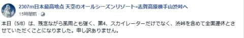
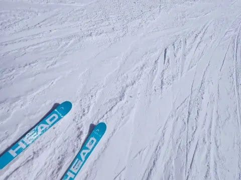
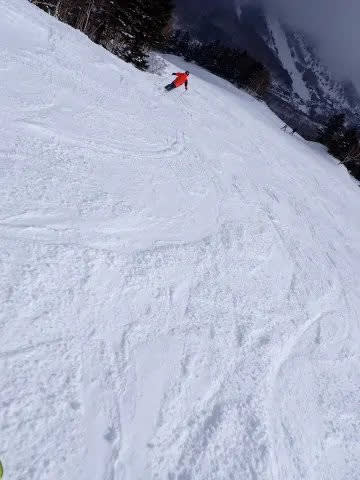
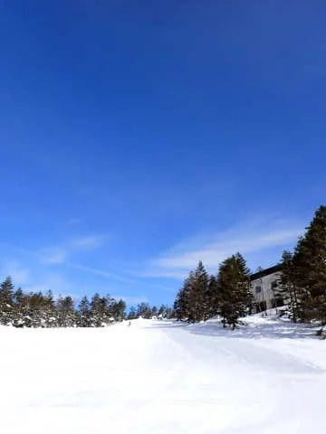
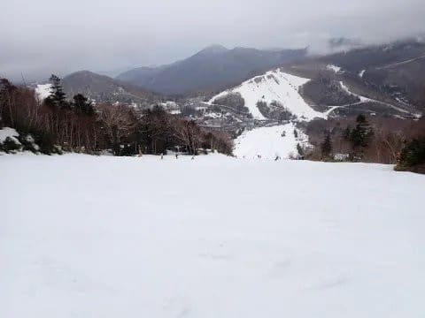
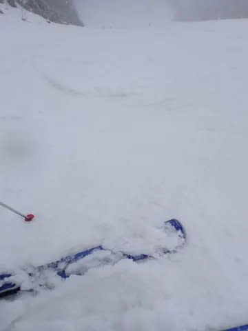
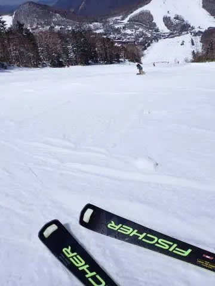

# 2024シーズンモデルのスキー板，試乗レポートをボチボチ始めないと…

📅 投稿日時: 2023-05-09 03:25:44

えー．

志賀高原で生き残ったのは渋＆横手第4だけと

なった本日5月8日ですが…

残念ながら，本日は強風のため渋・横手ともに

運休だったようです…

（[横手山Facebook](https://www.facebook.com/yokoteyama2307/posts/pfbid02RYhacxzEtRgmkT3dNLE8VhhSDx8Mqf1b7gk5V9s8cXMqDPdDAgFqjADb8hakMtaVl?__cft__[0]=AZWc3zzEC7eSUu9kNC8KeFT--eaFDqOBycappDJySw9njIAmz9xIAqfwBe8a2Wv90Bw6db7XR_5FY5joce8fsd2iF5FDBjhY7CsTynbJso8I-6NLDHgqCaTLw19oSKjb8jCaB74B4auGFOXUU_JTGaGTMa4U4XLHUqvqDWD19iq6dyE1MQByYvD7jYCbArFFj5jFc1uPkNg--xpVK14bonPf&__tn__=%2CO%2CP-R)より）

ちなみに，今日の志賀高原．

気温は寒かったのに朝は雨で，昼前から

雪に変わったようですが…

せいぜい薄っすら積もる程度だったようです．

そして，かぐらも今日は全面運休だった

みたいですね．

…そして，かぐらは相変わらず

「5月21日まで営業！」

と宣言していますが…

ホントに21日まで営業できるのかな？？

…ってなところで，本題へ．

今シーズンも，

3月4，5日のエキップ試乗会＠焼額，

4月8，9日のアルペングループ試乗会＠一の瀬

のふたつの試乗会に参加し，かなりの数の

来シーズンモデルのスキー板に試乗してきました～！！

30機種以上乗ってきましたよ～！

で．

エキップさんの試乗会は2か月前，

アルペングループ試乗会は1か月前と．

もうネタがちょっと古くなってしまったの

ですが…

仕事をやらなくても何とかなる日は全て

スキーに費やす日々がGWを境に終わり．

スキー場レポートやら，スキー場の天気予想

やら特派員レポートなどのネタが減っていく

ので，この時期からの連載開始になっちゃい

ました…

で．

試乗の時のコンディションですが．

3月のエキップさんの試乗会は…

土曜は気温が冷えて，朝はちょいと固めだったけど

昼間も雪は緩まず，トップシーズンのいい

コンディション！

そして，日曜は晴天で，気温が上がったものの…

雪が完全に緩んじゃう前の午前中に

試乗を終えたので．

基本的に，エキップさん試乗会で履いた板は，

トップシーズンの雪でどんな乗り味だったかを，

かなりのハイスピードで試したものになります…

で，4月の一の瀬でのアルペングループ試乗会は…

土曜の午前中は，前日の雨でザブザブで荒れ荒れの

最低のコンディションで…

午後になってその上にすごい重い新雪が

積もるという，試乗には適さない

コンディション（涙）

でも，翌日の日曜の朝は，この時期としては

強烈に冷えて，かっちり締まった

冷え冷えのいいバーン！！

ただ，昼ごろにはかなり荒れてきたので…

どちらかというと硬いバーンと春の

重い雪に強い，しっかりとした重量感の

ある強めの板の評価が高くなってます…

さらに，試乗の時に履いたブーツは

HEADのRaptor WCR3のフレックス140．

普通のゲレンデ用としてはかなり強めの

ブーツなので，これもしっかりとした

重量感と高いグリップがある板が評価が

高くなっちゃうかも…

ということで．

ブーツをHEADに変えた昨シーズンから，

SL競技用とかの，かなり強めの板の評価が

高くなってきている傾向があるので，

そのあたりを割り引いて読んでやって

ください…

といか．

そもそもいつも書いてるけど．

プライズも指導員資格も持っていない，

こんなド素人のレポートが役に立ってるんだろうか…？

と，いつも思ってるんですが…

とりあえず，いつもの注意書きを改めて

書いておくと．

このレポートを書いているのは，

指導員もテククラも持ってなければ，

レースをやっていたわけでも無い，

どシロートのレジャースキーヤーです．←ここ強調しておくところ

レジャースキーヤーが

自分の好き嫌いを言っているだけ

なので，

私がいいと思った板でも，

「なぜこれを誉める？」

と思う方もいっぱいいると思いますし．

逆に，私と合わなかった板でも，

「なぜこの良さが分からない…？」

という方もいっぱいいると思います．

あくまで，いちレジャースキーヤーが，

自分の好き嫌いを述べているだけですので，

そのあたりを心に留めて読んでもらえると

ありがたいです…

一応，私の板の嗜好を書いておくと．

滑走スピードは一般スキーヤーとすれば

比較的高めの部類でしょうか…

スピードを出して滑ることが多く，

また，ガッツリ板を雪面に喰わせての

深めのターン弧を好むという嗜好もあり．

比較的フレックスがしっかりして，

グリップがかなり強い板が好きです．

柔らかくて取り扱いやすい，グリップ

優し目の板は評価が低くなっているので，

ご注意を…

ってなことで．

レジャースキーヤーの言いたい放題な，

いい加減な試乗レポート．

次回からスタートです！
