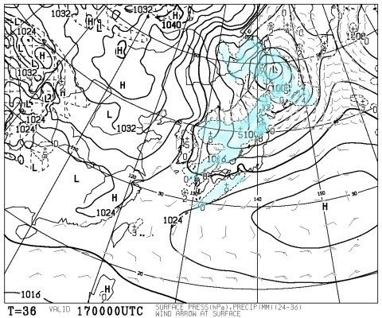

# 2月8，9日．今週末の志賀高原の天気は…土曜は朝まで雪，雲が多そうだけど…日曜は晴れそうかな？？

📅 投稿日時: 2017-02-16 06:34:26

ということで．

今日もご無体時間に更新していますが．

水曜定番，今週末の天気予想に参りましょうか…

えー．

まず．

週末の前日．

17日の金曜ですが…

やはり気温はかなり上がりそう…

志賀高原には，+3℃線がかかるレベル（涙）

…昼間の気温は，プラスまで上がりそうですね…

ただ．

この日の午後には前線が通過し，一気に気温が冷えて，

降り始めます．

…降り始めは微妙に湿った雪かもしれませんが．

＃液体が降るという恐ろしいことはないと信じたい

夕方から雪が降り始めますね～．

で．18日の土曜ですが…

850hpa図を見ると．

をを！

今度は，一気に冷えて，水色で示した-9℃線が

志賀高原にかかってます！

今度は朝の気温が-10℃を下回るレベル…

…両極端すぎるんですが（笑）

で．地上天気図を見ると…

冬型の気圧配置で日本海側に雪雲がかかってます．

だもんで．

志賀には10cmほど積雪がありそうかな？

そして日曜．

19日ですが…

この日も，850hpa図では水色の-9℃線が志賀高原にかかっています！

朝は-10℃以下までしっかり冷えてくれそう…

そして，地上天気図を見ると．

高気圧に覆われるので，晴れそうですね～．

ってことで．

まとめると．

18日土曜：朝は雪がちらつく．昨晩からの積雪は10cmほどかな？

　志賀高原への登り道は前日溶けた雪が凍った上に積雪なので

　滑りそう…注意！

　天気は雪がちらついたり止んだり．時折日も射す．

　気温は終日低め．朝は-10℃以下，昼間も-5℃を下回る．

　雪質は前日気温が下がるので，下地はちょっと固めに

　なるかもしれないけど，その上に柔らかい雪がかぶるので

　朝のうちはいい感じ．

　柔らかい雪がはがれる午後には，ちょっと下地の

　固いのが出てくるか…

19日日曜：前日からの積雪は無く，朝はしっかり

　締まった圧雪バーン．

　終日気温は低く，朝は-15度近くまで冷え込むかな？

　昼間も-10℃をわずかに上回る程度．

　朝のうち雪がちらつくかもしれないけど，

　じき晴れていく．

…といった感じかな～．

もし，金曜の降り始めが…

液体だったら．←考えたくないけど

下地がアイスバーンになりそうなので

そうならないことを祈るばかり．

眠いので，もう寝ます～！

## 💬 コメント一覧

### 💬 コメント by (はなげ親分)
**タイトル**: 更新時間
**投稿日**: 2017-02-16 16:14:56

なんという更新時間なんですか!!

そりゃ眠いでしょうよ…

お身体お大事にしてください。

おかげさまでカミさん15日に退院しました。

入院中お声かけいただいた皆様ありがとうございました。この場をお借りしまして御礼申し上げます。S様、勝手にこの欄お借りしましてすみません。

今週末から二度目のプチ冬休みに入ります♪週明けのゲレンデ状態はどんなでしょうか？

### 💬 コメント by (Skier_S)
**タイトル**: はなげ親分さま
**投稿日**: 2017-02-17 01:57:42

退院おめでとうございます！！！

無事，階段上って自宅に帰れるように

なったのでしょうか…

入院，大変だったかと思います．

これからも完治するまでもう少し大変かと

思いますが，ゲレンデ復帰目指して

しっかり治療にご専念ください…

ゲレンデでお待ちしています！＞奥さま

で．

今週末は，土日は予想通り，チラチラと

雪が降る，結構冷えた2日間に

なりそうですが．

20日，23日はヤバい感じです…

何日間お休みなんでしょうか？

### 💬 コメント by (はなげの女房)
**タイトル**: 待ってて下さい！
**投稿日**: 2017-02-17 20:36:56

ありがとうございます。治療に専念させていただいたお陰で無事退院し、仕事復帰しました。手術の時「もう一度スキーが出来るように治して下さい」とお願いしました。ゲレンデで待っていてくださるなんて、凄い励みになります。ゲレンデが本当の復活だと思っています。

### 💬 コメント by (Skier_S)
**タイトル**: はなげの女房さま
**投稿日**: 2017-02-17 23:39:14

退院おめでとうございます～！

職場復帰もお疲れ様でした．

ぜひ，しっかりリハビリして，

また雪の上に舞い戻ってきてください．

また志賀高原でお会いできる日を，

楽しみに待っています～！！

