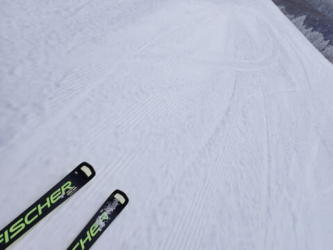

# 2024/1/28(日)の志賀高原焼額山スキー場の詳細レポート…雪よし，天気よし，そして混まないという3拍子揃った最高週末！

📅 投稿日時: 2024-01-30 00:10:27

🏷️ カテゴリ: [2024スキー滑走日記](c453f687e8a0f05679e95831d0a02cd0c.md)

えー．

本日も，志賀高原で滑っている特派員から

写真が送られてきましたが…

本日も最高だったようですね…！！

今日は終日晴天なのに気温は低く．

朝は-10℃程度だったみたいで…

雪質は終日いい感じだったようです！

そして人も少なく，シマシマがなかなか

消えないほどのガラガラ状態だった

らしく…

晴天でほぼ無人の，最高雪質バーンを

滑れた，日曜にまして最高コンディション

の志賀高原だったようです…

あぁ…今日も滑りに行きたかった…

ちなみに．

このあとは，明日30日は冷えて晴れ．

31日は…気温が上がり曇り．

1日は…風が強まり，雪がパラパラと

吹き付ける一日になりそうで．

今のところ，空から液体が降ってくる

危機は回避できたっぽい…

3，4日の週末は晴れ～曇り．

気温は高めながらも，雨の危機は

逃れたので．

そこそこいい状態で滑れそうな予感…

ってなことで，本題へ．

日曜の志賀高原焼額山スキー場の

詳細レポートです！

…まず．

朝は無事，8:30の営業開始前に並びますが…

土日にしては意外と待ちの列が短めかな？？

そして．

山頂に上ると…

気温は-12℃と，この時期としては標準的な

冷え込みながら…

ここしばらくの高温傾向から見ると，

激冷え！！

そして．

天気は曇り空ながらも，薄日も差し…

昨晩からの積雪はほとんどなかったのが

ちょっとだけ残念だけど．

その代わり，昨日降り積もった雪が

しっかり圧雪されて朝の低温でしっかり

冷えた，しっかり密度が高い感じで

ピシッと締まった，超上級の圧雪バーン！

ヤバい…

これはヤバい！！

しっかり締まったトップシーズンの雪は，

スピードが際限なく乗っていくのに，

しっかりエッジが効いてくれて．

こんないい雪で，超気持ちいい切れ切れ

ターンを刻んで行ける，この快感と

いったら…！！！

さらに．

営業開始30分を過ぎると，雲も切れていき，

ゲレンデが明るく見やすくなって…

…見よ，このトップシーズンらしい，

冷え冷え雪を…！！

そして，人の少なさを！！

この冷え冷え最高雪で人がいないバーンを

思う存分に飛ばせる，この快感ときたら…！

そして．

営業開始1時間後の9時半には，

もう見事なすっきり青空になってきました…！！

うほーーーーー！！

こんな最高雪質で，こんな見事な晴天に

なるとは…！！

これは私の日ごろの行いがよかったからに

違いないっ！！←全然違うから

いや．

この晴天で，雪がよくて．

そして，ゲレンデの人が少なくて，

好きなライン取り放題とは…

シアワセだ．

シアワセすぎる…！

人が多いタイミングでもこのくらいだし…

いや．

なんで今日は晴天の日曜なのに，ここまで

人が少ないんだろう？？

ただ，第1ゴンドラは一瞬ゲート外まで

列が並んだけど…

それも一瞬だけ．

ほとんどのタイミングで，ゴンドラ待ちは

ゲート内．

午後になると，搬器2-3台待ちで乗れちゃう

感じだし．

第2高速は，終日ガラガラだし…

なんでこんな雪も天気もいい週末に，

ここまでガラガラなの？？

そして，昼間になっても最高気温は

せいぜい-4℃くらいまでしか上がらないし…

気温が低いので，晴れているけど雪は

全く緩まず．

昼になっても最高雪質のままだし…

さらに，人も少なく，バーンも結構

締まり気味なので…

バーンが全く荒れない！

コースのどこに行っても，凸凹してない！

ただ．

本日の天気予想では，本来曇り～雪降りの

予想だったので．

晴れたのは朝のボーナスタイム的な感じで．

昼を過ぎてくると，ちょっと雲が出始めて

来ちゃいました…

そして，午後になると完全に曇り空（涙）

でも，雪はいいし，コースは荒れてないし，

人は少ないし…

かなり楽しく滑れますよ～！！

この写真も全く誰も写ってない…

いつもならコブっぽくなるGSコースの

この辺りも，多少うねりが出てきて

いるものの，夕方になっても185㎝の

大回り板で大回り可能！！

ってな感じで．

最高雪質のガラガラを楽しんでいたら…

営業終了までラスト1時間の15時過ぎに，

山頂付近にちょっとガスがかかり，

雪もちょっとぱらついて来ました…

けど．15時を過ぎるとコースも完全

無人に近い，ゴーストタウンバーンに

なってきたし．

雪は最高に良い雪で，楽しい～！！

夕方になっても，ゲレンデは締まって

フラットな，思う存分大回り可能状態

だし．

楽しすぎる…！！

…ってなことで．

今日も営業終了の16:15まで．

また昼休憩も取らず，休まず止まらず，

ひたすら滑る続けたのでした…

いやーーー．

良かった．

今日は本当に良かった…

もう，365日，毎日こんなだったらいいのに

な～！！←夏もこれで毎週スキーに来続けたら家計破綻するでしょ

## 💬 コメント一覧

### 💬 コメント by (院長)
**タイトル**: Unknown
**投稿日**: 2024-01-30 12:31:18

お借りします。副院長様、ニセ院長です。今日はお声掛け頂きありがとうございました。

火曜日の志賀高原情報

朝の上林-4℃　蓮池-8℃。快晴。ベストコンディションが今日で五連続。気っ持ち良すぎです。

朝一のダイヤは圧雪が今一だけど、視界がいいのでまずまず。

唐松はシマシマフラット満喫です。

オリンピックもフラット。下地がやや硬なので全く荒れない感じ。

白樺もGSもとにかく快適。ゴンドラで出会う人達も、一様に感動している。

奥志賀エキスパートも昨日に続いて私のベスト。ダウンヒルではお代わり連発。後ろ髪を引かれながら、漕ぐのが嫌なのでバスでダイヤへ戻って、あっさり終了。エス様の対極を行く潔い男ですね。(勿体なさが残ります)

### 💬 コメント by (おおすぎ)
**タイトル**: Unknown
**投稿日**: 2024-01-30 12:31:33

こんにちは！

朝一から、素晴らしい志賀高原のお写真を拝見出来て、見ているこちらも画面越しながら爽快感が湧いてきます！

有難うございます（デスクの写真盾に1枚、頂いても宜しいでしょうか・・・肖像権？？？）

### 💬 コメント by (副院長)
**タイトル**: Unknown
**投稿日**: 2024-01-31 00:32:49

レインボーさん達、発見❗️早い、全てが早い。

昨日も、今日も、春のようで、1月の末にこれで、大丈夫だろうか？でも、なぜか、滋賀県は、梯団走行してるし。なんか変です。また、日曜日よろしくおねがいします。

### 💬 コメント by (Skier_S)
**タイトル**: 今週はそこまでコンディション悪くなさそう
**投稿日**: 2024-01-31 03:17:46

＞ニセ院長さま

毎日ベストコンディションが更新されますね～！

これだけのベストコンディションで昼に上がっちゃうのはもったいないですよ！！（対極の発想）

＞おおすぎさま

写真は好き勝手に使ってください～！

壁紙にしてもよし，印刷してもよし．

好きに再配布してもらってもまったく構いませんので…

＞院長さま

晴天＆ベストコンディションが続いていていいですね．

1月末の志賀にしてはいい天気が続き，気温も高めですが…

でも，雪が悪くならない程度の気温なので，寒すぎずむしろ良いのかも？？

