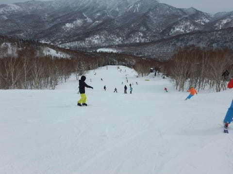
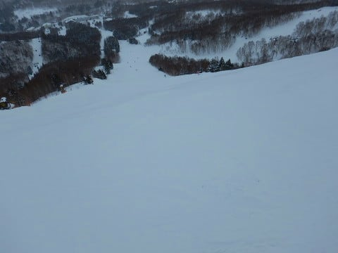

# 2019/2/11(月），3連休最終日の志賀高原スキー場，詳細レポート…雪もそれほど悪くなく，午後まで比較的フラット．午後はガラガラ飛ばしたい放題！昼間は晴れ間もあって，楽しめた一日

📅 投稿日時: 2019-02-13 07:03:15

ダメだ…

今日も帰宅後，倒れたように寝てしまったので．

3連休最終日の詳細レポート，

朝起きてから急いで書いてます…（涙）

なんでここまでして書いているんだろう…（謎）

とりあえず，最終日レポート，行ってみます！

まず．

あさイチのゴンドラは，いつもの週末より

人が少なく．

あんまり混まなさそう…

山頂気温は．

　朝イチの気温は-11～-12℃くらい．

と書いた通り，-11℃！！

ふはははは．すごい精度で当ててるぞ！（自画自賛）

あさイチの天気は曇り空．

新たな積雪は0ですが…

でも，ゲレンデは昨日積もった雪が圧雪された，

シアワセシマシマバーンっ！！

ちょいとコロコロがところどころあったけど，

ガッツリ傾けるシアワセバーンっ！！！

…だったのも，せいぜいゴンドラ3本だけ．

さすが3連休．

9時半には，ゲレンデの人口密度がすごいことに…

気持ちよく滑るというより，人の間を縫って

ゴンドラ乗り場まで何とか移動するという

感じに…（涙）

でも，ゴンドラ待ちは昨日ほどひどくならず．

せいぜい最大でこの程度．

これで5分待ちくらいかな…

でも，こんなに待ったのは1回くらい．

第1ゴンドラは，午前中は9時半～11時ごろまで，

平均2-3分待ちかな．

第2ゴンドラは，10分待ちまで行ったようですが…

午前中のゲレンデは人は多かったものの．

昨日積もった20cmの雪が効いているようで．

多少硬いところが出てくる部分があったものの．

ゲレンデはおおむね冷え冷え雪でカバーされて．

滑りいい感じ！

…そして．

3連休最終日．

早めに帰ろう…という人が多いのか．

昼になると，ゴンドラはガラガラに！

で．

昼間の気温は，これも

　昼間の気温も-5℃程度と冷え冷え．

と書いた通り．

ぴったり-5℃！！

すごいぞ，我が天気予想！！

3日前の金曜に，ここまで正確に

当てるとは…

と，自画自賛していたけど．

…あれれ？？

昼には，太陽が顔を出して…

見事な晴天に！！

…これは．

金曜の最終予想の

　この日は終日，曇り～雪がちらつく感じ．

という予想は外したようですね…（涙）

水曜段階の，

　適度にバーンが締まって，午後は日も射して

　滑り良い一日になってくれそう．

という方が当たったか…

晴れててバーンが締まって，

かなり滑り良くて．

いつものメンバーで集団爆走状態！

午後はゲレンデもガラガラで．

天気もいいし，冷え冷え雪だし．

いやーーーー．

最高…

3連休の午後は，早く帰る人が

多いからか．

いつもの日曜より空いているくらいで．

第1ゴンドラだけじゃなく，第2ゴンドラも

ガラガラ飛び乗り！

いやーー．

いいじゃないですか…！

と，思っていたら．

午後2時前にはまた雲が増え始め…

午後2時には曇り空に戻っちゃいました（涙）

それどころか，午後3時ごろには雪が

ぱらつくタイミングも…

うーむ．

本来なら，曇り～小雪と予想したので．

「見よ，わが予想の通りの天気になってきたじゃないか！」

と言いたいところだけど…

このまま外れ続けて，晴れていてほしかったなぁ…

でも，ゲレンデはガラガラだし．

GSコースの一部と，オリンピックコースは

ちょっと荒れ気味だったけど．

　最終日は人も少なく，午後まで

　そんなにゲレンデも荒れず，そこそこ

　いいコンディションで滑れるかも…

という予想通り．

人が多くて，夕方はいつも凸凹になる

サウスコースも，多少硬いところが

出てきたものの，最後まで割とフラット

だったし…

夕方は，それほど荒れてない

無人の貸し切りバーンを，

気持ちよく滑れましたよ～！

ってなわけで．

いつも通り，日が暮れ始めるまで

すべったわけですが…

この日は，夕方に某大学の団体さんが

ゲレンデに繰り出してきて．

そのおかげで，特別に17:15まで

第4ロマンスが延長営業という嬉しい

オマケ付き！

ってなことで．

ナイター照明がつく17時過ぎまで．

たっぷり楽しんで帰ったのでした…

…いつもより1時間近く長く滑った

おかげで．

帰宅時間はすごいことになりましたが…（涙）

ってなことで．

そこそこ天気も雪も良く，

意外と楽しめた3連休最終日．

初日はアイスバーン，

中日は超混雑＆凸凹バーンで

ちょっと残念な感じだったけど…

まぁ，3日間連続アイスバーン

地獄じゃなく．

ゲレンデ状況は結構回復してきたので，

まぁ良かったかな…

とりあえず．

ここ4週連続，呪われた週末が続きましたが．

注連縄の効果なのか．

5週間ぶりに，とんでもないことが何も起きなかった，

平和な週末を過ごせたのでした…

…が．

また，謎の出来事があったので．

また明後日にでも報告します…

## 💬 コメント一覧

### 💬 コメント by (かず)
**タイトル**: Unknown
**投稿日**: 2019-02-13 21:54:38

雪期待できないので　久々に別のゲレンデに明日から行きます慣れないとこって気分が違いますね　週末は志賀です

