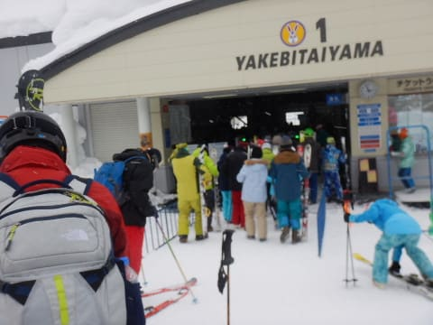

# 1月6日，3連休初日の志賀高原は…晴れのち雪降り．ちょっと混み気味…

📅 投稿日時: 2018-01-07 00:38:41

ってなわけで．

3連休に突入して．

まだまだ志賀高原滞在中のSkier_Sです．

ということで．

3連休初日の本日のレポートですが…

朝の積雪は…

ほとんどなかったようですね（涙）

…ちょっと予想外したか…

でも．

新雪が降ってないということは．

今朝はぴかぴかシマシマの最高圧雪に

違いないっ！！

ってことで，いつも通り焼額第1ゴンドラの

山頂へやってくると…

気温は-10℃ですか．

そこそこの冷え込み！

そして，天気は日が差して…

ゲレンデは．

そうです！

シマシマっ！！

結構やわらかめで，

エッジが深く食い込むシマシマっ！！

昨日に引き続いて，晴天のやわらか最高雪質の

シマシマ！！

ちょっと雪が柔らかすぎるけど…

でも，誰も滑ってない最高シマシマを

めいっぱいいただきます！！

オリンピックコースも，ぴかぴか圧雪で

すごいスピードが乗って滑りやすいし…

雪質は特A級！

もう，雪がいいのでなんでもできちゃいます…

そして．

曇りの天気予想を微妙に外してしまってますが

午前中は晴天ぴかぴか！

いやーーー．

やっぱりスキーって，晴天の下

やるものですよね…

と．

気持ちいい太陽の下滑っていたら…

あら．

あらららら…

やっぱり3連休だから，人が増えて

来ちゃいました…（涙）

第2ゴンドラは15分待ちですか…

そして．

第2高速リフトにも様子を見に行ってみましたが．

うーむ．

第2高速も，ゲートの外まで列が伸びていて，

数分待ちですね…

でも．

第1ゴンドラは，せいぜいゲートの外まで列が

延びるかどうか…という程度だったので．

最大2-3分待ち，ってところ．

第2ゴンドラが混んでも，

8人乗りで速度も速い第1ゴンドラは．

混まなくて快適です…

で．

昼間の気温も，せいぜい-7～8℃程度までしか上がらず．

午後も雪質は最高のまま！

ただ，やはり3連休の初日．

ゲレンデの人口密度は，午後になっても

それほど減らず…

いつもならガラガラになる，午後3時近くに

なっても，第1ゴンドラがゲート外まで

人が並んだり．

ちょっと人が多めでしたかね～．

でも，第1ゴンドラは最大でも2～3分待ち

だったので．我慢できるレベルでしたよ～！

ただ，午後2時を過ぎてくると．

予想通り，雪が強く降り始め．

午後3時には，かなり吹雪気味の天気でしたかね～．

でも．

しっかり最終リフトまで滑ったあとは…

はい．

そうです．

まだ終わりませんよ～．

ナイターに行きます！

今日は，サンバレーナイターに

やってきました～．

午後7時から9時までの2時間のみの

営業ですが．

圧雪をかけなおして，全面シマシマ…

というか，シマシマの上に雪がうっすら

積もった新雪状態で．

それでいて，距離の長いクワッドリフトが滑れるので．

志賀高原では一番面白いナイターかも…

ってことで．

今日も朝イチからナイターストップまで，たっぷり

楽しみました～！

…今，志賀高原は雪がちらついていますが．

このまま，明日の朝までは雪がちらつく天気なので．

明日の朝は，非圧雪コースはブーツパフが楽しめるかな～．

ってことで．

また明日，焼額滑ってます～！

## 💬 コメント一覧

### 💬 コメント by (ゆうこ)
**タイトル**: 背負子デビューしました。
**投稿日**: 2018-01-07 17:16:06

お久しぶりです。

三連休やっとスキーに来ました。

今年は子供を背負子に背負ってスキーしました（妹が）

子どもは、かなり気に入ったようで、「早く早く」と言ってました。

Sさんのお子さんのようにスキーが好きになってくれると嬉しいです。

明日も一ノ瀬あたりにいる予定です。

もし焼額から遠征して見かけたら声かけてください。

### 💬 コメント by (Skier_S)
**タイトル**: ゆうこさま
**投稿日**: 2018-01-08 00:33:28

お久しぶりです～！

お元気なようで安心しました…

しかし，ついに背負子デビューですか！

「早く早く」はうちの娘と一緒ですね(笑)

背負われていると，スキーの感覚が身につくようで．

スキーを履いていきなり

「こんな風に滑ってたよね～」

といって，すいすい滑り始めたのにびっくりした

思い出があります…

大丈夫です．

このまま背負い続ければ，きっとスキー好きになります！

明日一の瀬まで行ければ，また声かけます！

