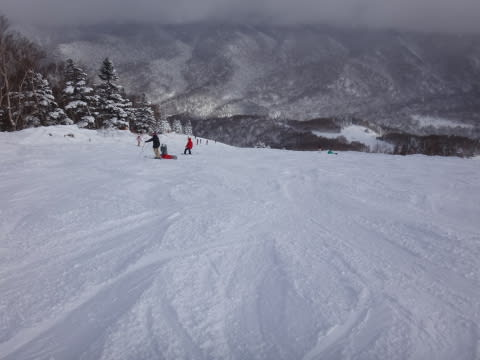

# 12月28日（水）の志賀高原スキー場…パウダー30～50cm！ゲレンデはちょっと混雑．道路状況は積雪路なのでご注意を．

📅 投稿日時: 2016-12-29 06:01:44

🏷️ カテゴリ: [2017スキー滑走日記](c7d777cecfc91bdf0fa464ad62c6d49ab.md)

えー．

私の記憶が確かなら．

27日の夜，忘年会に参加して．

帰宅が23時ごろだった気がするのだが．

それから3時間睡眠で日帰り志賀に行った

気がするのだが．

＃翌日の運転を考え，午後8時以降はアルコール抜きです

…志賀高原から帰ってくると，なぜかこんな時間（涙）

帰りの高速のSAで熟睡かましてました…

だもんで．

本日は速報モードにて．

えー．

本日の朝．

高速は坂城からチェーン規制．

志賀高原の登り坂は…

かなり気合が入った積雪路ですので，

ご注意！

そして…

朝のゲレンデは…吹雪です．

かなりの勢いで雪が積もってます！

　朝まで雪が降り続け，朝イチは30cmほど積もってるか…

　パウダーデーの予感！！

という予想通り，

非圧雪の場所では，深さ30cm～50cmほど．

脛パフのパウダー！！

朝の気温は-13℃と低く，

ゲレンデの雪質は最高！

…でも．

年末年始休み前の平日なのに．

ゲレンデの人は多めでした…

とはいえ，ゴンドラ待ちは平均搬器1-2台程度．

ゴンドラ待ちはほぼ無かったので，

その点は良かったかな．

とりあえず．

非圧雪の場所はパウダーが思いっきり楽しめ．

雪質は終日良かったですよ～！

そして．

概ね予想通り，昼ごろには雪も弱まり．

ごくわずかに日も射すタイミングもあり．

ここも予想通り，午後にはちょっとゲレンデが荒れ気味にはなったものの．

焼額のゴンドラストップまで，冷え冷え

最高の雪質のゲレンデを，たらふく滑ったのでした…

…

…

で．

あれ？

今日は日帰りのはずなのに…

そうです．

睡眠時間3時間でゲレンデに向かおうが．

日帰りだろうが．

ナイターが動いていれば，滑る！！←終わってる

…だって．

今日からダイヤモンドナイターが営業ですもの…

いやー．

今日のナイターは最高の冷え冷えシマシマバーンだったな！！

ということで．

帰りの高速では，さすがに疲れていたのか爆睡2時間…

ついさっき帰ってきました．

家を出て，24時間を超えてますね…（汗）

いやー．

しかし，ゲレンデはかなり良くなってきました．

明日からようやっと，焼額はオリンピックコースも

オープンのようです！

年末年始は，結構いいコンディションで滑れそうだな～．

## 💬 コメント一覧

### 💬 コメント by (めいめい)
**タイトル**: はじめてまして
**投稿日**: 2016-12-29 07:57:24

いつも楽しくブログ拝見しております。昨日ダイヤモンドのナイター、リフトに乗り込む寸前の徒然さんの直後から、失礼と思いましたが板をのぞき込み、あのシールが貼られているのを確認、間違いない！！と。有名人に会ったような感動と緊張で結局最後までお声がけできずでした。次回お会いできたら、お邪魔しない程度にお話しでれきばと思いますm(_ _)m

### 💬 コメント by (Goku)
**タイトル**: Crazy Skier
**投稿日**: 2016-12-29 12:22:34

K県から日帰りでナイターまで…

確実に終わってます(笑)

やはりここまで執念がないとゴールドステッカーは貼れませんね！

### 💬 コメント by (Skier_S)
**タイトル**: 志賀高原でお会いしましょう！
**投稿日**: 2016-12-30 00:00:27

＞めいめいさま

あら…発見されましたか…（＾＾；

有名人でも何でもない，タダのレジャースキーヤーなので

噛みついたり吠えたりしないです（笑）

安心して声をかけてください…

しかし．

ダイヤモンドのナイターで滑っていると予告してた

わけでないのに，なぜ私がいるって気づいたのか，

少し気になるところです．

…なんでだろう？？？

＞Gokuさま

いや…

ダイヤナイター動き出したら，やっぱり滑らないと（爆）．

…昨日は昼ごはんも抜いてナイターまで行ったのに，

ヤケビゴンドラが減速気味で，わずか18500mでした…

やはり，昼間だけで20000m行く方とは別格ですので（笑）

### 💬 コメント by (めいめい)
**タイトル**: それはですね
**投稿日**: 2016-12-30 01:02:39

二度目のコメ、失礼いたします。

アトミックSX、そして誰よりも気持ちよさそうに

ノンストップで滑られていたため確信がありました。

昨日がダイヤモンドのナイター初日でしたよね。

ホテルからシマシマバーンを見てしまったため、

予定外のナイター参戦でしたが本当によかったですｗ

今回はご一緒！？できませんでしたが、

通常モードであれば私も同じようなペースで

滑りますので・・・同じにおいがしたといいましょうかｗ

### 💬 コメント by (Skier_S)
**タイトル**: めいめいさま
**投稿日**: 2016-12-30 22:10:40

「誰よりも気持ちよさそうにノンストップで」

…そんなところで確信を持たれたとはっ！！

ちょっとマズい滑りをしっかり見られていたようで，

ちと恥ずかしいところです…

また今度は，ぜひお声がけください！

一緒にグルグルしましょう…

＃もしかすると，めいめいさまもSX履いてますか？

### 💬 コメント by (めいめい)
**タイトル**: お疲れ様です
**投稿日**: 2016-12-31 00:22:22

中1日で舞い戻られるとは！

さすが我らがアイドルｗ

私は今回、サロの24HoursMAX、練習用でした。

師匠（X-RACE）、弟子1号（LX）、と私の3人で

止まっているペアリフト側にて大回りの練習でした。

メインはX-RACEです。

仲間内3人で徒然さんのお話しをします。

1人が弟子1号、もう1人は弟子1号の奥さん（サロX12）。

次回発見次第、私たち3人でお声がけいたします！

よろしくお願いしますm(__)m

### 💬 コメント by (Skier_S)
**タイトル**: めいめいさま
**投稿日**: 2016-12-31 22:38:34

あ，わかりました．

向こう側の暗いところで練習されていた

3人組の方ですね…

確かに何回かリフト乗り場でお見掛け

しましたね～．

また今度はお声がけお願いします！

