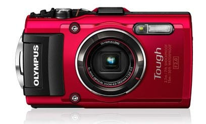
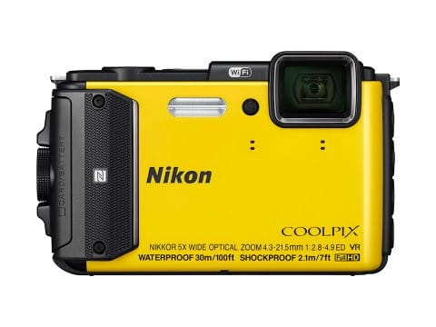
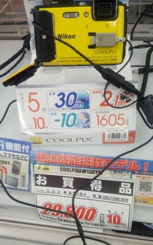
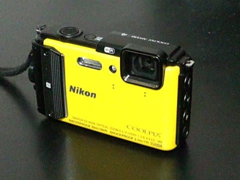
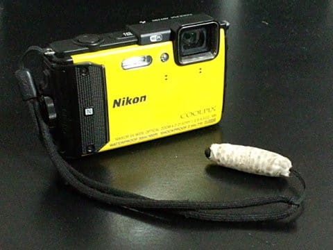

# デジカメ後継機購入！…Nikon Coolpix AW130を買ったよ

📅 投稿日時: 2017-05-24 01:20:56

🏷️ カテゴリ: [PC,カメラ&小物](c0d8caed13e597efe97b661a8ae56bed0.md)

30℃を超えるような日々が続き．

まだスキーシーズンは終わっていないというのに，

夏が来てしまった感じがする今日この頃，

皆様いかがお過ごしでしょうか．←だから，普通の人はもうスキーシーズン終わってるから

ってことで．

本日は，昨日の[デジカメ後継機選定](e1273cce799d4366184f82154de3b38c5.md)の続きです…

果たして．

・防水＆頑丈

・鏡筒が繰り出さない・起動が早い

・液晶モニタの画質がきれい

・広角側換算24mm

・動画ズームが早い・デジタルズームミックス

　でもいいので換算300mm以上の望遠

・グローブしたまま起動・ズーム・撮影が

　片手でできる

という，私の超ワガママな要求を満たす，

そんなデジカメ，あるのか？？

…と，調べたところ．

候補に残ったのは，

・15m防水のOlympusのTG-4

（Olympusホームページより）

・30m防水のNIKONのCOOLPIX AW130

（NIKONホームページより）

ふむ．

この2機種ですか…

で．OlympusのTG-4．

以前ちょっと触ったことがあって．

レンズの解放F値が2.0と明るいのは魅力！

でも…広角25mmはいいんですが，望遠側が換算100mm．

さらに，動画撮影時にデジタルズームが使えず，

動画撮影時の光学ズームもちょっと遅いので．

スキーの滑りの動画撮影は厳しそう…

で，TX30と比べると，液晶モニタも

解像度が低く，ちょっと見劣りがするという…

うーむ．

良いカメラなんだけど．

TX30後継機としては物足りないか…

で，対するCOOLPIX AW130．

レンズの解放F値は2.8と，TG-4より一段暗いけど…

望遠側は換算120mmと，望遠側が強く．

さらに動画撮影時にデジタルズームも使え，

光学ズーミングも早く．

そして広角は24mm…

これだ！

こっちが，TX30の後継機候補だ…っ！！

しかし．

なんと．

このカメラ．

昨年春に一旦生産中止になってるみたい

じゃないですか…（涙）

＃昨年11月に色を変えてわずかに

＃追加生産されたけど，すぐに製造終了

一応，まだ通販では追加生産分が

残っている店もあるみたいですが…

通販の底値でも，30,800円か…

ちと高いなぁ…

と，思っていたところ．

先日，我が家のそばの某家電量販店に行ってみたところ…

なんと！

まだ在庫があるじゃないですか…っ！！

でも…

このお値段だと，通販の方が安いなぁ…

とりあえず，アタックしてみますか．

私「これ…いくらまで安くなりますかねぇ…

　税込み3万切りますか？」

店員「確認しますので，ちょっとお待ちを…」

（しばらく後）

店員「すいません．在庫がなくて

　展示品しかないようです…

　展示品でもいいですか？」

私（あ，やっぱり在庫ないのか…．

　製造中止品だからなぁ…）

　「展示品はちょっと…

　むちゃくちゃ安くなるなら，

　考えますけど」

店員「…じゃ，税抜き2万5000円でどうでしょう？」

私（表示の29800円から，たった5000円引きか…）

　「でも，バッテリーが中古だったら，

　劣化しててやだなぁ…」←Li-ion電池は

　サイクル寿命300サイクル程度なので，毎日フル充電を繰り返す

　展示品だとあっという間に劣化する

店員「いえ，バッテリーは未使用です！」

私（ええ？？バッテリー未使用なら，

　本体が展示品って言っても…ほとんど電源

　入れることなかったみたいだし．

　これならお得かも？？）

　「…もう一声行けば考えますが…」

店員「税抜き2万4000円で…」

私「買った！」

…ということで．

展示品投げ売り（？）で，通販底値よりも

5000円ほど安く買うことができました～！

…そして．

あれ？タッチパネルのカメラじゃないのに．

なぜ，このカメラにもタッチペン…？？

いや～．

ウェアのポケットからこのストラップを

ぶら下げとくと，グローブしたままスマホ

使うのに超便利だったので…

ということで．

カメラは変わっても．

ポケットからタッチペンをぶら下げている

怪しいスキーヤーというのは

変わりませんので，ご安心を←なんのこっちゃ…？？

とりあえず．

このカメラ．

黄色くて目立つから，今度はゲレンデで落としてもすぐ

見つかりますね！！！←普通は2度と落とさないように

注意すると思うが…また落とすつもりなのか？？？

## 💬 コメント一覧

### 💬 コメント by (まいる)
**タイトル**: カメラ落としたんですね
**投稿日**: 2017-05-24 18:52:12

Sさん、お疲れさまです。

スノーシーズン終わり登山を楽しんでます。

カメラ更新されたんですね。

私は、なぜか一眼レフを今年買ってしまいました。

Sさん、値引きの達人ですねー

### 💬 コメント by (Goku)
**タイトル**: 検討中
**投稿日**: 2017-05-24 19:39:30

私もシーズン中デジカメが壊れて、後半はスマホでブログ用の写真を撮っていましたが、やはりスマホのカメラ性能だと限界を感じました。

それと、動画はほとんどズームも効かないし・・・

来シーズンに向けてやはりデジカメ買おうかな。

### 💬 コメント by (しんちゃん)
**タイトル**: 祝ご購入
**投稿日**: 2017-05-24 21:18:22

デジカメ後継機ご購入おめでとうございます!!(^^♪

ポケットからタッチペンをぶら下げている姿が引き続きみられるので安心しました（なんのこっちゃぁ(笑)）

かぐら最終日に雪解けとともにカメラが見つかるといいですね。（踊りの効果が出るかも(笑)）

もし、見つからなかったとしても、後継機の色だとすぐに見つけてもらえそうですね。いいのが見つかってよかったです。

私は現在オリンパスSH-60を使用していますが、防水機能がなく・ちょっと重いといった所があるものの、動画の手振れや望遠時のぶれはほとんどなく気に入っています。ＳＤカードがEye-Fiで、撮ったデータをスマホにwi-fiで飛ばせるのも楽しいです。

### 💬 コメント by (Skier_S)
**タイトル**: すでに先週のレポートはこのカメラで撮ってます
**投稿日**: 2017-05-25 00:49:33

＞まいるさま

そうなんです…カメラ落っことしちゃいました（涙）．

一眼レフ買われたのですか…

何を買ったのですか？？

私も欲しいのですが，

スキー用具に散在しているので

そんな贅沢許されません（笑）

＞Gokuさま

でしょ～．

スマホのカメラだと，ズームがやりにくいし，

露出補正やら調整がやりにくいので…

私も単体デジカメが欲しい，

おじさん世代です（笑）

ゲレンデで使うなら，防水のAW130，

いいですよ～！

＞しんちゃんさま

いやーー．

買っちゃいましたよ…

AW130はWifiがついてるのですが，

Wifiで飛ばしたら遅そうだし

カメラもスマホも電池を食いそうですね…

Eye-Fiで動画をスマホに飛ばすのは

時間かかりませんか？

### 💬 コメント by (しんちゃん)
**タイトル**: 時間かかりそうです
**投稿日**: 2017-05-25 23:04:15

＞Ｓ様

Eye-Fiはもう時代遅れの感がありますね。

買ったときは最先端だったんですが。。。

実はスマホへの転送は静止画しかやっていません。

動画の転送は時間かかりそうですね。

本体にWi-fi機能があるならそちらの方が早いと思います。

また、スマホを買い替えたら（静止画の転送ですが）転送速度がやたら早くなりました。バッテリーの消耗については、静止画転送ぐらいなら全く影響ありません。

### 💬 コメント by (Skier_S)
**タイトル**: しんちゃんさま
**投稿日**: 2017-05-26 04:33:34

今のデジカメ，ほとんどがWiFi機能

備えてますよね～．

ただ，デジカメやスマホの電池がすぐ

無くなっちゃうのでは…？

と，WiFi機能はほとんど使ったことが

無かったのですが．

電池はそんなに減らないのですね…

電池が減らないよう，WiFiもGPSも

止めてるんですが…

せっかくAW130はWiFiがついてるので，

今度チャレンジしてみます．

