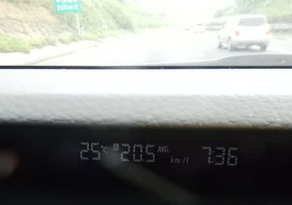

# BRレガシィ君，長距離ラストラン！…そして16万kmの生涯燃費はどのくらいだったのか？

📅 投稿日時: 2018-07-08 03:45:51

🏷️ カテゴリ: [車](cba0e8330b3f2ded7c1addfacc75d4547.md)

ってなわけで．

本日．

BRレガシィ君の最後の遠出に出てきました…

娘と一緒に，日帰り往復500kmの道のりです．

これまで，スキー場の往復だとかなんだとかで．

BRレガシィ君で，数え切れないくらい

遠出しましたが．

これが最後となると，ちと寂しいですね…

でも．

夏タイヤ＆ルーフボックス無しで．

エコラン気味の走りをすれば

今回もリッター20km超えてきたので．

やっぱり高速燃費はいい車だなぁ…

ってことで．

BRレガシィ君とのお付き合いも，残る

1週間となり．

ここらでBRレガシィ君の生涯燃費を

計算してみたのですが…

その結果．

大体リッター14.1km弱という値になりました…！

カタログ値が14.4km/Lなので．

16万3000kmでの平均燃費．

ほぼカタログ値に近い燃費だったと

いうことですね…

まぁ，最近のハイブリッド車と比べると．

そんなに良くない値かもしれませんが…

でも，ハイブリッドじゃない，純粋ガソリン車の

4WDワゴンと考えると，結構いい値じゃないでしょうか？

…というより，BRレガシィをこれだけの好燃費で

乗りつづけた人はいないのでは？？

スキー場の往復で走行距離が伸びているので，

高速道路の走行率が7割くらいだったという

条件があるものの．

通勤にも使ってる車でこれだけの燃費だったので，

自分的には結構満足ですが…

私の運転が良かったのか，このBRレガシィ君が

たまたま「あたり」の個体だったのか…．

で．

生涯燃費を計算したついでに．

BRレガシィ君にかかったた全ガソリン代を

計算したわけですが…

100万円を軽く超える金額を目の前に突きつけられ．

「な，なんということだ…」

と，かなりクラクラ来ました…

…冷静に考えると，16万km走るのに使ったガソリン，

1万リッター以上．

リッター100円以上かかることを考えれば，

当たり前の事実なんですけどね～…

ってなわけで．

次のLEVORGは，さすがにこのBRレガシィ君ほど

燃費は良くないだろうし．

さらにハイオクガソリン（涙）．

ガソリン代金が，いくら上がることやら…（恐怖）

## 💬 コメント一覧

### 💬 コメント by (michi)
**タイトル**: 生涯燃費
**投稿日**: 2018-07-08 18:59:07

LEVORGはODO燃費が出ますが、私は街乗りが多いので11.7kmです。

Sさんの場合は高速が多いのでBRと同じ14kmくらい行くのではないかと思います。

ちなみに私は夏場で12から12.5km、冬場で11kmと燃費はイマイチです(T . T)

### 💬 コメント by (Skier_S)
**タイトル**: michiさま
**投稿日**: 2018-07-09 00:06:42

あ，ODO燃費が出るんですね？？

2.0Lでも14km行きますかね～…

意外と1.6も2.0も燃費が変わらないようなこと

言いますが，エコランでリッター20kmの，

今のBRレガシィ並みに走ってくれると

嬉しいです…

それでも，ハイオク化でリッターあたり10円の

コストアップですから（涙）

### 💬 コメント by (いか)
**タイトル**: Unknown
**投稿日**: 2018-07-10 00:54:32

私はODD14,000km手前ですが、満タン法ベースで11.64km/Lですね～(車内メーターは普段見ていないのでわかりません、、、）。田舎の信号の少ないところで平坦だと20km/L近く出ると思います。高速だと巡航を80km/hくらいまで落とさないと、20km/Lは厳しいかな？という感じです。

街乗りは、2Lの低速トルクを生かして、出だしの加速でできるだけ負圧を維持すると燃費ダメージが少ないです、よく言われる2000rpm以下でしょうか。

とはいいながらも、たまには踏んでみてください、楽しいです(^^)

### 💬 コメント by (Skier_S)
**タイトル**: いかさま
**投稿日**: 2018-07-10 01:08:19

80kmくらいまで落とせば，20km/L近くになるのですね…！

BRレガシィ君だと，90km巡行くらいで20km/L行くので，

それよりはちょっと厳しそうだけど…

でも，思ったよりいい燃費ですね…

もっとひどいと思ってました（笑）．

やっぱり，ブーストを効かさない領域で走るのが

ミソですね．

…でも，せっかくの300馬力だから，時々それも味わいたいし．

直噴エンジン，あまり踏まないでいると吸気系のカーボンスラッジ

蓄積もありそうなので．

時折はガンガン飛ばしたいですね～！

やっぱり…

