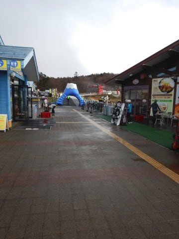
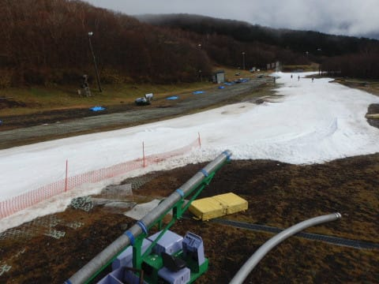
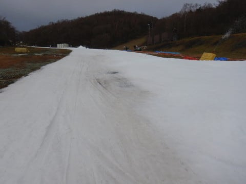
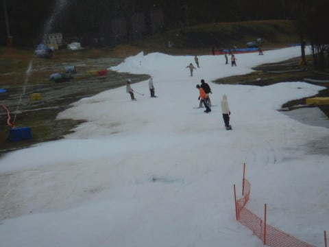
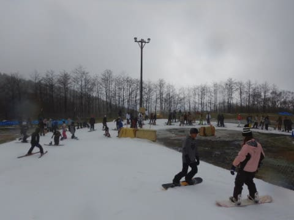
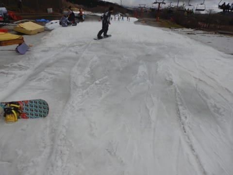
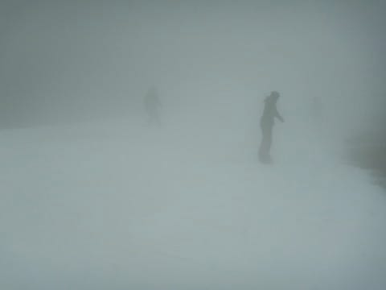
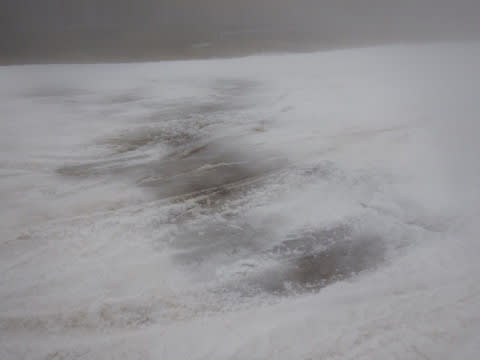
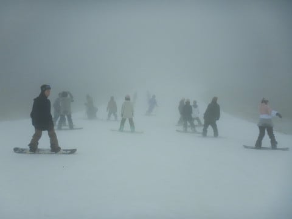

# 2019/11/24(日)のイエティのゲレンデ状況速報＆動画…午前中は雨，午後はガス（涙）なのに混んでたよ…

📅 投稿日時: 2019-11-25 00:07:36

ってなことで，昨晩

無事帰国したので．

ご無体出張のストレスを晴らすべく，

今日は絶対スキーに行くぞ！！

…と，気合満々でいたわけですが．

…残念ながら，熊の湯もかぐらも

24日はオープンできず（涙）．

だもんで，そろそろ飽きてきている感に

あふれつつあるのですが．

今日もイエティへ行ってきました…

詳細レポートは明日に譲って，

本日は速報モード＆動画にて，

今日のイエティの状況をお送りします．

えー．

本日は，朝，雨降りで始まった

わけですが…（涙）

朝8時，1本目を滑り出すころには

雨も止んでくれたので．

「今日はいいコンディションで滑れそう…っ！」

と期待して1本目に飛び込んだのですが…

なんということか．

昨日の雨＆オールナイト営業のおかげで，

あさイチからゲレンデはかなり荒れ気味（涙）

もう，朝から茶色くなってるところも…

うーむ．

コース幅は先週より多少広がったけど，

この2日間の高温で，雪はかなり薄く

なった様子…

残念ながら，午前中からゲレンデは

凸凹＆ところどころ穴が開いてます（泣）

それなのに，なぜか混んでいた本日．

並行してかかるペアリフトは11時から営業して，

そちらは待ち0でしたが，

クワッドは終日こんな感じの待ち時間．

激烈に待つって程ではないけど，

雨降りの割には，人がいますね…

天気は，8時から10時ごろまでは，

基本的に曇り．

時折霧雨がぱらつく程度だったのですが…

10時半ごろから20分ほど，結構な

本降りになりました（涙）

その後は雨が止みましたが．

ゲレンデの雪は，いたるところに

ダメージが…（泣）

さらに，午後1時ごろからは

ひどいガスで視界が悪化（涙）

視界が悪く，雪も穴が開き始め．

そしてコースも人口密度が高いという，

3重苦（泣）

…どうしたというのだ．

私の日ごろの行いは何も悪く

ないのに．←いや，悪いことだらけだから

なぜ…

なぜ，こんな状況に…（激涙）

ってな感じで．

今日は夕方に用事もあり，帰宅せねば

ならなかったので．

午後2時過ぎに退散しました…

いやーー．

今日はかなり残念な一日でした…（涙）

とりあえず，午前10時ごろのコース状況の

動画を載せておきます．

詳細レポートは，また明日！←いや，これで十分詳細だと思うけど…

## 💬 コメント一覧

### 💬 コメント by (ジョナサン)
**タイトル**: Unknown
**投稿日**: 2019-11-25 05:49:49

おはようございます。日帰りスキーお疲れ様です。かなり溶けてしまい酷い状態になりましたね。プルーク先生からも金曜の温かい雨でどっと溶けたと連絡ありました。私はウイングにいましたが、金曜雨は全く降らず、土曜は20℃位上がり板走らなくなりました。さて今週はいよいよ冷え冷え踊りを全国の皆さんで踊りましょうね～🎶🎶

### 💬 コメント by (Skier_S)
**タイトル**: ＞ジョナサンさま
**投稿日**: 2019-11-26 00:16:42

昨日は来てらっしゃらないなぁ…と思っていたら，

ウイングヒルズだったのですね．

日曜のYetiは，かなり雪がやられてました（涙）

ウイングヒルズは雪は残ってたのでしょうか…

とりあえず，今晩一瞬冷えますが，人工降雪機が

ガンガン動かせるほどじゃなく，また27日は気温が

上がります…（涙）

でも，28，29，30日はすごく冷えそうなので，

そこに期待！！

皆さんで冷え冷え降れ降れ踊りを踊り続けましょう！！

