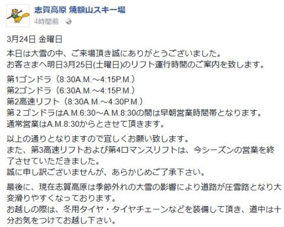
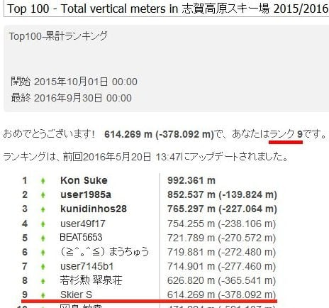
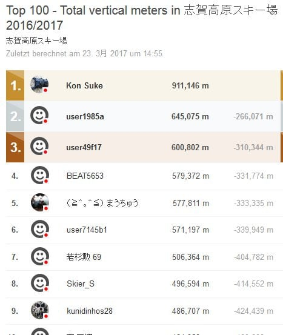

# 今週末の志賀高原の天気は，土曜は晴れ！日曜は曇りのち雪…そして，現在のSkiline順位を見て気づいたこと

📅 投稿日時: 2017-03-24 22:35:52

🏷️ カテゴリ: [日記](cc4b5682fb7b8b144980957a978653fb0.md)

ということで．

…どうやら，今日の志賀高原．

結構降ったようですね～！

大雪だったんですか…

…しかし．

知らぬ間に，焼額第3高速リフトの営業が

終わっていたとは…（涙）．

で．

今週末の天気ですが．

概ね昨日の予想の通りですが，微妙に低気圧の

動きが早まったので，

土曜は朝から晴れ，

日曜は朝から曇り…

という感じになりそうです．

直前最終予想としては，

土曜：朝から晴れ！

　道路は昨晩からの積雪で本格雪道なので注意…

　朝は放射冷却で-10℃クラスの冷え込みで，

　朝イチはトップシーズン並みの柔らかシマシマ圧雪バーン！

　天気は終日良さそう．昼間も気温は-3℃程度までしか上がらず，

　日差しがあるにもかかわらず，3月末と思えない

　いい雪質をキープ！

　ただ，昼ごろにはゲレンデは結構荒れ始め，午後は

　結構凸凹＆下地の固いのが出てくるかな…

日曜：朝から曇り気味．

　朝の気温は-5℃程度．

　朝イチは冷え冷え締まり気味の圧雪！

　早朝は曇り空だけど，雪は最高だろうなぁ…

　で．

　昼ごろ，ちょっと湿り気味の雪が降り始める．

　午後まで雪がぱらつき，時折強く降る．

　今のところ，志賀高原の標高なら雨になる

　心配は無し．

　…標高の低いスキー場はみぞれ～雨でしょう…

って感じでしょうか．

…という，天気の話題のあとは．

そうなんですよ．

さっき，Skilineのシーズン標高差ランキングを見て

気づいたのですが．

昨年のシーズン終了直後のランキングと．

現時点のランキング．

…この二つを比べてみると．

kunidinhos28さんが，3位から9位に落ちている以外．

残りの前後関係，全く同じじゃないですか！（笑）

トップ１，２はKon Sukeさんとuser1985さん．

それに続いて，user49f17さん＆BEAT5653さん＆まうちゅうさん

＆user7145b1さんの4人で僅差の争いを繰り広げ．

それを若杉さんと私が1万mほどの僅差のデッドヒートを

しながら追いかける…

という．

この2年間，全く同じ図式が繰り返されていますね（笑）

大体，シーズンも終盤になると．

いつものメンバーが大体落ち着く順位に

落ち着いてくる，ということですね～…

ということで．

私は今週末も志賀高原を滑ってます～！

## 💬 コメント一覧

### 💬 コメント by (まいる)
**タイトル**: 新雪が
**投稿日**: 2017-03-25 10:45:00

Sさん、お疲れさまです。

雪いっぱいふったようですねー

今日は午前中、蓮池の方にいて、夕方に焼額に行こうと考えてます。

明日も焼額かなと

### 💬 コメント by (Skier_S)
**タイトル**: まいるさま
**投稿日**: 2017-03-26 00:08:21

いやーー．

今週はかなり積もったようですね．

でも，今日は焼額第2高速が止まっていたので，

焼額までこれませんでしたよね…

私は逆に焼額から出られませんでした（笑）．

明日も焼額滑ってる可能性が高いですが…

宿が一の瀬なので，娘の気分次第で

一の瀬になるか焼額になるか…

第2高速があしたも直らなくて，一の瀬スタートだと…

焼額に行けない可能性が（涙）

