# 2024年8月，今年も座間味で親子ダイビング！その18…座間味島の高月山からの絶景を堪能！

📅 投稿日時: 2024-09-18 01:41:54

結局，3連休もどこにも行かず，家でひたすら

仕事をやり続けて…

そして．

それでも仕事が終わってない（涙）

この週末の3連休も，おそらくどこにも

行けない予感…

スキーシーズンで3連休にスキーに

いけなかったら死ぬけど，スキーシーズン

じゃなくてよかった…

…ってか．

スキーシーズンじゃなくても．

週末は休みたいぞ（涙）

とりあえず．

今日も何時に寝られるかわからないけど．

それでもいつもの座間味ダイビング日記を

投稿するのだ！！

ーー

（[前回はこちら](eb29f9340f43d8498e3582ca2d4ae2654.md)）

ってなことで．

高月山の展望台までやってきましたが…

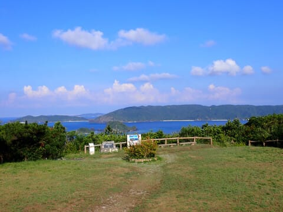

こちら側は，島の東側を眺める方角ですね．

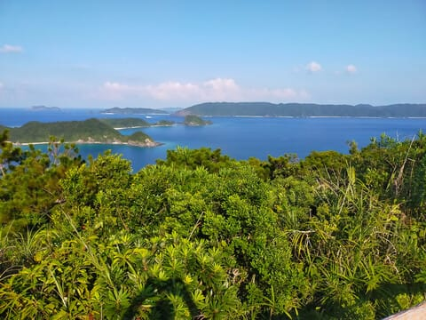

国立公園を主張する立派な石碑の

横にある案内板を読むと．

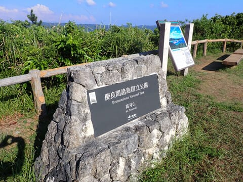

へーーー．

座間味って，1300年代からすでに中国貿易の

港として使われてたんだ…！！

ってか，その時代から爆薬を使った浚渫を

行っていたとは…！！

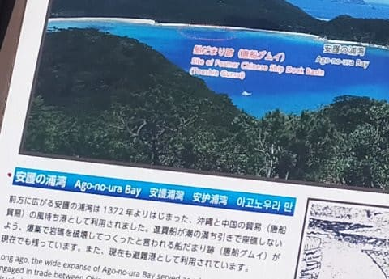

…

確かに，見てみるとそれっぽい跡があり

ますね…！！

700年以上も前の工事の跡が残っているとは，

すごい…

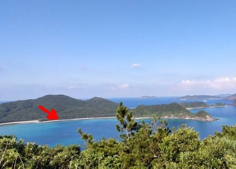

そして．

この広場の反対側には，展望小屋（？）が

建っていて…

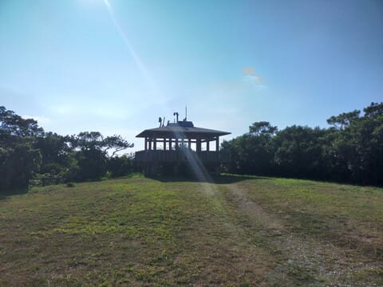

この展望小屋からは，座間味の街中が

見下ろせます！

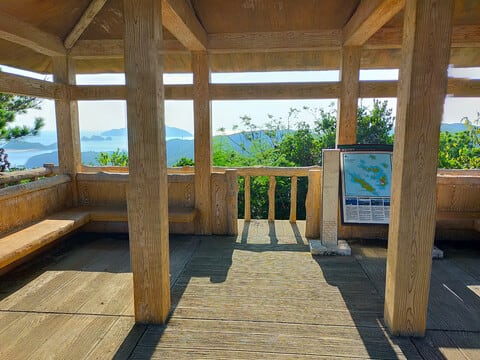

…うーん．

以前は周りの木がもう少し刈り取られて，

もうちょっと見晴らしがよかった気が

するけど…

今回は牙生い茂っていて，座間味の街の

一部しか見えませんね（ちょい涙）

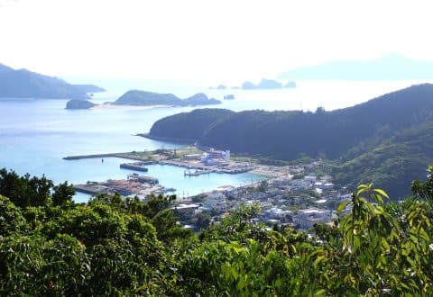

…でも．

泊まっている星砂さんはしっかり見えて

ますね…！

建物の上にある，我が一家が泊っている

3階のスペースが見えますし．

港には，特徴的な高いマストが突き立って

いるティンガーラ号も見えてます．

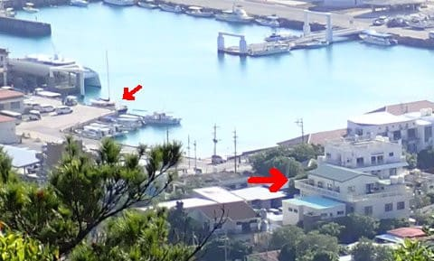

しばらく座間味の街中を見下ろしたら．

今度は第2展望台へ移動！

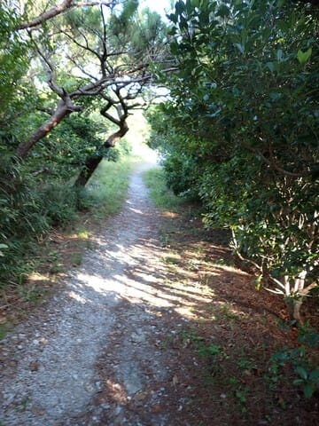

第1展望台から150mほど歩くと，

視界が開けて…

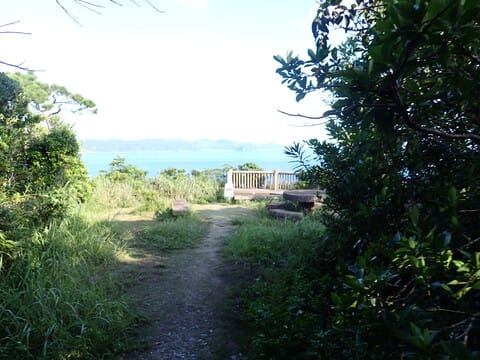

やってきました，第2展望台！

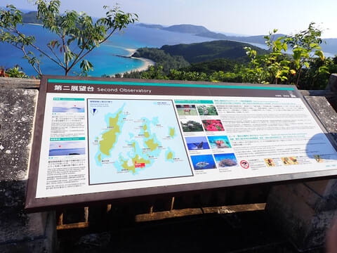

この第2展望台，座間味島の東端から

渡嘉敷を眺められる景色から…

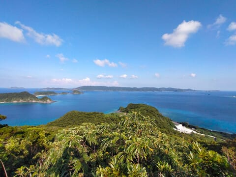

古座間味ビーチからそれに連なる

安室島…

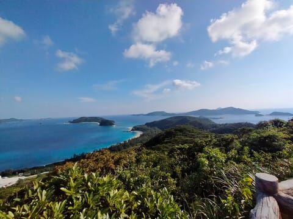

果ては，南西方面に連なる安慶名敷島，

ガヒ島，阿嘉島から慶留間，外地島に

連なる，座間味諸島が一望に眺められ…

実は第1展望台より景色がいいんじゃない？？

と思ってます．

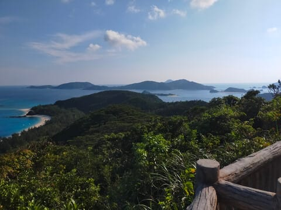

ちなみに．

ダイビングに行った時，いつもお昼休憩で

寄るのがこの島ですね…！

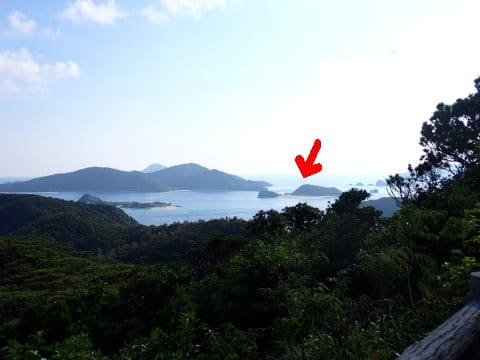

しかし．

この景色のきれいさ…

これを見ていると心が落ち着きます…

そして．

古座間味ビーチ，やっぱりきれいですね！！

[去年，早朝にこんなビーチを貸し切りで
楽しめた](efe86ccc6639e4c5efe9584b455856c67.md)のは，すごいゼイタクだったかも…

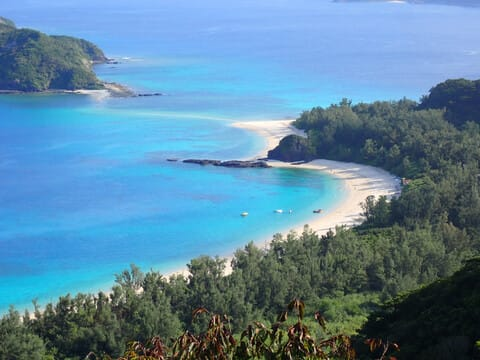

ってなことで．

第2展望台に佇んで，美しい景色を

堪能することしばし．

そろそろ第2展望台を後にして，

下山しましょうか…

（[続く](e1f54634452906196e5319dc3cf5ee05f.md)）
