# 雪解けで営業中止のイエティは復活できるのか？そして横手・熊の湯はいつ頃オープンできそうなのか？水曜深夜恒例のスキー場天気予想スタート！

📅 投稿日時: 2023-11-09 03:38:31

🏷️ カテゴリ: [スキー天気予想](c6554f5c3c106093b511a8daae23757e8.md)

えー．

イエティですが．

本日8日（水）の昼間のライブカメラを見ると…

悲惨の一言ですね（涙）

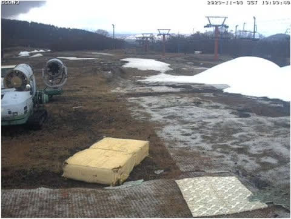

（[WNI イエティライブカメラ](http://webcam.wni.co.jp/KAC24326/loop.html)より）

つい4日前の土曜に滑った時は

こんなだったのに…

わずか3日でここまでひどくなる

とは…（激涙）

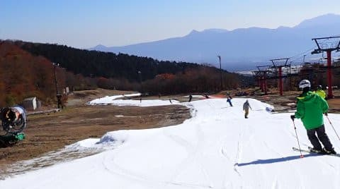

とりあえず．

水曜深夜1時半現在の状況を見ると．

ちょっとは雪山が増えてきているけど…

コースがつながるまでは，まだまだ

かかりそうですね（涙）

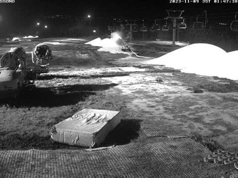

（[WNI イエティライブカメラ](http://webcam.wni.co.jp/KAC24326/loop.html)より）

9日も気温が高く，晴れて日差しが

強そうなので…

うーん．10日の金曜オープンは厳しそうな

予感がする…

一方で，軽井沢の今日のライブカメラを

見てみると．

軽井沢は雪がダメージを受けているような

様子はあんまりなくて，平和なようですね…

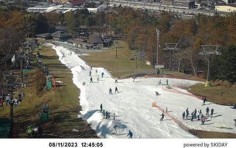

（[軽井沢スキー場ライブカメラ](https://skiday.app/v5XpDAiHz0PL2Cp8ADxt/869223040349613/embed)より）

ってなことで．

スキーシーズンのこのBlogの水曜深夜恒例と

なっている，スキー場天気予想．

この天気予想を，今シーズンは今日から

始めようと思っているわけですが．

今週末までにイエティは復活できるのか？

横手山はいつ頃オープンできそう

なのか？

熊の湯は予定通り11月18日にオープン

できるのか？？

…といったあたりの予想を含めた

拡大版でお送りします！

まず．

9日の木曜ですが…

昨日の予想から変わらず．

赤い0℃線はかなり北に行っており．

志賀高原付近は水色の+9℃線が

かかるレベルなので…

絶対に人工降雪機は動かせない気温です（涙）

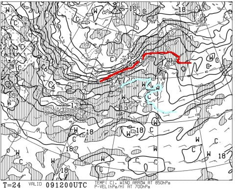

地上天気図でも，全面的に高気圧に

覆われて晴れそうなので．

日がさす暑いくらいの1日になり．

イエティの造雪も厳しい感じになりそう…

まぁ，雨が降るよりはいいけど．

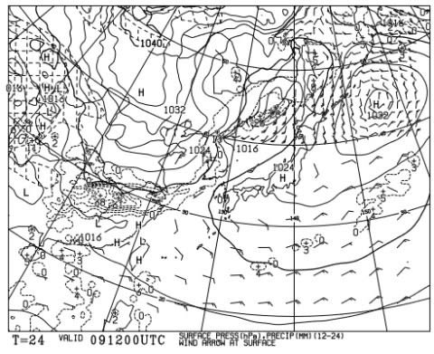

そして，10日の金曜日．

850hpa気温を見ると…

この日の予想も昨日と変わらず．

本州にかかるのは水色の+9℃線．

志賀高原でも人工降雪機が動かせる

レベルからは遠い…（泣）

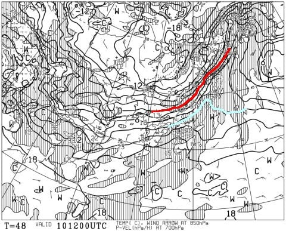

そして．この日はさらに残念なことに…

地上天気図は水色で塗った降水域に

日本がすっぽり覆われており．

全国的に高温の雨が降る一日に

なりそう（泣）

おそらくイエティは，ゲレンデがぎりぎり

つながるかどうかのレベルなので，

高温で雨が降るとなると，また一瞬で

ゲレンデが切れちゃうと思うので．

金曜のゲレンデオープンはあきらめて，

シートをかけて雪が溶けないようにして，

ゲレンデ保全に徹するんじゃないかな…（泣）

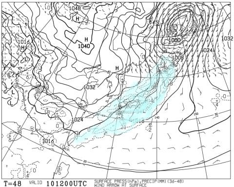

そして．

11日の土曜ですが．

850hpa気温を見ると．

ここも大体昨日の予想からずれて

おらず．

志賀高原に赤い0℃線がかかってます！

11日は人工降雪機が動かせます！！

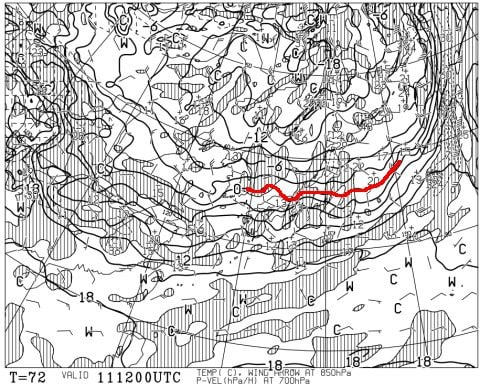

で．

この日の地上天気図は，日本海側に

水色の降水域がかかっているので…

志賀高原，天然雪が降るんじゃないかな？

まぁ，多くても5㎝程度だと思いますが…

イエティ付近は降ってもぱらぱらなので，

雪が前日までに準備できれば11日に

オープンできるかも？？

10日の雨で雪がかなりやられたら，

11日のオープンは厳しそうですが…

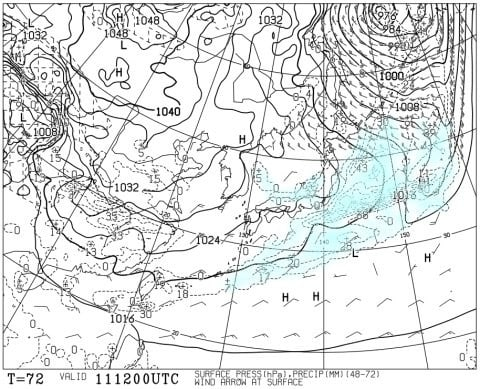

そして．

12日の日曜ですが…

うむ．

この日もちゃんと赤い0℃線は

志賀高原付近に居残ってくれてます！

人工降雪機が動かせます！

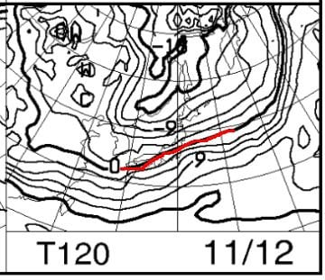

天気図も，日本海側に雪雲が伸びている

ので…

志賀高原はわずかに雪がぱらつくかな？

積もるほどじゃなさそう．

太平洋側のイエティは晴れ～曇りくらいの

感じ．軽井沢は曇り～時々日が差すくらい．

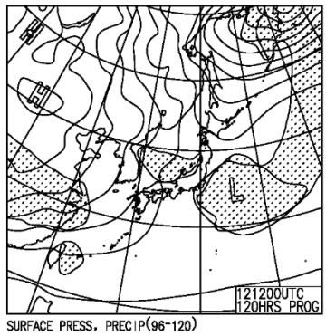

ってなことで．

10日金曜：軽井沢・イエティ含め終日雨．

　気温は高い．

　イエティのオープンは厳しい感じ．

　志賀の人工降雪は無理．

11日土曜：軽井沢・イエティともに曇り

　10日の雨でやられたらイエティオープン

　厳しい．

　時々晴れ．時折ポツポツ雨がぱらつく？

　気温は結構冷える．

　志賀は雪！人工降雪機も動き出す！！

12日日曜：軽井沢は曇り～晴れ，イエティは

　晴れ～曇り．寒い．

　土曜オープンできなくても，この日の

　イエティはオープンできるんじゃないかな？

　志賀は人工降雪機フル稼働っ！！

ってな感じですか…

横手山はさすがにわずか2日間の

人工降雪だけでオープンできるとは

思えないので，

今週末もオープンは無理だと思います．

無理です．

あきらめましょう…

では，志賀高原はいつ頃オープン

できそうなのか？

ということで，それ以降の天気を見てみると…

13日は赤い0℃線がかなり南に下がり

ます！！

14，15日は志賀より北に0℃線が行って

しまいますが…

でも，+3℃線より北にあれば，

横手山なら人工降雪機が動かせるので．

たぶん13日から15日も人工降雪機が

動かせそう…！

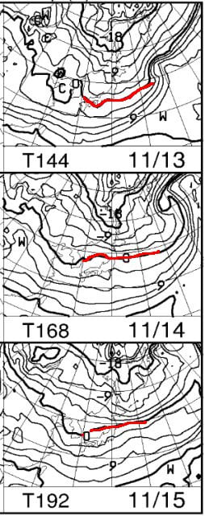

地上天気図は，13日は日本海側に

雪雲がかかっているので雪が積もりそう…！

14，15日は雪は降らなさそうなので．

日が出ちゃうと，昼間は人工降雪機

動かせないかも…

でも，夜はフル稼働できるはず！

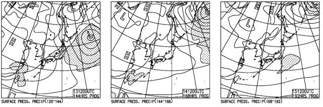

ってなことで．

11日から15日までは人工降雪機が

動かせそうで．

さらに多ければ天然雪も10㎝くらい

積もる可能性があるので…

天然雪の量にもよりますが．

もしかしたら，早ければ16日あたりに

横手山はオープンできるかも…？

ただ，13日にあまり天然雪が積もらな

ければ，さすがに人工降雪だけでは

16日にオープンできないかな…

で．

その後の天気を見るべく．

このBlogではあまり使わない，

FEAS21という天気図で，16日の

予想を見てみると…

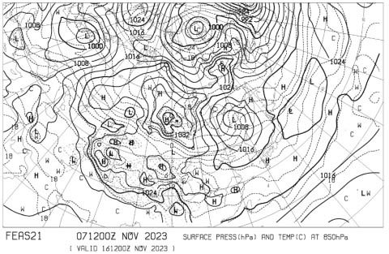

日本付近を拡大すると．

うーん．

この日も赤い0℃線は志賀より北ですが…

でも，水色の+3℃線よりは南．

これなら，ぎりぎり人工降雪機が

動かせるレベル！！

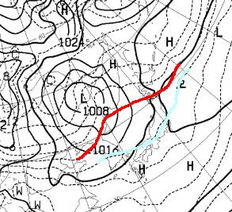

さらに，FEAS26で，18日の土曜の

天気図を見てみると．

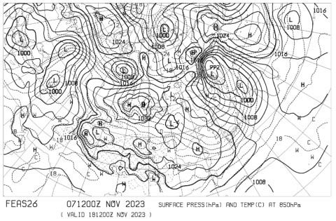

ををををを！！

この日は志賀高原に水色の-3℃線が

かかってます！！

そして地上天気図も，西高東低の

冬型だし…

これ，冷え冷えで雪が降る天気図！！

この天気図のままなら，18日は

志賀にかなり雪が積もりますよ…！

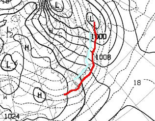

ってなことで．

11日以降は，そこまで気温が上がらず

最悪でも志賀でぎりぎり人工降雪機が

動かせる気温が続いてくれるので…

11日の人工降雪開始から1週間後の

18，19日の週末は，横手山が営業できそう…！

そして，今の予想図の通りに18日に雪が降れば…

熊の湯も19日の日曜にはオープンできるかも？？

…ただし．

ただし，だ．

私がBlogで滅多に使わない，FEASxxシリーズの

天気図．

なぜ使わないかというと…

あまりにも先の予想すぎて，ほとんど

当たらないからなのだ（涙）

ということで．

今の予想では，来週末には志賀の横手と

熊の湯がオープンできそうな気配が

ありますが．

今から1週間後の予想天気図なんて，

当たる確率は占いと同じレベル

なので．

あくまで単なる期待として聞いておいて

ください…

でも．

来週，気温はそんなに上がらなさそうなので，

ちょっと期待！！！

## 💬 コメント一覧

### 💬 コメント by (ぽーちゃん)
**タイトル**: Unknown
**投稿日**: 2023-11-09 17:37:48

ズバリ天気予報ありがとうございます。

再来週...良いんです。Sさんの予報で少しでも可能性があれば気持ちアゲアゲ⤴⤴⤴です。

仕事も頑張れます。!(^^)!

### 💬 コメント by (Skier_S)
**タイトル**: ＞ぽーちゃんさま
**投稿日**: 2023-11-10 01:43:30

とりあえず，15日までは冷えそうです…

熊の湯はぎりぎりだけど，横手は来週末は開いてほしい…

その後冷えるかどうかは，皆さんが祈って踊って歌ってくれるかどうかにかかってます！←なんのこっちゃ

